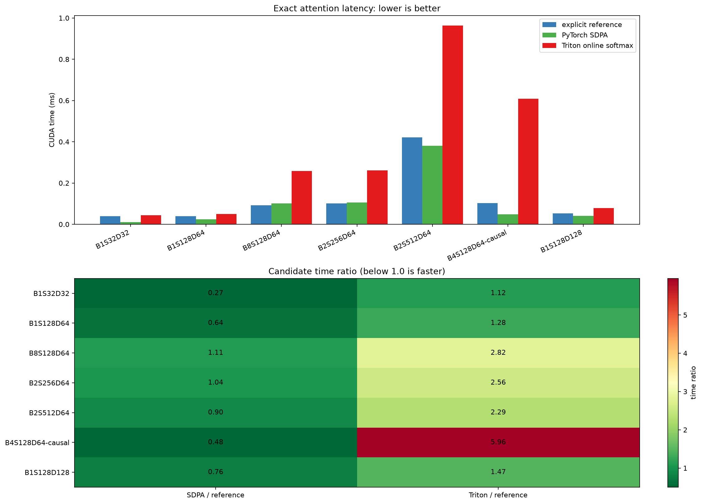

# FlashAttention Candidate Report

This report measures the submission-owned exact Triton online-softmax kernel against the unchanged explicit attention equation and PyTorch SDPA. The Triton kernel streams K/V tiles, maintains a running max/normalizer, and never materializes the S×S score matrix. It is a correctness/performance candidate; the active Transformer path uses whichever implementation is supported by the measured evidence. Timing uses 10 warm-up calls, 50 calls per CUDA-event sample, and the median of three samples.

Speedup is explicit-reference latency divided by candidate latency. Correctness uses the supplied lab.py per-element rule (absolute error ≤ 0.001 OR relative error ≤ 1%).

| Shape | Setup | Causal | Reference ms | SDPA ms | Triton ms | SDPA speedup | Triton speedup | SDPA max abs | Triton max abs | Pass |
| --- | --- | :---: | ---: | ---: | ---: | ---: | ---: | ---: | ---: | --- |
| B1S32D32 | B=1,H=4,S=32,D_head=32 | no | 0.0387 | 0.0105 | 0.0434 | 3.703× | 0.892× | 1.79e-06 | 4.77e-07 | PASS |
| B1S128D64 | B=1,H=8,S=128,D_head=64 | no | 0.0387 | 0.0249 | 0.0497 | 1.556× | 0.780× | 1.31e-06 | 4.77e-07 | PASS |
| B8S128D64 | B=8,H=8,S=128,D_head=64 | no | 0.0918 | 0.1020 | 0.2588 | 0.900× | 0.355× | 2.09e-06 | 7.15e-07 | PASS |
| B2S256D64 | B=2,H=8,S=256,D_head=64 | no | 0.1018 | 0.1060 | 0.2608 | 0.961× | 0.390× | 1.4e-06 | 7.75e-07 | PASS |
| B2S512D64 | B=2,H=8,S=512,D_head=64 | no | 0.4216 | 0.3805 | 0.9640 | 1.108× | 0.437× | 1.04e-06 | 7.15e-07 | PASS |
| B4S128D64-causal | B=4,H=8,S=128,D_head=64 | yes | 0.1021 | 0.0487 | 0.6079 | 2.094× | 0.168× | 1.91e-06 | 7.15e-07 | PASS |
| B1S128D128 | B=1,H=8,S=128,D_head=128 | no | 0.0532 | 0.0405 | 0.0779 | 1.313× | 0.682× | 1.91e-06 | 5.36e-07 | PASS |

## Decision

The Triton candidate wins against SDPA on 0/7 measured shapes. PyTorch SDPA remains the active implementation because it is the faster mature fused backend on this RTX 4060 for the tested shapes; the custom kernel is retained as a reproducible FlashAttention algorithm implementation and can be revisited after shape-specific autotuning.

The decision follows the FlashAttention/FlashAttention-2 papers: online softmax and tiled IO are implemented exactly, while the final choice is made from CUDA-event measurements rather than transferring a paper speedup to a different GPU.

Raw data: `flash_attention_results.csv`.
