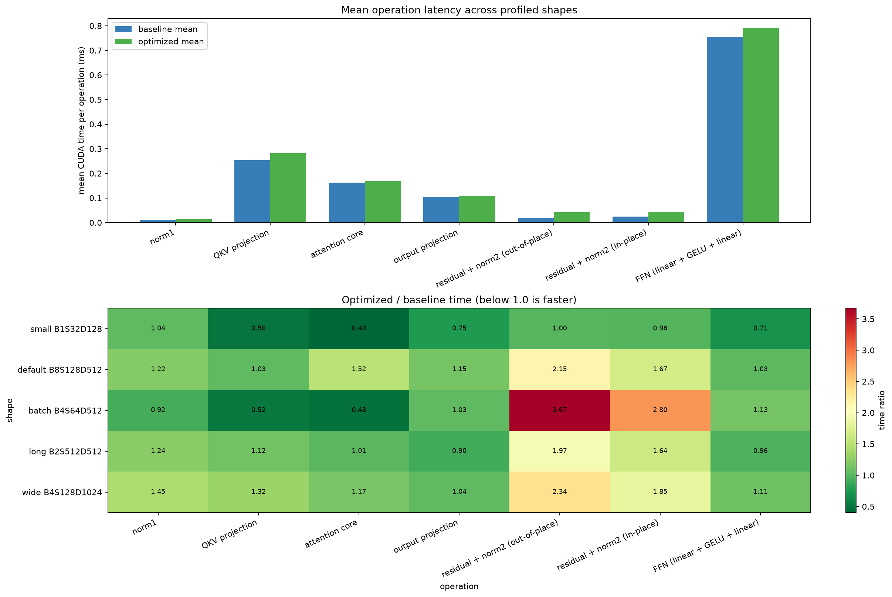

# Operation Profile (5 Shapes)

Generated by `operation_profile_report.py` using CUDA events after warmup. Each operation is measured independently on identical tensors and weights; the numbers are not profiler traces.

## Interpretation

- **small B1S32D128**: baseline hotspot is `FFN (linear + GELU + linear)` (24.8% of isolated operation time); strongest measured reduction is `attention core` at 2.47× speedup.
- **default B8S128D512**: baseline hotspot is `FFN (linear + GELU + linear)` (61.1% of isolated operation time); strongest measured reduction is `FFN (linear + GELU + linear)` at 0.97× speedup.
- **batch B4S64D512**: baseline hotspot is `FFN (linear + GELU + linear)` (45.2% of isolated operation time); strongest measured reduction is `attention core` at 2.09× speedup.
- **long B2S512D512**: baseline hotspot is `FFN (linear + GELU + linear)` (49.3% of isolated operation time); strongest measured reduction is `output projection` at 1.11× speedup.
- **wide B4S128D1024**: baseline hotspot is `FFN (linear + GELU + linear)` (63.8% of isolated operation time); strongest measured reduction is `output projection` at 0.96× speedup.

## Per-operation measurements

| Shape | Operation | Baseline ms | Optimized ms | Speedup | Baseline share | Optimized share |
| --- | --- | ---: | ---: | ---: | ---: | ---: |
| small B1S32D128 | norm1 | 0.006605 | 0.006861 | 0.963× | 3.7% | 5.7% |
| small B1S32D128 | QKV projection | 0.041318 | 0.020726 | 1.994× | 23.0% | 17.3% |
| small B1S32D128 | attention core | 0.037107 | 0.015002 | 2.474× | 20.6% | 12.5% |
| small B1S32D128 | output projection | 0.015616 | 0.011776 | 1.326× | 8.7% | 9.8% |
| small B1S32D128 | residual + norm2 (out-of-place) | 0.014643 | 0.014592 | 1.004× | 8.1% | 12.1% |
| small B1S32D128 | residual + norm2 (in-place) | 0.020026 | 0.019610 | 1.021× | 11.1% | 16.3% |
| small B1S32D128 | FFN (linear + GELU + linear) | 0.044646 | 0.031539 | 1.416× | 24.8% | 26.3% |
| default B8S128D512 | norm1 | 0.014182 | 0.017306 | 0.820× | 1.0% | 1.1% |
| default B8S128D512 | QKV projection | 0.294349 | 0.303053 | 0.971× | 19.9% | 18.6% |
| default B8S128D512 | attention core | 0.091750 | 0.139622 | 0.657× | 6.2% | 8.6% |
| default B8S128D512 | output projection | 0.121651 | 0.139520 | 0.872× | 8.2% | 8.6% |
| default B8S128D512 | residual + norm2 (out-of-place) | 0.024218 | 0.052070 | 0.465× | 1.6% | 3.2% |
| default B8S128D512 | residual + norm2 (in-place) | 0.030054 | 0.050182 | 0.599× | 2.0% | 3.1% |
| default B8S128D512 | FFN (linear + GELU + linear) | 0.904150 | 0.930048 | 0.972× | 61.1% | 57.0% |
| batch B4S64D512 | norm1 | 0.009826 | 0.009062 | 1.084× | 2.3% | 2.0% |
| batch B4S64D512 | QKV projection | 0.111360 | 0.058368 | 1.908× | 25.8% | 13.0% |
| batch B4S64D512 | attention core | 0.047155 | 0.022528 | 2.093× | 10.9% | 5.0% |
| batch B4S64D512 | output projection | 0.037379 | 0.038554 | 0.970× | 8.7% | 8.6% |
| batch B4S64D512 | residual + norm2 (out-of-place) | 0.013320 | 0.048896 | 0.272× | 3.1% | 10.9% |
| batch B4S64D512 | residual + norm2 (in-place) | 0.017459 | 0.048949 | 0.357× | 4.0% | 10.9% |
| batch B4S64D512 | FFN (linear + GELU + linear) | 0.195328 | 0.221333 | 0.883× | 45.2% | 49.4% |
| long B2S512D512 | norm1 | 0.015718 | 0.019507 | 0.806× | 0.8% | 1.0% |
| long B2S512D512 | QKV projection | 0.297472 | 0.334643 | 0.889× | 14.9% | 16.5% |
| long B2S512D512 | attention core | 0.517888 | 0.525621 | 0.985× | 26.0% | 25.9% |
| long B2S512D512 | output projection | 0.123904 | 0.111768 | 1.109× | 6.2% | 5.5% |
| long B2S512D512 | residual + norm2 (out-of-place) | 0.024525 | 0.048226 | 0.509× | 1.2% | 2.4% |
| long B2S512D512 | residual + norm2 (in-place) | 0.030467 | 0.049976 | 0.610× | 1.5% | 2.5% |
| long B2S512D512 | FFN (linear + GELU + linear) | 0.981811 | 0.943258 | 1.041× | 49.3% | 46.4% |
| wide B4S128D1024 | norm1 | 0.010899 | 0.015770 | 0.691× | 0.4% | 0.5% |
| wide B4S128D1024 | QKV projection | 0.523674 | 0.692838 | 0.756× | 20.3% | 23.0% |
| wide B4S128D1024 | attention core | 0.120781 | 0.140800 | 0.858× | 4.7% | 4.7% |
| wide B4S128D1024 | output projection | 0.231373 | 0.239770 | 0.965× | 9.0% | 7.9% |
| wide B4S128D1024 | residual + norm2 (out-of-place) | 0.021040 | 0.049254 | 0.427× | 0.8% | 1.6% |
| wide B4S128D1024 | residual + norm2 (in-place) | 0.027136 | 0.050069 | 0.542× | 1.1% | 1.7% |
| wide B4S128D1024 | FFN (linear + GELU + linear) | 1.645926 | 1.828403 | 0.900× | 63.8% | 60.6% |

## Optimization plan

1. Keep SDPA as the attention implementation: the profiler verifies a fused CUTLASS FMHA kernel, while FlashAttention-2 shows that tiled online-softmax and work partitioning are the correct algorithmic target.
2. Prioritize FFN GEMMs when they dominate: they are already dispatched to vendor GEMM; future work should test compiler/autotuned GEMM choices rather than replace them with an unvalidated custom kernel.
3. Keep fused residual + LayerNorm only where its measured reduction exceeds launch overhead; the active model uses the 131,072-element shape gate.
4. Treat QKV packing as a secondary win: it removes two projection launches, but its benefit is bounded by the GEMM arithmetic and layout cost.

Raw data: `operation_profile_results.csv`.
