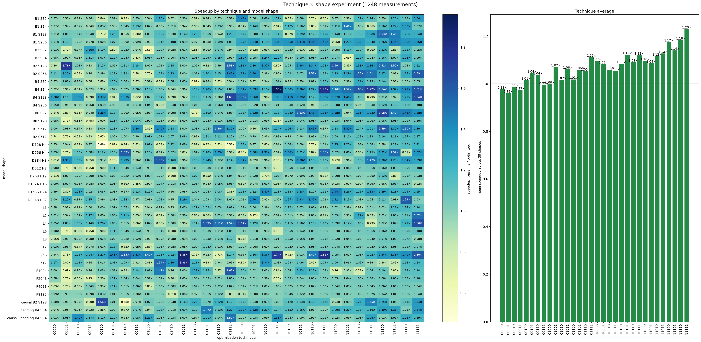

# Technique × Model-Shape Experiment (1248 Configurations)

Generated: 2026-08-28 by `technique_shape_report.py`.

> **Historical screening snapshot.** This file was generated before the timing
> controls were tightened (1 accuracy trial, 3 warmups, 10 event repeats, one
> round). The old low-sample maximum of 1.960× is not a validated speedup. The
> runner now
> uses paired alternating measurements, reuses exact duplicate configurations,
> and defaults to 10 warmups, 30 CUDA-event repeats, and 3 rounds. Regenerate
> this report with `.venv/bin/python tiktok/tests/technique_shape_report.py`.

This is a full factorial experiment with 39 model shapes and 32 technique combinations (1248 rows). Bits in each combination are ordered QKV / SDPA / Triton LN / In-place / Shape-specialized LN. `00000` is a second true BaselineTransformer control. The modular ablation model toggles only the named technique while keeping the lab.py equations, weights, inputs, and eager FP32 baseline fixed; it does not modify the supplied benchmark outside UserOptimizedTransformer. Compilation startup is not involved. Each technique is timed beside its baseline with alternating order to cancel GPU clock/thermal drift. Identical configurations repeated by different ablation groups reuse one timing measurement (for example B8/S128 = D512/H8 = L6 = F2048), so labels cannot disagree because of run order. Screening timing uses 1 accuracy trial(s), 3 warm-up calls, 10 CUDA-event repeats, and 1 benchmark round(s).

Speedup is `baseline median latency / optimized median latency`. Accuracy uses lab.py's unchanged criterion: absolute error ≤ 0.001 OR relative error ≤ 1%.

## Technique-combination summary

| Bits (QKV/SDPA/LN/in-place/shape-LN) | Mean speedup | Median speedup | Best shape | Best speedup | Accuracy failures |
| --- | ---: | ---: | --- | ---: | ---: |
| 00000 | 0.976× | 0.982× | B4 S128 | 1.303× | 0 |
| 00001 | 0.960× | 0.952× | B2 S128 | 1.762× | 0 |
| 00010 | 0.987× | 0.967× | causal+padding B4 S64 | 1.401× | 0 |
| 00011 | 0.973× | 0.969× | B2 S32 | 1.301× | 0 |
| 00100 | 1.014× | 1.004× | causal B2 S128 | 1.663× | 0 |
| 00101 | 1.044× | 1.031× | F256 | 1.426× | 0 |
| 00110 | 1.036× | 1.020× | D256 H4 | 1.589× | 0 |
| 00111 | 0.994× | 0.991× | F256 | 1.430× | 0 |
| 01000 | 0.998× | 0.991× | F256 | 1.473× | 0 |
| 01001 | 1.070× | 1.024× | D384 H8 | 1.580× | 0 |
| 01010 | 1.016× | 1.005× | F512 | 1.364× | 0 |
| 01011 | 1.061× | 1.001× | F256 | 1.885× | 0 |
| 01100 | 1.018× | 1.026× | F1024 | 1.270× | 0 |
| 01101 | 1.058× | 1.032× | L4 | 1.590× | 0 |
| 01110 | 1.052× | 1.035× | L4 | 1.514× | 0 |
| 01111 | 1.111× | 1.059× | B4 S128 | 1.689× | 0 |
| 10000 | 1.095× | 1.009× | L4 | 1.639× | 0 |
| 10001 | 1.082× | 1.020× | B2 S256 | 1.404× | 0 |
| 10010 | 1.059× | 1.005× | D1536 H24 | 1.396× | 0 |
| 10011 | 1.054× | 1.002× | B4 S64 | 1.960× | 0 |
| 10100 | 1.083× | 1.050× | B4 S128 | 1.410× | 0 |
| 10101 | 1.121× | 1.071× | B8 S32 | 1.530× | 0 |
| 10110 | 1.090× | 1.052× | B2 S256 | 1.531× | 0 |
| 10111 | 1.119× | 1.036× | F256 | 1.810× | 0 |
| 11000 | 1.096× | 1.048× | B2 S128 | 1.587× | 0 |
| 11001 | 1.086× | 1.035× | B4 S64 | 1.515× | 0 |
| 11010 | 1.115× | 1.060× | B4 S64 | 1.604× | 0 |
| 11011 | 1.127× | 1.060× | B4 S64 | 1.719× | 0 |
| 11100 | 1.175× | 1.122× | B8 S32 | 1.684× | 0 |
| 11101 | 1.140× | 1.083× | D256 H4 | 1.523× | 0 |
| 11110 | 1.183× | 1.153× | D2048 H32 | 1.592× | 0 |
| 11111 | 1.229× | 1.178× | L4 | 1.658× | 0 |

## Interpretation

- Best average combination: **11111 (QKV + SDPA + Triton LN + In-place + Shape-specialized LN)**, mean 1.229× across all shapes.
- Best individual measurement: **10011 (QKV + In-place + Shape-specialized LN)** on B4 S64 at 1.960×.
- The Triton-LN-only (`00100`) and shape-specialized-LN-only (`00001`) rows stay near 1× on average; their launch cost is visible when the FFN dominates, so the fused path should be selected by measured shape.
- QKV or SDPA by themselves are close to 1× on many shapes; their launch and layout overhead can outweigh the saved work for small or unfavorable GEMM sizes.
- Choose the combination by shape rather than assuming `11111` always wins. The heat map and CSV expose the per-shape winner.

## All 1248 measurements

| Group | Shape | Setup | Technique | Accuracy | Baseline ms | Optimized ms | Speedup |
| --- | --- | --- | --- | --- | ---: | ---: | ---: |
| batch×sequence | B1 S32 | B=1,S=32,D=512,H=8,FFN=2048,L=6 | 00000 | PASS (0/16384) | 1.8166 | 1.8688 | **0.972×** |
| batch×sequence | B1 S32 | B=1,S=32,D=512,H=8,FFN=2048,L=6 | 00001 | PASS (0/16384) | 1.8719 | 1.9686 | **0.951×** |
| batch×sequence | B1 S32 | B=1,S=32,D=512,H=8,FFN=2048,L=6 | 00010 | PASS (0/16384) | 1.8079 | 1.9287 | **0.937×** |
| batch×sequence | B1 S32 | B=1,S=32,D=512,H=8,FFN=2048,L=6 | 00011 | PASS (0/16384) | 1.7915 | 1.8627 | **0.962×** |
| batch×sequence | B1 S32 | B=1,S=32,D=512,H=8,FFN=2048,L=6 | 00100 | PASS (0/16384) | 1.8836 | 2.2502 | **0.837×** |
| batch×sequence | B1 S32 | B=1,S=32,D=512,H=8,FFN=2048,L=6 | 00101 | PASS (0/16384) | 1.7782 | 1.8278 | **0.973×** |
| batch×sequence | B1 S32 | B=1,S=32,D=512,H=8,FFN=2048,L=6 | 00110 | PASS (0/16384) | 1.9089 | 2.6132 | **0.730×** |
| batch×sequence | B1 S32 | B=1,S=32,D=512,H=8,FFN=2048,L=6 | 00111 | PASS (0/16384) | 1.9671 | 1.9942 | **0.986×** |
| batch×sequence | B1 S32 | B=1,S=32,D=512,H=8,FFN=2048,L=6 | 01000 | PASS (0/16384) | 1.4024 | 1.4956 | **0.938×** |
| batch×sequence | B1 S32 | B=1,S=32,D=512,H=8,FFN=2048,L=6 | 01001 | PASS (0/16384) | 2.2200 | 1.7700 | **1.254×** |
| batch×sequence | B1 S32 | B=1,S=32,D=512,H=8,FFN=2048,L=6 | 01010 | PASS (0/16384) | 1.8196 | 1.9743 | **0.922×** |
| batch×sequence | B1 S32 | B=1,S=32,D=512,H=8,FFN=2048,L=6 | 01011 | PASS (0/16384) | 1.7864 | 1.8299 | **0.976×** |
| batch×sequence | B1 S32 | B=1,S=32,D=512,H=8,FFN=2048,L=6 | 01100 | PASS (0/16384) | 1.7629 | 2.0357 | **0.866×** |
| batch×sequence | B1 S32 | B=1,S=32,D=512,H=8,FFN=2048,L=6 | 01101 | PASS (0/16384) | 1.7039 | 1.8048 | **0.944×** |
| batch×sequence | B1 S32 | B=1,S=32,D=512,H=8,FFN=2048,L=6 | 01110 | PASS (0/16384) | 1.7772 | 1.8279 | **0.972×** |
| batch×sequence | B1 S32 | B=1,S=32,D=512,H=8,FFN=2048,L=6 | 01111 | PASS (0/16384) | 1.8412 | 1.8632 | **0.988×** |
| batch×sequence | B1 S32 | B=1,S=32,D=512,H=8,FFN=2048,L=6 | 10000 | PASS (0/16384) | 1.8790 | 1.3251 | **1.418×** |
| batch×sequence | B1 S32 | B=1,S=32,D=512,H=8,FFN=2048,L=6 | 10001 | PASS (0/16384) | 1.8519 | 1.8550 | **0.998×** |
| batch×sequence | B1 S32 | B=1,S=32,D=512,H=8,FFN=2048,L=6 | 10010 | PASS (0/16384) | 1.7705 | 1.6230 | **1.091×** |
| batch×sequence | B1 S32 | B=1,S=32,D=512,H=8,FFN=2048,L=6 | 10011 | PASS (0/16384) | 3.1642 | 2.7092 | **1.168×** |
| batch×sequence | B1 S32 | B=1,S=32,D=512,H=8,FFN=2048,L=6 | 10100 | PASS (0/16384) | 1.9338 | 2.3270 | **0.831×** |
| batch×sequence | B1 S32 | B=1,S=32,D=512,H=8,FFN=2048,L=6 | 10101 | PASS (0/16384) | 1.7966 | 1.6937 | **1.061×** |
| batch×sequence | B1 S32 | B=1,S=32,D=512,H=8,FFN=2048,L=6 | 10110 | PASS (0/16384) | 2.2046 | 2.9410 | **0.750×** |
| batch×sequence | B1 S32 | B=1,S=32,D=512,H=8,FFN=2048,L=6 | 10111 | PASS (0/16384) | 1.8751 | 2.3455 | **0.799×** |
| batch×sequence | B1 S32 | B=1,S=32,D=512,H=8,FFN=2048,L=6 | 11000 | PASS (0/16384) | 1.7208 | 1.7736 | **0.970×** |
| batch×sequence | B1 S32 | B=1,S=32,D=512,H=8,FFN=2048,L=6 | 11001 | PASS (0/16384) | 1.9896 | 2.1592 | **0.921×** |
| batch×sequence | B1 S32 | B=1,S=32,D=512,H=8,FFN=2048,L=6 | 11010 | PASS (0/16384) | 1.8538 | 1.5831 | **1.171×** |
| batch×sequence | B1 S32 | B=1,S=32,D=512,H=8,FFN=2048,L=6 | 11011 | PASS (0/16384) | 1.9021 | 1.6742 | **1.136×** |
| batch×sequence | B1 S32 | B=1,S=32,D=512,H=8,FFN=2048,L=6 | 11100 | PASS (0/16384) | 2.1074 | 2.1356 | **0.987×** |
| batch×sequence | B1 S32 | B=1,S=32,D=512,H=8,FFN=2048,L=6 | 11101 | PASS (0/16384) | 1.3876 | 1.1541 | **1.202×** |
| batch×sequence | B1 S32 | B=1,S=32,D=512,H=8,FFN=2048,L=6 | 11110 | PASS (0/16384) | 1.8693 | 1.6707 | **1.119×** |
| batch×sequence | B1 S32 | B=1,S=32,D=512,H=8,FFN=2048,L=6 | 11111 | PASS (0/16384) | 1.6599 | 1.2411 | **1.337×** |
| batch×sequence | B1 S64 | B=1,S=64,D=512,H=8,FFN=2048,L=6 | 00000 | PASS (0/32768) | 1.5688 | 1.6183 | **0.969×** |
| batch×sequence | B1 S64 | B=1,S=64,D=512,H=8,FFN=2048,L=6 | 00001 | PASS (0/32768) | 2.3313 | 2.4013 | **0.971×** |
| batch×sequence | B1 S64 | B=1,S=64,D=512,H=8,FFN=2048,L=6 | 00010 | PASS (0/32768) | 1.8524 | 1.9067 | **0.972×** |
| batch×sequence | B1 S64 | B=1,S=64,D=512,H=8,FFN=2048,L=6 | 00011 | PASS (0/32768) | 2.3823 | 2.5221 | **0.945×** |
| batch×sequence | B1 S64 | B=1,S=64,D=512,H=8,FFN=2048,L=6 | 00100 | PASS (0/32768) | 2.1673 | 2.1100 | **1.027×** |
| batch×sequence | B1 S64 | B=1,S=64,D=512,H=8,FFN=2048,L=6 | 00101 | PASS (0/32768) | 2.3014 | 2.3593 | **0.975×** |
| batch×sequence | B1 S64 | B=1,S=64,D=512,H=8,FFN=2048,L=6 | 00110 | PASS (0/32768) | 2.3281 | 2.2420 | **1.038×** |
| batch×sequence | B1 S64 | B=1,S=64,D=512,H=8,FFN=2048,L=6 | 00111 | PASS (0/32768) | 2.0675 | 1.8253 | **1.133×** |
| batch×sequence | B1 S64 | B=1,S=64,D=512,H=8,FFN=2048,L=6 | 01000 | PASS (0/32768) | 2.2835 | 2.2493 | **1.015×** |
| batch×sequence | B1 S64 | B=1,S=64,D=512,H=8,FFN=2048,L=6 | 01001 | PASS (0/32768) | 2.2569 | 2.2947 | **0.984×** |
| batch×sequence | B1 S64 | B=1,S=64,D=512,H=8,FFN=2048,L=6 | 01010 | PASS (0/32768) | 1.7910 | 1.7777 | **1.007×** |
| batch×sequence | B1 S64 | B=1,S=64,D=512,H=8,FFN=2048,L=6 | 01011 | PASS (0/32768) | 2.2303 | 2.3839 | **0.936×** |
| batch×sequence | B1 S64 | B=1,S=64,D=512,H=8,FFN=2048,L=6 | 01100 | PASS (0/32768) | 1.7879 | 1.9860 | **0.900×** |
| batch×sequence | B1 S64 | B=1,S=64,D=512,H=8,FFN=2048,L=6 | 01101 | PASS (0/32768) | 2.1617 | 2.2948 | **0.942×** |
| batch×sequence | B1 S64 | B=1,S=64,D=512,H=8,FFN=2048,L=6 | 01110 | PASS (0/32768) | 2.0850 | 2.0204 | **1.032×** |
| batch×sequence | B1 S64 | B=1,S=64,D=512,H=8,FFN=2048,L=6 | 01111 | PASS (0/32768) | 2.2123 | 2.2584 | **0.980×** |
| batch×sequence | B1 S64 | B=1,S=64,D=512,H=8,FFN=2048,L=6 | 10000 | PASS (0/32768) | 1.8166 | 1.9328 | **0.940×** |
| batch×sequence | B1 S64 | B=1,S=64,D=512,H=8,FFN=2048,L=6 | 10001 | PASS (0/32768) | 2.2641 | 1.9841 | **1.141×** |
| batch×sequence | B1 S64 | B=1,S=64,D=512,H=8,FFN=2048,L=6 | 10010 | PASS (0/32768) | 2.2385 | 2.2605 | **0.990×** |
| batch×sequence | B1 S64 | B=1,S=64,D=512,H=8,FFN=2048,L=6 | 10011 | PASS (0/32768) | 1.7500 | 2.0879 | **0.838×** |
| batch×sequence | B1 S64 | B=1,S=64,D=512,H=8,FFN=2048,L=6 | 10100 | PASS (0/32768) | 2.2405 | 1.9103 | **1.173×** |
| batch×sequence | B1 S64 | B=1,S=64,D=512,H=8,FFN=2048,L=6 | 10101 | PASS (0/32768) | 2.3037 | 2.1018 | **1.096×** |
| batch×sequence | B1 S64 | B=1,S=64,D=512,H=8,FFN=2048,L=6 | 10110 | PASS (0/32768) | 1.7290 | 2.1704 | **0.797×** |
| batch×sequence | B1 S64 | B=1,S=64,D=512,H=8,FFN=2048,L=6 | 10111 | PASS (0/32768) | 2.2559 | 2.2303 | **1.011×** |
| batch×sequence | B1 S64 | B=1,S=64,D=512,H=8,FFN=2048,L=6 | 11000 | PASS (0/32768) | 2.1018 | 1.8951 | **1.109×** |
| batch×sequence | B1 S64 | B=1,S=64,D=512,H=8,FFN=2048,L=6 | 11001 | PASS (0/32768) | 2.2729 | 1.5575 | **1.459×** |
| batch×sequence | B1 S64 | B=1,S=64,D=512,H=8,FFN=2048,L=6 | 11010 | PASS (0/32768) | 2.1975 | 2.2077 | **0.995×** |
| batch×sequence | B1 S64 | B=1,S=64,D=512,H=8,FFN=2048,L=6 | 11011 | PASS (0/32768) | 1.7193 | 1.9933 | **0.863×** |
| batch×sequence | B1 S64 | B=1,S=64,D=512,H=8,FFN=2048,L=6 | 11100 | PASS (0/32768) | 2.2323 | 1.9185 | **1.164×** |
| batch×sequence | B1 S64 | B=1,S=64,D=512,H=8,FFN=2048,L=6 | 11101 | PASS (0/32768) | 2.5678 | 2.0219 | **1.270×** |
| batch×sequence | B1 S64 | B=1,S=64,D=512,H=8,FFN=2048,L=6 | 11110 | PASS (0/32768) | 2.3818 | 1.7869 | **1.333×** |
| batch×sequence | B1 S64 | B=1,S=64,D=512,H=8,FFN=2048,L=6 | 11111 | PASS (0/32768) | 2.2764 | 2.1187 | **1.074×** |
| batch×sequence | B1 S128 | B=1,S=128,D=512,H=8,FFN=2048,L=6 | 00000 | PASS (0/65536) | 2.6588 | 2.6419 | **1.006×** |
| batch×sequence | B1 S128 | B=1,S=128,D=512,H=8,FFN=2048,L=6 | 00001 | PASS (0/65536) | 2.7428 | 2.5851 | **1.061×** |
| batch×sequence | B1 S128 | B=1,S=128,D=512,H=8,FFN=2048,L=6 | 00010 | PASS (0/65536) | 2.6706 | 2.5620 | **1.042×** |
| batch×sequence | B1 S128 | B=1,S=128,D=512,H=8,FFN=2048,L=6 | 00011 | PASS (0/65536) | 2.7709 | 2.6568 | **1.043×** |
| batch×sequence | B1 S128 | B=1,S=128,D=512,H=8,FFN=2048,L=6 | 00100 | PASS (0/65536) | 2.1862 | 2.8211 | **0.775×** |
| batch×sequence | B1 S128 | B=1,S=128,D=512,H=8,FFN=2048,L=6 | 00101 | PASS (0/65536) | 2.6675 | 2.2308 | **1.196×** |
| batch×sequence | B1 S128 | B=1,S=128,D=512,H=8,FFN=2048,L=6 | 00110 | PASS (0/65536) | 2.3071 | 2.4330 | **0.948×** |
| batch×sequence | B1 S128 | B=1,S=128,D=512,H=8,FFN=2048,L=6 | 00111 | PASS (0/65536) | 1.6200 | 2.0157 | **0.804×** |
| batch×sequence | B1 S128 | B=1,S=128,D=512,H=8,FFN=2048,L=6 | 01000 | PASS (0/65536) | 2.6420 | 2.5774 | **1.025×** |
| batch×sequence | B1 S128 | B=1,S=128,D=512,H=8,FFN=2048,L=6 | 01001 | PASS (0/65536) | 2.7259 | 2.3624 | **1.154×** |
| batch×sequence | B1 S128 | B=1,S=128,D=512,H=8,FFN=2048,L=6 | 01010 | PASS (0/65536) | 2.4724 | 2.3977 | **1.031×** |
| batch×sequence | B1 S128 | B=1,S=128,D=512,H=8,FFN=2048,L=6 | 01011 | PASS (0/65536) | 2.6808 | 2.3619 | **1.135×** |
| batch×sequence | B1 S128 | B=1,S=128,D=512,H=8,FFN=2048,L=6 | 01100 | PASS (0/65536) | 2.7151 | 2.2625 | **1.200×** |
| batch×sequence | B1 S128 | B=1,S=128,D=512,H=8,FFN=2048,L=6 | 01101 | PASS (0/65536) | 2.7136 | 2.5672 | **1.057×** |
| batch×sequence | B1 S128 | B=1,S=128,D=512,H=8,FFN=2048,L=6 | 01110 | PASS (0/65536) | 2.6772 | 2.8465 | **0.941×** |
| batch×sequence | B1 S128 | B=1,S=128,D=512,H=8,FFN=2048,L=6 | 01111 | PASS (0/65536) | 2.8150 | 2.3552 | **1.195×** |
| batch×sequence | B1 S128 | B=1,S=128,D=512,H=8,FFN=2048,L=6 | 10000 | PASS (0/65536) | 2.7535 | 2.3603 | **1.167×** |
| batch×sequence | B1 S128 | B=1,S=128,D=512,H=8,FFN=2048,L=6 | 10001 | PASS (0/65536) | 2.5585 | 2.3752 | **1.077×** |
| batch×sequence | B1 S128 | B=1,S=128,D=512,H=8,FFN=2048,L=6 | 10010 | PASS (0/65536) | 2.7473 | 2.4714 | **1.112×** |
| batch×sequence | B1 S128 | B=1,S=128,D=512,H=8,FFN=2048,L=6 | 10011 | PASS (0/65536) | 2.6808 | 2.3470 | **1.142×** |
| batch×sequence | B1 S128 | B=1,S=128,D=512,H=8,FFN=2048,L=6 | 10100 | PASS (0/65536) | 2.1996 | 2.5392 | **0.866×** |
| batch×sequence | B1 S128 | B=1,S=128,D=512,H=8,FFN=2048,L=6 | 10101 | PASS (0/65536) | 2.3020 | 1.9297 | **1.193×** |
| batch×sequence | B1 S128 | B=1,S=128,D=512,H=8,FFN=2048,L=6 | 10110 | PASS (0/65536) | 2.7336 | 2.4378 | **1.121×** |
| batch×sequence | B1 S128 | B=1,S=128,D=512,H=8,FFN=2048,L=6 | 10111 | PASS (0/65536) | 2.7069 | 2.2712 | **1.192×** |
| batch×sequence | B1 S128 | B=1,S=128,D=512,H=8,FFN=2048,L=6 | 11000 | PASS (0/65536) | 1.6236 | 1.4239 | **1.140×** |
| batch×sequence | B1 S128 | B=1,S=128,D=512,H=8,FFN=2048,L=6 | 11001 | PASS (0/65536) | 2.6660 | 2.3670 | **1.126×** |
| batch×sequence | B1 S128 | B=1,S=128,D=512,H=8,FFN=2048,L=6 | 11010 | PASS (0/65536) | 2.6860 | 2.3373 | **1.149×** |
| batch×sequence | B1 S128 | B=1,S=128,D=512,H=8,FFN=2048,L=6 | 11011 | PASS (0/65536) | 2.7044 | 2.1130 | **1.280×** |
| batch×sequence | B1 S128 | B=1,S=128,D=512,H=8,FFN=2048,L=6 | 11100 | PASS (0/65536) | 2.5155 | 1.6466 | **1.528×** |
| batch×sequence | B1 S128 | B=1,S=128,D=512,H=8,FFN=2048,L=6 | 11101 | PASS (0/65536) | 2.7674 | 1.8893 | **1.465×** |
| batch×sequence | B1 S128 | B=1,S=128,D=512,H=8,FFN=2048,L=6 | 11110 | PASS (0/65536) | 2.6286 | 2.0936 | **1.256×** |
| batch×sequence | B1 S128 | B=1,S=128,D=512,H=8,FFN=2048,L=6 | 11111 | PASS (0/65536) | 2.8057 | 2.2651 | **1.239×** |
| batch×sequence | B1 S256 | B=1,S=256,D=512,H=8,FFN=2048,L=6 | 00000 | PASS (0/131072) | 3.8303 | 3.6992 | **1.035×** |
| batch×sequence | B1 S256 | B=1,S=256,D=512,H=8,FFN=2048,L=6 | 00001 | PASS (0/131072) | 4.2460 | 3.7765 | **1.124×** |
| batch×sequence | B1 S256 | B=1,S=256,D=512,H=8,FFN=2048,L=6 | 00010 | PASS (0/131072) | 4.1296 | 4.1478 | **0.996×** |
| batch×sequence | B1 S256 | B=1,S=256,D=512,H=8,FFN=2048,L=6 | 00011 | PASS (0/131072) | 4.0704 | 4.1815 | **0.973×** |
| batch×sequence | B1 S256 | B=1,S=256,D=512,H=8,FFN=2048,L=6 | 00100 | PASS (0/131072) | 4.1580 | 4.1462 | **1.003×** |
| batch×sequence | B1 S256 | B=1,S=256,D=512,H=8,FFN=2048,L=6 | 00101 | PASS (0/131072) | 4.2926 | 4.0008 | **1.073×** |
| batch×sequence | B1 S256 | B=1,S=256,D=512,H=8,FFN=2048,L=6 | 00110 | PASS (0/131072) | 4.2168 | 4.2138 | **1.001×** |
| batch×sequence | B1 S256 | B=1,S=256,D=512,H=8,FFN=2048,L=6 | 00111 | PASS (0/131072) | 4.1802 | 4.2163 | **0.991×** |
| batch×sequence | B1 S256 | B=1,S=256,D=512,H=8,FFN=2048,L=6 | 01000 | PASS (0/131072) | 4.0460 | 4.2276 | **0.957×** |
| batch×sequence | B1 S256 | B=1,S=256,D=512,H=8,FFN=2048,L=6 | 01001 | PASS (0/131072) | 4.0806 | 3.6911 | **1.106×** |
| batch×sequence | B1 S256 | B=1,S=256,D=512,H=8,FFN=2048,L=6 | 01010 | PASS (0/131072) | 4.1569 | 3.7914 | **1.096×** |
| batch×sequence | B1 S256 | B=1,S=256,D=512,H=8,FFN=2048,L=6 | 01011 | PASS (0/131072) | 4.1627 | 4.0238 | **1.035×** |
| batch×sequence | B1 S256 | B=1,S=256,D=512,H=8,FFN=2048,L=6 | 01100 | PASS (0/131072) | 4.0448 | 4.1672 | **0.971×** |
| batch×sequence | B1 S256 | B=1,S=256,D=512,H=8,FFN=2048,L=6 | 01101 | PASS (0/131072) | 4.2629 | 4.3561 | **0.979×** |
| batch×sequence | B1 S256 | B=1,S=256,D=512,H=8,FFN=2048,L=6 | 01110 | PASS (0/131072) | 3.7688 | 3.4735 | **1.085×** |
| batch×sequence | B1 S256 | B=1,S=256,D=512,H=8,FFN=2048,L=6 | 01111 | PASS (0/131072) | 4.3494 | 3.9808 | **1.093×** |
| batch×sequence | B1 S256 | B=1,S=256,D=512,H=8,FFN=2048,L=6 | 10000 | PASS (0/131072) | 4.0182 | 3.1217 | **1.287×** |
| batch×sequence | B1 S256 | B=1,S=256,D=512,H=8,FFN=2048,L=6 | 10001 | PASS (0/131072) | 4.2986 | 3.2195 | **1.335×** |
| batch×sequence | B1 S256 | B=1,S=256,D=512,H=8,FFN=2048,L=6 | 10010 | PASS (0/131072) | 3.7632 | 3.1616 | **1.190×** |
| batch×sequence | B1 S256 | B=1,S=256,D=512,H=8,FFN=2048,L=6 | 10011 | PASS (0/131072) | 4.2783 | 3.1764 | **1.347×** |
| batch×sequence | B1 S256 | B=1,S=256,D=512,H=8,FFN=2048,L=6 | 10100 | PASS (0/131072) | 4.2012 | 3.0828 | **1.363×** |
| batch×sequence | B1 S256 | B=1,S=256,D=512,H=8,FFN=2048,L=6 | 10101 | PASS (0/131072) | 4.3366 | 3.0781 | **1.409×** |
| batch×sequence | B1 S256 | B=1,S=256,D=512,H=8,FFN=2048,L=6 | 10110 | PASS (0/131072) | 4.4297 | 3.0566 | **1.449×** |
| batch×sequence | B1 S256 | B=1,S=256,D=512,H=8,FFN=2048,L=6 | 10111 | PASS (0/131072) | 4.3633 | 3.0792 | **1.417×** |
| batch×sequence | B1 S256 | B=1,S=256,D=512,H=8,FFN=2048,L=6 | 11000 | PASS (0/131072) | 2.7449 | 3.2138 | **0.854×** |
| batch×sequence | B1 S256 | B=1,S=256,D=512,H=8,FFN=2048,L=6 | 11001 | PASS (0/131072) | 4.9408 | 3.8323 | **1.289×** |
| batch×sequence | B1 S256 | B=1,S=256,D=512,H=8,FFN=2048,L=6 | 11010 | PASS (0/131072) | 4.1597 | 3.1273 | **1.330×** |
| batch×sequence | B1 S256 | B=1,S=256,D=512,H=8,FFN=2048,L=6 | 11011 | PASS (0/131072) | 3.9767 | 3.2005 | **1.243×** |
| batch×sequence | B1 S256 | B=1,S=256,D=512,H=8,FFN=2048,L=6 | 11100 | PASS (0/131072) | 3.5697 | 2.8406 | **1.257×** |
| batch×sequence | B1 S256 | B=1,S=256,D=512,H=8,FFN=2048,L=6 | 11101 | PASS (0/131072) | 4.3233 | 3.0014 | **1.440×** |
| batch×sequence | B1 S256 | B=1,S=256,D=512,H=8,FFN=2048,L=6 | 11110 | PASS (0/131072) | 4.2004 | 3.0817 | **1.363×** |
| batch×sequence | B1 S256 | B=1,S=256,D=512,H=8,FFN=2048,L=6 | 11111 | PASS (0/131072) | 4.2035 | 3.0894 | **1.361×** |
| batch×sequence | B2 S32 | B=2,S=32,D=512,H=8,FFN=2048,L=6 | 00000 | PASS (0/32768) | 2.2062 | 2.1857 | **1.009×** |
| batch×sequence | B2 S32 | B=2,S=32,D=512,H=8,FFN=2048,L=6 | 00001 | PASS (0/32768) | 1.6891 | 2.1976 | **0.769×** |
| batch×sequence | B2 S32 | B=2,S=32,D=512,H=8,FFN=2048,L=6 | 00010 | PASS (0/32768) | 2.1463 | 2.2191 | **0.967×** |
| batch×sequence | B2 S32 | B=2,S=32,D=512,H=8,FFN=2048,L=6 | 00011 | PASS (0/32768) | 2.1038 | 1.6170 | **1.301×** |
| batch×sequence | B2 S32 | B=2,S=32,D=512,H=8,FFN=2048,L=6 | 00100 | PASS (0/32768) | 2.4218 | 2.1949 | **1.103×** |
| batch×sequence | B2 S32 | B=2,S=32,D=512,H=8,FFN=2048,L=6 | 00101 | PASS (0/32768) | 1.9620 | 2.4045 | **0.816×** |
| batch×sequence | B2 S32 | B=2,S=32,D=512,H=8,FFN=2048,L=6 | 00110 | PASS (0/32768) | 2.0864 | 2.0198 | **1.033×** |
| batch×sequence | B2 S32 | B=2,S=32,D=512,H=8,FFN=2048,L=6 | 00111 | PASS (0/32768) | 1.7449 | 1.8499 | **0.943×** |
| batch×sequence | B2 S32 | B=2,S=32,D=512,H=8,FFN=2048,L=6 | 01000 | PASS (0/32768) | 1.4720 | 2.3337 | **0.631×** |
| batch×sequence | B2 S32 | B=2,S=32,D=512,H=8,FFN=2048,L=6 | 01001 | PASS (0/32768) | 2.2098 | 2.1576 | **1.024×** |
| batch×sequence | B2 S32 | B=2,S=32,D=512,H=8,FFN=2048,L=6 | 01010 | PASS (0/32768) | 2.3645 | 2.4167 | **0.978×** |
| batch×sequence | B2 S32 | B=2,S=32,D=512,H=8,FFN=2048,L=6 | 01011 | PASS (0/32768) | 2.2631 | 2.2385 | **1.011×** |
| batch×sequence | B2 S32 | B=2,S=32,D=512,H=8,FFN=2048,L=6 | 01100 | PASS (0/32768) | 2.0829 | 2.4407 | **0.853×** |
| batch×sequence | B2 S32 | B=2,S=32,D=512,H=8,FFN=2048,L=6 | 01101 | PASS (0/32768) | 2.1545 | 2.2524 | **0.957×** |
| batch×sequence | B2 S32 | B=2,S=32,D=512,H=8,FFN=2048,L=6 | 01110 | PASS (0/32768) | 2.1089 | 1.9666 | **1.072×** |
| batch×sequence | B2 S32 | B=2,S=32,D=512,H=8,FFN=2048,L=6 | 01111 | PASS (0/32768) | 2.1531 | 2.2845 | **0.942×** |
| batch×sequence | B2 S32 | B=2,S=32,D=512,H=8,FFN=2048,L=6 | 10000 | PASS (0/32768) | 2.2236 | 2.2231 | **1.000×** |
| batch×sequence | B2 S32 | B=2,S=32,D=512,H=8,FFN=2048,L=6 | 10001 | PASS (0/32768) | 1.7485 | 2.1335 | **0.820×** |
| batch×sequence | B2 S32 | B=2,S=32,D=512,H=8,FFN=2048,L=6 | 10010 | PASS (0/32768) | 2.1212 | 2.2892 | **0.927×** |
| batch×sequence | B2 S32 | B=2,S=32,D=512,H=8,FFN=2048,L=6 | 10011 | PASS (0/32768) | 2.1807 | 2.3357 | **0.934×** |
| batch×sequence | B2 S32 | B=2,S=32,D=512,H=8,FFN=2048,L=6 | 10100 | PASS (0/32768) | 2.1693 | 2.1064 | **1.030×** |
| batch×sequence | B2 S32 | B=2,S=32,D=512,H=8,FFN=2048,L=6 | 10101 | PASS (0/32768) | 2.1565 | 2.3700 | **0.910×** |
| batch×sequence | B2 S32 | B=2,S=32,D=512,H=8,FFN=2048,L=6 | 10110 | PASS (0/32768) | 1.9123 | 2.1856 | **0.875×** |
| batch×sequence | B2 S32 | B=2,S=32,D=512,H=8,FFN=2048,L=6 | 10111 | PASS (0/32768) | 2.2975 | 2.1755 | **1.056×** |
| batch×sequence | B2 S32 | B=2,S=32,D=512,H=8,FFN=2048,L=6 | 11000 | PASS (0/32768) | 2.3117 | 2.3444 | **0.986×** |
| batch×sequence | B2 S32 | B=2,S=32,D=512,H=8,FFN=2048,L=6 | 11001 | PASS (0/32768) | 2.2190 | 1.9144 | **1.159×** |
| batch×sequence | B2 S32 | B=2,S=32,D=512,H=8,FFN=2048,L=6 | 11010 | PASS (0/32768) | 2.2380 | 2.0050 | **1.116×** |
| batch×sequence | B2 S32 | B=2,S=32,D=512,H=8,FFN=2048,L=6 | 11011 | PASS (0/32768) | 1.7859 | 1.9835 | **0.900×** |
| batch×sequence | B2 S32 | B=2,S=32,D=512,H=8,FFN=2048,L=6 | 11100 | PASS (0/32768) | 2.1668 | 1.7705 | **1.224×** |
| batch×sequence | B2 S32 | B=2,S=32,D=512,H=8,FFN=2048,L=6 | 11101 | PASS (0/32768) | 2.0997 | 2.3788 | **0.883×** |
| batch×sequence | B2 S32 | B=2,S=32,D=512,H=8,FFN=2048,L=6 | 11110 | PASS (0/32768) | 2.2078 | 1.8703 | **1.180×** |
| batch×sequence | B2 S32 | B=2,S=32,D=512,H=8,FFN=2048,L=6 | 11111 | PASS (0/32768) | 2.0598 | 1.9656 | **1.048×** |
| batch×sequence | B2 S64 | B=2,S=64,D=512,H=8,FFN=2048,L=6 | 00000 | PASS (0/65536) | 2.1084 | 2.1473 | **0.982×** |
| batch×sequence | B2 S64 | B=2,S=64,D=512,H=8,FFN=2048,L=6 | 00001 | PASS (0/65536) | 2.5247 | 2.6127 | **0.966×** |
| batch×sequence | B2 S64 | B=2,S=64,D=512,H=8,FFN=2048,L=6 | 00010 | PASS (0/65536) | 2.4755 | 2.6107 | **0.948×** |
| batch×sequence | B2 S64 | B=2,S=64,D=512,H=8,FFN=2048,L=6 | 00011 | PASS (0/65536) | 2.6818 | 2.4166 | **1.110×** |
| batch×sequence | B2 S64 | B=2,S=64,D=512,H=8,FFN=2048,L=6 | 00100 | PASS (0/65536) | 2.5288 | 2.3526 | **1.075×** |
| batch×sequence | B2 S64 | B=2,S=64,D=512,H=8,FFN=2048,L=6 | 00101 | PASS (0/65536) | 2.6972 | 2.4059 | **1.121×** |
| batch×sequence | B2 S64 | B=2,S=64,D=512,H=8,FFN=2048,L=6 | 00110 | PASS (0/65536) | 2.6455 | 2.4607 | **1.075×** |
| batch×sequence | B2 S64 | B=2,S=64,D=512,H=8,FFN=2048,L=6 | 00111 | PASS (0/65536) | 2.1248 | 2.5743 | **0.825×** |
| batch×sequence | B2 S64 | B=2,S=64,D=512,H=8,FFN=2048,L=6 | 01000 | PASS (0/65536) | 2.5195 | 2.3757 | **1.061×** |
| batch×sequence | B2 S64 | B=2,S=64,D=512,H=8,FFN=2048,L=6 | 01001 | PASS (0/65536) | 2.5380 | 2.4550 | **1.034×** |
| batch×sequence | B2 S64 | B=2,S=64,D=512,H=8,FFN=2048,L=6 | 01010 | PASS (0/65536) | 2.4622 | 2.4509 | **1.005×** |
| batch×sequence | B2 S64 | B=2,S=64,D=512,H=8,FFN=2048,L=6 | 01011 | PASS (0/65536) | 2.4934 | 2.3439 | **1.064×** |
| batch×sequence | B2 S64 | B=2,S=64,D=512,H=8,FFN=2048,L=6 | 01100 | PASS (0/65536) | 2.5564 | 2.4125 | **1.060×** |
| batch×sequence | B2 S64 | B=2,S=64,D=512,H=8,FFN=2048,L=6 | 01101 | PASS (0/65536) | 2.5779 | 2.3726 | **1.087×** |
| batch×sequence | B2 S64 | B=2,S=64,D=512,H=8,FFN=2048,L=6 | 01110 | PASS (0/65536) | 2.5400 | 2.2180 | **1.145×** |
| batch×sequence | B2 S64 | B=2,S=64,D=512,H=8,FFN=2048,L=6 | 01111 | PASS (0/65536) | 2.4909 | 2.5144 | **0.991×** |
| batch×sequence | B2 S64 | B=2,S=64,D=512,H=8,FFN=2048,L=6 | 10000 | PASS (0/65536) | 2.5324 | 1.9553 | **1.295×** |
| batch×sequence | B2 S64 | B=2,S=64,D=512,H=8,FFN=2048,L=6 | 10001 | PASS (0/65536) | 2.5242 | 2.4069 | **1.049×** |
| batch×sequence | B2 S64 | B=2,S=64,D=512,H=8,FFN=2048,L=6 | 10010 | PASS (0/65536) | 2.4914 | 2.0019 | **1.245×** |
| batch×sequence | B2 S64 | B=2,S=64,D=512,H=8,FFN=2048,L=6 | 10011 | PASS (0/65536) | 2.5359 | 2.0705 | **1.225×** |
| batch×sequence | B2 S64 | B=2,S=64,D=512,H=8,FFN=2048,L=6 | 10100 | PASS (0/65536) | 2.5585 | 2.6092 | **0.981×** |
| batch×sequence | B2 S64 | B=2,S=64,D=512,H=8,FFN=2048,L=6 | 10101 | PASS (0/65536) | 2.5421 | 2.3137 | **1.099×** |
| batch×sequence | B2 S64 | B=2,S=64,D=512,H=8,FFN=2048,L=6 | 10110 | PASS (0/65536) | 2.1268 | 2.0214 | **1.052×** |
| batch×sequence | B2 S64 | B=2,S=64,D=512,H=8,FFN=2048,L=6 | 10111 | PASS (0/65536) | 2.5395 | 2.3419 | **1.084×** |
| batch×sequence | B2 S64 | B=2,S=64,D=512,H=8,FFN=2048,L=6 | 11000 | PASS (0/65536) | 2.4899 | 2.3219 | **1.072×** |
| batch×sequence | B2 S64 | B=2,S=64,D=512,H=8,FFN=2048,L=6 | 11001 | PASS (0/65536) | 1.5550 | 2.2508 | **0.691×** |
| batch×sequence | B2 S64 | B=2,S=64,D=512,H=8,FFN=2048,L=6 | 11010 | PASS (0/65536) | 2.5636 | 2.1458 | **1.195×** |
| batch×sequence | B2 S64 | B=2,S=64,D=512,H=8,FFN=2048,L=6 | 11011 | PASS (0/65536) | 2.4855 | 2.3808 | **1.044×** |
| batch×sequence | B2 S64 | B=2,S=64,D=512,H=8,FFN=2048,L=6 | 11100 | PASS (0/65536) | 2.4965 | 2.1549 | **1.159×** |
| batch×sequence | B2 S64 | B=2,S=64,D=512,H=8,FFN=2048,L=6 | 11101 | PASS (0/65536) | 2.4233 | 2.2559 | **1.074×** |
| batch×sequence | B2 S64 | B=2,S=64,D=512,H=8,FFN=2048,L=6 | 11110 | PASS (0/65536) | 2.5856 | 2.0475 | **1.263×** |
| batch×sequence | B2 S64 | B=2,S=64,D=512,H=8,FFN=2048,L=6 | 11111 | PASS (0/65536) | 2.4724 | 2.2702 | **1.089×** |
| batch×sequence | B2 S128 | B=2,S=128,D=512,H=8,FFN=2048,L=6 | 00000 | PASS (0/131072) | 3.6787 | 4.2716 | **0.861×** |
| batch×sequence | B2 S128 | B=2,S=128,D=512,H=8,FFN=2048,L=6 | 00001 | PASS (0/131072) | 4.6310 | 2.6276 | **1.762×** |
| batch×sequence | B2 S128 | B=2,S=128,D=512,H=8,FFN=2048,L=6 | 00010 | PASS (0/131072) | 4.4033 | 4.2906 | **1.026×** |
| batch×sequence | B2 S128 | B=2,S=128,D=512,H=8,FFN=2048,L=6 | 00011 | PASS (0/131072) | 4.1052 | 4.3955 | **0.934×** |
| batch×sequence | B2 S128 | B=2,S=128,D=512,H=8,FFN=2048,L=6 | 00100 | PASS (0/131072) | 3.6710 | 3.2686 | **1.123×** |
| batch×sequence | B2 S128 | B=2,S=128,D=512,H=8,FFN=2048,L=6 | 00101 | PASS (0/131072) | 3.8658 | 3.7780 | **1.023×** |
| batch×sequence | B2 S128 | B=2,S=128,D=512,H=8,FFN=2048,L=6 | 00110 | PASS (0/131072) | 3.9768 | 3.5948 | **1.106×** |
| batch×sequence | B2 S128 | B=2,S=128,D=512,H=8,FFN=2048,L=6 | 00111 | PASS (0/131072) | 4.1933 | 3.5518 | **1.181×** |
| batch×sequence | B2 S128 | B=2,S=128,D=512,H=8,FFN=2048,L=6 | 01000 | PASS (0/131072) | 4.1208 | 4.1078 | **1.003×** |
| batch×sequence | B2 S128 | B=2,S=128,D=512,H=8,FFN=2048,L=6 | 01001 | PASS (0/131072) | 4.2173 | 4.1595 | **1.014×** |
| batch×sequence | B2 S128 | B=2,S=128,D=512,H=8,FFN=2048,L=6 | 01010 | PASS (0/131072) | 4.6362 | 4.0550 | **1.143×** |
| batch×sequence | B2 S128 | B=2,S=128,D=512,H=8,FFN=2048,L=6 | 01011 | PASS (0/131072) | 4.2230 | 4.2092 | **1.003×** |
| batch×sequence | B2 S128 | B=2,S=128,D=512,H=8,FFN=2048,L=6 | 01100 | PASS (0/131072) | 4.3100 | 4.2332 | **1.018×** |
| batch×sequence | B2 S128 | B=2,S=128,D=512,H=8,FFN=2048,L=6 | 01101 | PASS (0/131072) | 3.6440 | 3.9547 | **0.921×** |
| batch×sequence | B2 S128 | B=2,S=128,D=512,H=8,FFN=2048,L=6 | 01110 | PASS (0/131072) | 3.4872 | 3.5139 | **0.992×** |
| batch×sequence | B2 S128 | B=2,S=128,D=512,H=8,FFN=2048,L=6 | 01111 | PASS (0/131072) | 4.1830 | 2.7336 | **1.530×** |
| batch×sequence | B2 S128 | B=2,S=128,D=512,H=8,FFN=2048,L=6 | 10000 | PASS (0/131072) | 4.4749 | 3.3987 | **1.317×** |
| batch×sequence | B2 S128 | B=2,S=128,D=512,H=8,FFN=2048,L=6 | 10001 | PASS (0/131072) | 4.0960 | 3.1483 | **1.301×** |
| batch×sequence | B2 S128 | B=2,S=128,D=512,H=8,FFN=2048,L=6 | 10010 | PASS (0/131072) | 3.8728 | 2.8314 | **1.368×** |
| batch×sequence | B2 S128 | B=2,S=128,D=512,H=8,FFN=2048,L=6 | 10011 | PASS (0/131072) | 3.0945 | 3.8728 | **0.799×** |
| batch×sequence | B2 S128 | B=2,S=128,D=512,H=8,FFN=2048,L=6 | 10100 | PASS (0/131072) | 4.2583 | 4.0468 | **1.052×** |
| batch×sequence | B2 S128 | B=2,S=128,D=512,H=8,FFN=2048,L=6 | 10101 | PASS (0/131072) | 3.9506 | 2.9123 | **1.357×** |
| batch×sequence | B2 S128 | B=2,S=128,D=512,H=8,FFN=2048,L=6 | 10110 | PASS (0/131072) | 4.3285 | 3.2256 | **1.342×** |
| batch×sequence | B2 S128 | B=2,S=128,D=512,H=8,FFN=2048,L=6 | 10111 | PASS (0/131072) | 4.1585 | 3.2978 | **1.261×** |
| batch×sequence | B2 S128 | B=2,S=128,D=512,H=8,FFN=2048,L=6 | 11000 | PASS (0/131072) | 4.1588 | 2.6198 | **1.587×** |
| batch×sequence | B2 S128 | B=2,S=128,D=512,H=8,FFN=2048,L=6 | 11001 | PASS (0/131072) | 2.7013 | 3.1908 | **0.847×** |
| batch×sequence | B2 S128 | B=2,S=128,D=512,H=8,FFN=2048,L=6 | 11010 | PASS (0/131072) | 4.0515 | 3.0853 | **1.313×** |
| batch×sequence | B2 S128 | B=2,S=128,D=512,H=8,FFN=2048,L=6 | 11011 | PASS (0/131072) | 4.5752 | 3.3536 | **1.364×** |
| batch×sequence | B2 S128 | B=2,S=128,D=512,H=8,FFN=2048,L=6 | 11100 | PASS (0/131072) | 4.5005 | 2.9870 | **1.507×** |
| batch×sequence | B2 S128 | B=2,S=128,D=512,H=8,FFN=2048,L=6 | 11101 | PASS (0/131072) | 4.0666 | 2.6711 | **1.522×** |
| batch×sequence | B2 S128 | B=2,S=128,D=512,H=8,FFN=2048,L=6 | 11110 | PASS (0/131072) | 2.6501 | 2.5656 | **1.033×** |
| batch×sequence | B2 S128 | B=2,S=128,D=512,H=8,FFN=2048,L=6 | 11111 | PASS (0/131072) | 3.5635 | 2.9271 | **1.217×** |
| batch×sequence | B2 S256 | B=2,S=256,D=512,H=8,FFN=2048,L=6 | 00000 | PASS (0/262144) | 6.1558 | 5.5516 | **1.109×** |
| batch×sequence | B2 S256 | B=2,S=256,D=512,H=8,FFN=2048,L=6 | 00001 | PASS (0/262144) | 7.3236 | 5.7498 | **1.274×** |
| batch×sequence | B2 S256 | B=2,S=256,D=512,H=8,FFN=2048,L=6 | 00010 | PASS (0/262144) | 4.8338 | 6.1676 | **0.784×** |
| batch×sequence | B2 S256 | B=2,S=256,D=512,H=8,FFN=2048,L=6 | 00011 | PASS (0/262144) | 5.9387 | 6.3227 | **0.939×** |
| batch×sequence | B2 S256 | B=2,S=256,D=512,H=8,FFN=2048,L=6 | 00100 | PASS (0/262144) | 5.8143 | 5.8460 | **0.995×** |
| batch×sequence | B2 S256 | B=2,S=256,D=512,H=8,FFN=2048,L=6 | 00101 | PASS (0/262144) | 7.2242 | 6.4625 | **1.118×** |
| batch×sequence | B2 S256 | B=2,S=256,D=512,H=8,FFN=2048,L=6 | 00110 | PASS (0/262144) | 6.4548 | 5.7754 | **1.118×** |
| batch×sequence | B2 S256 | B=2,S=256,D=512,H=8,FFN=2048,L=6 | 00111 | PASS (0/262144) | 4.6285 | 5.9311 | **0.780×** |
| batch×sequence | B2 S256 | B=2,S=256,D=512,H=8,FFN=2048,L=6 | 01000 | PASS (0/262144) | 4.6321 | 6.0124 | **0.770×** |
| batch×sequence | B2 S256 | B=2,S=256,D=512,H=8,FFN=2048,L=6 | 01001 | PASS (0/262144) | 6.1583 | 5.4318 | **1.134×** |
| batch×sequence | B2 S256 | B=2,S=256,D=512,H=8,FFN=2048,L=6 | 01010 | PASS (0/262144) | 5.7754 | 4.6945 | **1.230×** |
| batch×sequence | B2 S256 | B=2,S=256,D=512,H=8,FFN=2048,L=6 | 01011 | PASS (0/262144) | 5.9264 | 5.9366 | **0.998×** |
| batch×sequence | B2 S256 | B=2,S=256,D=512,H=8,FFN=2048,L=6 | 01100 | PASS (0/262144) | 5.7457 | 5.4164 | **1.061×** |
| batch×sequence | B2 S256 | B=2,S=256,D=512,H=8,FFN=2048,L=6 | 01101 | PASS (0/262144) | 7.0246 | 5.8516 | **1.200×** |
| batch×sequence | B2 S256 | B=2,S=256,D=512,H=8,FFN=2048,L=6 | 01110 | PASS (0/262144) | 6.3780 | 5.5404 | **1.151×** |
| batch×sequence | B2 S256 | B=2,S=256,D=512,H=8,FFN=2048,L=6 | 01111 | PASS (0/262144) | 6.3074 | 4.4493 | **1.418×** |
| batch×sequence | B2 S256 | B=2,S=256,D=512,H=8,FFN=2048,L=6 | 10000 | PASS (0/262144) | 6.1767 | 4.6694 | **1.323×** |
| batch×sequence | B2 S256 | B=2,S=256,D=512,H=8,FFN=2048,L=6 | 10001 | PASS (0/262144) | 7.7906 | 5.5497 | **1.404×** |
| batch×sequence | B2 S256 | B=2,S=256,D=512,H=8,FFN=2048,L=6 | 10010 | PASS (0/262144) | 5.5414 | 5.6765 | **0.976×** |
| batch×sequence | B2 S256 | B=2,S=256,D=512,H=8,FFN=2048,L=6 | 10011 | PASS (0/262144) | 5.3827 | 5.6950 | **0.945×** |
| batch×sequence | B2 S256 | B=2,S=256,D=512,H=8,FFN=2048,L=6 | 10100 | PASS (0/262144) | 6.0979 | 5.5988 | **1.089×** |
| batch×sequence | B2 S256 | B=2,S=256,D=512,H=8,FFN=2048,L=6 | 10101 | PASS (0/262144) | 5.8820 | 5.4723 | **1.075×** |
| batch×sequence | B2 S256 | B=2,S=256,D=512,H=8,FFN=2048,L=6 | 10110 | PASS (0/262144) | 6.8936 | 4.5030 | **1.531×** |
| batch×sequence | B2 S256 | B=2,S=256,D=512,H=8,FFN=2048,L=6 | 10111 | PASS (0/262144) | 6.3560 | 5.6044 | **1.134×** |
| batch×sequence | B2 S256 | B=2,S=256,D=512,H=8,FFN=2048,L=6 | 11000 | PASS (0/262144) | 6.1793 | 5.0417 | **1.226×** |
| batch×sequence | B2 S256 | B=2,S=256,D=512,H=8,FFN=2048,L=6 | 11001 | PASS (0/262144) | 6.1629 | 4.7841 | **1.288×** |
| batch×sequence | B2 S256 | B=2,S=256,D=512,H=8,FFN=2048,L=6 | 11010 | PASS (0/262144) | 7.2246 | 4.6464 | **1.555×** |
| batch×sequence | B2 S256 | B=2,S=256,D=512,H=8,FFN=2048,L=6 | 11011 | PASS (0/262144) | 7.6728 | 5.0852 | **1.509×** |
| batch×sequence | B2 S256 | B=2,S=256,D=512,H=8,FFN=2048,L=6 | 11100 | PASS (0/262144) | 6.2679 | 4.9254 | **1.273×** |
| batch×sequence | B2 S256 | B=2,S=256,D=512,H=8,FFN=2048,L=6 | 11101 | PASS (0/262144) | 4.6100 | 4.9347 | **0.934×** |
| batch×sequence | B2 S256 | B=2,S=256,D=512,H=8,FFN=2048,L=6 | 11110 | PASS (0/262144) | 6.1604 | 4.9000 | **1.257×** |
| batch×sequence | B2 S256 | B=2,S=256,D=512,H=8,FFN=2048,L=6 | 11111 | PASS (0/262144) | 6.8552 | 4.3054 | **1.592×** |
| batch×sequence | B4 S32 | B=4,S=32,D=512,H=8,FFN=2048,L=6 | 00000 | PASS (0/65536) | 2.4735 | 2.5549 | **0.968×** |
| batch×sequence | B4 S32 | B=4,S=32,D=512,H=8,FFN=2048,L=6 | 00001 | PASS (0/65536) | 2.4904 | 2.3557 | **1.057×** |
| batch×sequence | B4 S32 | B=4,S=32,D=512,H=8,FFN=2048,L=6 | 00010 | PASS (0/65536) | 2.3946 | 2.4397 | **0.982×** |
| batch×sequence | B4 S32 | B=4,S=32,D=512,H=8,FFN=2048,L=6 | 00011 | PASS (0/65536) | 2.3885 | 2.7151 | **0.880×** |
| batch×sequence | B4 S32 | B=4,S=32,D=512,H=8,FFN=2048,L=6 | 00100 | PASS (0/65536) | 2.4279 | 2.7684 | **0.877×** |
| batch×sequence | B4 S32 | B=4,S=32,D=512,H=8,FFN=2048,L=6 | 00101 | PASS (0/65536) | 2.4509 | 2.1243 | **1.154×** |
| batch×sequence | B4 S32 | B=4,S=32,D=512,H=8,FFN=2048,L=6 | 00110 | PASS (0/65536) | 2.6286 | 2.4899 | **1.056×** |
| batch×sequence | B4 S32 | B=4,S=32,D=512,H=8,FFN=2048,L=6 | 00111 | PASS (0/65536) | 2.3352 | 2.6972 | **0.866×** |
| batch×sequence | B4 S32 | B=4,S=32,D=512,H=8,FFN=2048,L=6 | 01000 | PASS (0/65536) | 2.3741 | 2.5743 | **0.922×** |
| batch×sequence | B4 S32 | B=4,S=32,D=512,H=8,FFN=2048,L=6 | 01001 | PASS (0/65536) | 1.9743 | 2.3619 | **0.836×** |
| batch×sequence | B4 S32 | B=4,S=32,D=512,H=8,FFN=2048,L=6 | 01010 | PASS (0/65536) | 2.5083 | 2.3265 | **1.078×** |
| batch×sequence | B4 S32 | B=4,S=32,D=512,H=8,FFN=2048,L=6 | 01011 | PASS (0/65536) | 2.5170 | 2.3910 | **1.053×** |
| batch×sequence | B4 S32 | B=4,S=32,D=512,H=8,FFN=2048,L=6 | 01100 | PASS (0/65536) | 2.8989 | 4.3050 | **0.673×** |
| batch×sequence | B4 S32 | B=4,S=32,D=512,H=8,FFN=2048,L=6 | 01101 | PASS (0/65536) | 2.5108 | 2.5626 | **0.980×** |
| batch×sequence | B4 S32 | B=4,S=32,D=512,H=8,FFN=2048,L=6 | 01110 | PASS (0/65536) | 2.0982 | 2.5559 | **0.821×** |
| batch×sequence | B4 S32 | B=4,S=32,D=512,H=8,FFN=2048,L=6 | 01111 | PASS (0/65536) | 2.1908 | 2.3388 | **0.937×** |
| batch×sequence | B4 S32 | B=4,S=32,D=512,H=8,FFN=2048,L=6 | 10000 | PASS (0/65536) | 2.4212 | 2.3926 | **1.012×** |
| batch×sequence | B4 S32 | B=4,S=32,D=512,H=8,FFN=2048,L=6 | 10001 | PASS (0/65536) | 1.8857 | 2.0388 | **0.925×** |
| batch×sequence | B4 S32 | B=4,S=32,D=512,H=8,FFN=2048,L=6 | 10010 | PASS (0/65536) | 2.2088 | 2.3510 | **0.939×** |
| batch×sequence | B4 S32 | B=4,S=32,D=512,H=8,FFN=2048,L=6 | 10011 | PASS (0/65536) | 2.3777 | 2.2923 | **1.037×** |
| batch×sequence | B4 S32 | B=4,S=32,D=512,H=8,FFN=2048,L=6 | 10100 | PASS (0/65536) | 2.2528 | 2.3654 | **0.952×** |
| batch×sequence | B4 S32 | B=4,S=32,D=512,H=8,FFN=2048,L=6 | 10101 | PASS (0/65536) | 2.4586 | 2.4714 | **0.995×** |
| batch×sequence | B4 S32 | B=4,S=32,D=512,H=8,FFN=2048,L=6 | 10110 | PASS (0/65536) | 2.4545 | 2.4131 | **1.017×** |
| batch×sequence | B4 S32 | B=4,S=32,D=512,H=8,FFN=2048,L=6 | 10111 | PASS (0/65536) | 2.4151 | 2.0997 | **1.150×** |
| batch×sequence | B4 S32 | B=4,S=32,D=512,H=8,FFN=2048,L=6 | 11000 | PASS (0/65536) | 2.3859 | 2.4192 | **0.986×** |
| batch×sequence | B4 S32 | B=4,S=32,D=512,H=8,FFN=2048,L=6 | 11001 | PASS (0/65536) | 2.1898 | 2.2205 | **0.986×** |
| batch×sequence | B4 S32 | B=4,S=32,D=512,H=8,FFN=2048,L=6 | 11010 | PASS (0/65536) | 2.3101 | 1.8560 | **1.245×** |
| batch×sequence | B4 S32 | B=4,S=32,D=512,H=8,FFN=2048,L=6 | 11011 | PASS (0/65536) | 2.5580 | 2.2656 | **1.129×** |
| batch×sequence | B4 S32 | B=4,S=32,D=512,H=8,FFN=2048,L=6 | 11100 | PASS (0/65536) | 2.3982 | 2.0997 | **1.142×** |
| batch×sequence | B4 S32 | B=4,S=32,D=512,H=8,FFN=2048,L=6 | 11101 | PASS (0/65536) | 2.1217 | 2.2820 | **0.930×** |
| batch×sequence | B4 S32 | B=4,S=32,D=512,H=8,FFN=2048,L=6 | 11110 | PASS (0/65536) | 2.1361 | 2.1427 | **0.997×** |
| batch×sequence | B4 S32 | B=4,S=32,D=512,H=8,FFN=2048,L=6 | 11111 | PASS (0/65536) | 2.4827 | 2.3619 | **1.051×** |
| batch×sequence | B4 S64 | B=4,S=64,D=512,H=8,FFN=2048,L=6 | 00000 | PASS (0/131072) | 4.0433 | 4.3981 | **0.919×** |
| batch×sequence | B4 S64 | B=4,S=64,D=512,H=8,FFN=2048,L=6 | 00001 | PASS (0/131072) | 3.7530 | 4.1098 | **0.913×** |
| batch×sequence | B4 S64 | B=4,S=64,D=512,H=8,FFN=2048,L=6 | 00010 | PASS (0/131072) | 3.9798 | 4.3720 | **0.910×** |
| batch×sequence | B4 S64 | B=4,S=64,D=512,H=8,FFN=2048,L=6 | 00011 | PASS (0/131072) | 4.1796 | 4.3116 | **0.969×** |
| batch×sequence | B4 S64 | B=4,S=64,D=512,H=8,FFN=2048,L=6 | 00100 | PASS (0/131072) | 4.2819 | 4.5036 | **0.951×** |
| batch×sequence | B4 S64 | B=4,S=64,D=512,H=8,FFN=2048,L=6 | 00101 | PASS (0/131072) | 4.0965 | 4.0228 | **1.018×** |
| batch×sequence | B4 S64 | B=4,S=64,D=512,H=8,FFN=2048,L=6 | 00110 | PASS (0/131072) | 4.0729 | 3.9946 | **1.020×** |
| batch×sequence | B4 S64 | B=4,S=64,D=512,H=8,FFN=2048,L=6 | 00111 | PASS (0/131072) | 4.2214 | 3.9690 | **1.064×** |
| batch×sequence | B4 S64 | B=4,S=64,D=512,H=8,FFN=2048,L=6 | 01000 | PASS (0/131072) | 4.3730 | 3.8564 | **1.134×** |
| batch×sequence | B4 S64 | B=4,S=64,D=512,H=8,FFN=2048,L=6 | 01001 | PASS (0/131072) | 4.0105 | 3.7693 | **1.064×** |
| batch×sequence | B4 S64 | B=4,S=64,D=512,H=8,FFN=2048,L=6 | 01010 | PASS (0/131072) | 3.5738 | 3.7924 | **0.942×** |
| batch×sequence | B4 S64 | B=4,S=64,D=512,H=8,FFN=2048,L=6 | 01011 | PASS (0/131072) | 3.6076 | 3.7396 | **0.965×** |
| batch×sequence | B4 S64 | B=4,S=64,D=512,H=8,FFN=2048,L=6 | 01100 | PASS (0/131072) | 3.9363 | 3.3167 | **1.187×** |
| batch×sequence | B4 S64 | B=4,S=64,D=512,H=8,FFN=2048,L=6 | 01101 | PASS (0/131072) | 4.0422 | 3.1478 | **1.284×** |
| batch×sequence | B4 S64 | B=4,S=64,D=512,H=8,FFN=2048,L=6 | 01110 | PASS (0/131072) | 4.2489 | 3.7018 | **1.148×** |
| batch×sequence | B4 S64 | B=4,S=64,D=512,H=8,FFN=2048,L=6 | 01111 | PASS (0/131072) | 4.0114 | 3.7315 | **1.075×** |
| batch×sequence | B4 S64 | B=4,S=64,D=512,H=8,FFN=2048,L=6 | 10000 | PASS (0/131072) | 4.2015 | 3.1242 | **1.345×** |
| batch×sequence | B4 S64 | B=4,S=64,D=512,H=8,FFN=2048,L=6 | 10001 | PASS (0/131072) | 4.2440 | 3.1924 | **1.329×** |
| batch×sequence | B4 S64 | B=4,S=64,D=512,H=8,FFN=2048,L=6 | 10010 | PASS (0/131072) | 3.6816 | 3.0909 | **1.191×** |
| batch×sequence | B4 S64 | B=4,S=64,D=512,H=8,FFN=2048,L=6 | 10011 | PASS (0/131072) | 4.7555 | 2.4264 | **1.960×** |
| batch×sequence | B4 S64 | B=4,S=64,D=512,H=8,FFN=2048,L=6 | 10100 | PASS (0/131072) | 4.5240 | 3.4755 | **1.302×** |
| batch×sequence | B4 S64 | B=4,S=64,D=512,H=8,FFN=2048,L=6 | 10101 | PASS (0/131072) | 4.1816 | 3.0787 | **1.358×** |
| batch×sequence | B4 S64 | B=4,S=64,D=512,H=8,FFN=2048,L=6 | 10110 | PASS (0/131072) | 3.7275 | 3.0061 | **1.240×** |
| batch×sequence | B4 S64 | B=4,S=64,D=512,H=8,FFN=2048,L=6 | 10111 | PASS (0/131072) | 4.9143 | 2.7387 | **1.794×** |
| batch×sequence | B4 S64 | B=4,S=64,D=512,H=8,FFN=2048,L=6 | 11000 | PASS (0/131072) | 4.0433 | 2.7735 | **1.458×** |
| batch×sequence | B4 S64 | B=4,S=64,D=512,H=8,FFN=2048,L=6 | 11001 | PASS (0/131072) | 3.9700 | 2.6204 | **1.515×** |
| batch×sequence | B4 S64 | B=4,S=64,D=512,H=8,FFN=2048,L=6 | 11010 | PASS (0/131072) | 4.4339 | 2.7648 | **1.604×** |
| batch×sequence | B4 S64 | B=4,S=64,D=512,H=8,FFN=2048,L=6 | 11011 | PASS (0/131072) | 4.4431 | 2.5851 | **1.719×** |
| batch×sequence | B4 S64 | B=4,S=64,D=512,H=8,FFN=2048,L=6 | 11100 | PASS (0/131072) | 4.0095 | 2.6015 | **1.541×** |
| batch×sequence | B4 S64 | B=4,S=64,D=512,H=8,FFN=2048,L=6 | 11101 | PASS (0/131072) | 3.4606 | 2.6148 | **1.323×** |
| batch×sequence | B4 S64 | B=4,S=64,D=512,H=8,FFN=2048,L=6 | 11110 | PASS (0/131072) | 3.6297 | 2.5728 | **1.411×** |
| batch×sequence | B4 S64 | B=4,S=64,D=512,H=8,FFN=2048,L=6 | 11111 | PASS (0/131072) | 4.0571 | 2.5272 | **1.605×** |
| batch×sequence | B4 S128 | B=4,S=128,D=512,H=8,FFN=2048,L=6 | 00000 | PASS (0/262144) | 5.5660 | 4.2706 | **1.303×** |
| batch×sequence | B4 S128 | B=4,S=128,D=512,H=8,FFN=2048,L=6 | 00001 | PASS (0/262144) | 6.6422 | 5.7436 | **1.156×** |
| batch×sequence | B4 S128 | B=4,S=128,D=512,H=8,FFN=2048,L=6 | 00010 | PASS (0/262144) | 5.8508 | 4.3858 | **1.334×** |
| batch×sequence | B4 S128 | B=4,S=128,D=512,H=8,FFN=2048,L=6 | 00011 | PASS (0/262144) | 5.2291 | 5.8726 | **0.890×** |
| batch×sequence | B4 S128 | B=4,S=128,D=512,H=8,FFN=2048,L=6 | 00100 | PASS (0/262144) | 5.6480 | 4.2506 | **1.329×** |
| batch×sequence | B4 S128 | B=4,S=128,D=512,H=8,FFN=2048,L=6 | 00101 | PASS (0/262144) | 4.6696 | 5.5383 | **0.843×** |
| batch×sequence | B4 S128 | B=4,S=128,D=512,H=8,FFN=2048,L=6 | 00110 | PASS (0/262144) | 5.8634 | 4.4068 | **1.331×** |
| batch×sequence | B4 S128 | B=4,S=128,D=512,H=8,FFN=2048,L=6 | 00111 | PASS (0/262144) | 4.5583 | 5.5512 | **0.821×** |
| batch×sequence | B4 S128 | B=4,S=128,D=512,H=8,FFN=2048,L=6 | 01000 | PASS (0/262144) | 5.6453 | 5.5142 | **1.024×** |
| batch×sequence | B4 S128 | B=4,S=128,D=512,H=8,FFN=2048,L=6 | 01001 | PASS (0/262144) | 5.4088 | 4.7621 | **1.136×** |
| batch×sequence | B4 S128 | B=4,S=128,D=512,H=8,FFN=2048,L=6 | 01010 | PASS (0/262144) | 5.2690 | 5.9182 | **0.890×** |
| batch×sequence | B4 S128 | B=4,S=128,D=512,H=8,FFN=2048,L=6 | 01011 | PASS (0/262144) | 5.4928 | 5.9638 | **0.921×** |
| batch×sequence | B4 S128 | B=4,S=128,D=512,H=8,FFN=2048,L=6 | 01100 | PASS (0/262144) | 6.6303 | 5.5921 | **1.186×** |
| batch×sequence | B4 S128 | B=4,S=128,D=512,H=8,FFN=2048,L=6 | 01101 | PASS (0/262144) | 5.5624 | 5.0115 | **1.110×** |
| batch×sequence | B4 S128 | B=4,S=128,D=512,H=8,FFN=2048,L=6 | 01110 | PASS (0/262144) | 5.2357 | 5.2475 | **0.998×** |
| batch×sequence | B4 S128 | B=4,S=128,D=512,H=8,FFN=2048,L=6 | 01111 | PASS (0/262144) | 6.9683 | 4.1267 | **1.689×** |
| batch×sequence | B4 S128 | B=4,S=128,D=512,H=8,FFN=2048,L=6 | 10000 | PASS (0/262144) | 7.5720 | 5.0555 | **1.498×** |
| batch×sequence | B4 S128 | B=4,S=128,D=512,H=8,FFN=2048,L=6 | 10001 | PASS (0/262144) | 6.9571 | 5.1343 | **1.355×** |
| batch×sequence | B4 S128 | B=4,S=128,D=512,H=8,FFN=2048,L=6 | 10010 | PASS (0/262144) | 4.6382 | 5.1323 | **0.904×** |
| batch×sequence | B4 S128 | B=4,S=128,D=512,H=8,FFN=2048,L=6 | 10011 | PASS (0/262144) | 6.7652 | 5.1021 | **1.326×** |
| batch×sequence | B4 S128 | B=4,S=128,D=512,H=8,FFN=2048,L=6 | 10100 | PASS (0/262144) | 7.0932 | 5.0304 | **1.410×** |
| batch×sequence | B4 S128 | B=4,S=128,D=512,H=8,FFN=2048,L=6 | 10101 | PASS (0/262144) | 7.0272 | 5.0698 | **1.386×** |
| batch×sequence | B4 S128 | B=4,S=128,D=512,H=8,FFN=2048,L=6 | 10110 | PASS (0/262144) | 5.6438 | 4.8077 | **1.174×** |
| batch×sequence | B4 S128 | B=4,S=128,D=512,H=8,FFN=2048,L=6 | 10111 | PASS (0/262144) | 6.0532 | 4.5609 | **1.327×** |
| batch×sequence | B4 S128 | B=4,S=128,D=512,H=8,FFN=2048,L=6 | 11000 | PASS (0/262144) | 7.3595 | 5.3873 | **1.366×** |
| batch×sequence | B4 S128 | B=4,S=128,D=512,H=8,FFN=2048,L=6 | 11001 | PASS (0/262144) | 7.6948 | 5.5014 | **1.399×** |
| batch×sequence | B4 S128 | B=4,S=128,D=512,H=8,FFN=2048,L=6 | 11010 | PASS (0/262144) | 5.6581 | 5.1999 | **1.088×** |
| batch×sequence | B4 S128 | B=4,S=128,D=512,H=8,FFN=2048,L=6 | 11011 | PASS (0/262144) | 4.2962 | 5.4380 | **0.790×** |
| batch×sequence | B4 S128 | B=4,S=128,D=512,H=8,FFN=2048,L=6 | 11100 | PASS (0/262144) | 4.9894 | 4.9208 | **1.014×** |
| batch×sequence | B4 S128 | B=4,S=128,D=512,H=8,FFN=2048,L=6 | 11101 | PASS (0/262144) | 4.2972 | 4.4201 | **0.972×** |
| batch×sequence | B4 S128 | B=4,S=128,D=512,H=8,FFN=2048,L=6 | 11110 | PASS (0/262144) | 7.3585 | 5.6852 | **1.294×** |
| batch×sequence | B4 S128 | B=4,S=128,D=512,H=8,FFN=2048,L=6 | 11111 | PASS (0/262144) | 7.8500 | 4.7836 | **1.641×** |
| batch×sequence | B4 S256 | B=4,S=256,D=512,H=8,FFN=2048,L=6 | 00000 | PASS (0/524288) | 9.9665 | 9.5017 | **1.049×** |
| batch×sequence | B4 S256 | B=4,S=256,D=512,H=8,FFN=2048,L=6 | 00001 | PASS (0/524288) | 10.2871 | 10.8042 | **0.952×** |
| batch×sequence | B4 S256 | B=4,S=256,D=512,H=8,FFN=2048,L=6 | 00010 | PASS (0/524288) | 12.7570 | 13.4569 | **0.948×** |
| batch×sequence | B4 S256 | B=4,S=256,D=512,H=8,FFN=2048,L=6 | 00011 | PASS (0/524288) | 12.5573 | 13.0376 | **0.963×** |
| batch×sequence | B4 S256 | B=4,S=256,D=512,H=8,FFN=2048,L=6 | 00100 | PASS (0/524288) | 13.2280 | 12.8046 | **1.033×** |
| batch×sequence | B4 S256 | B=4,S=256,D=512,H=8,FFN=2048,L=6 | 00101 | PASS (0/524288) | 12.7657 | 12.9044 | **0.989×** |
| batch×sequence | B4 S256 | B=4,S=256,D=512,H=8,FFN=2048,L=6 | 00110 | PASS (0/524288) | 12.8927 | 12.7913 | **1.008×** |
| batch×sequence | B4 S256 | B=4,S=256,D=512,H=8,FFN=2048,L=6 | 00111 | PASS (0/524288) | 12.8113 | 12.7309 | **1.006×** |
| batch×sequence | B4 S256 | B=4,S=256,D=512,H=8,FFN=2048,L=6 | 01000 | PASS (0/524288) | 12.9014 | 12.3556 | **1.044×** |
| batch×sequence | B4 S256 | B=4,S=256,D=512,H=8,FFN=2048,L=6 | 01001 | PASS (0/524288) | 10.9084 | 12.4493 | **0.876×** |
| batch×sequence | B4 S256 | B=4,S=256,D=512,H=8,FFN=2048,L=6 | 01010 | PASS (0/524288) | 12.8860 | 12.4411 | **1.036×** |
| batch×sequence | B4 S256 | B=4,S=256,D=512,H=8,FFN=2048,L=6 | 01011 | PASS (0/524288) | 12.9331 | 12.4995 | **1.035×** |
| batch×sequence | B4 S256 | B=4,S=256,D=512,H=8,FFN=2048,L=6 | 01100 | PASS (0/524288) | 12.6375 | 12.1318 | **1.042×** |
| batch×sequence | B4 S256 | B=4,S=256,D=512,H=8,FFN=2048,L=6 | 01101 | PASS (0/524288) | 12.8164 | 12.1098 | **1.058×** |
| batch×sequence | B4 S256 | B=4,S=256,D=512,H=8,FFN=2048,L=6 | 01110 | PASS (0/524288) | 12.8758 | 12.1580 | **1.059×** |
| batch×sequence | B4 S256 | B=4,S=256,D=512,H=8,FFN=2048,L=6 | 01111 | PASS (0/524288) | 13.0033 | 12.2030 | **1.066×** |
| batch×sequence | B4 S256 | B=4,S=256,D=512,H=8,FFN=2048,L=6 | 10000 | PASS (0/524288) | 12.9249 | 12.6218 | **1.024×** |
| batch×sequence | B4 S256 | B=4,S=256,D=512,H=8,FFN=2048,L=6 | 10001 | PASS (0/524288) | 12.9249 | 12.6372 | **1.023×** |
| batch×sequence | B4 S256 | B=4,S=256,D=512,H=8,FFN=2048,L=6 | 10010 | PASS (0/524288) | 12.9070 | 12.7754 | **1.010×** |
| batch×sequence | B4 S256 | B=4,S=256,D=512,H=8,FFN=2048,L=6 | 10011 | PASS (0/524288) | 12.8901 | 12.7570 | **1.010×** |
| batch×sequence | B4 S256 | B=4,S=256,D=512,H=8,FFN=2048,L=6 | 10100 | PASS (0/524288) | 12.9116 | 12.5343 | **1.030×** |
| batch×sequence | B4 S256 | B=4,S=256,D=512,H=8,FFN=2048,L=6 | 10101 | PASS (0/524288) | 12.8840 | 12.6802 | **1.016×** |
| batch×sequence | B4 S256 | B=4,S=256,D=512,H=8,FFN=2048,L=6 | 10110 | PASS (0/524288) | 11.5103 | 12.5926 | **0.914×** |
| batch×sequence | B4 S256 | B=4,S=256,D=512,H=8,FFN=2048,L=6 | 10111 | PASS (0/524288) | 12.9080 | 12.4902 | **1.033×** |
| batch×sequence | B4 S256 | B=4,S=256,D=512,H=8,FFN=2048,L=6 | 11000 | PASS (0/524288) | 12.9321 | 11.9716 | **1.080×** |
| batch×sequence | B4 S256 | B=4,S=256,D=512,H=8,FFN=2048,L=6 | 11001 | PASS (0/524288) | 12.8860 | 11.8630 | **1.086×** |
| batch×sequence | B4 S256 | B=4,S=256,D=512,H=8,FFN=2048,L=6 | 11010 | PASS (0/524288) | 12.8134 | 13.4482 | **0.953×** |
| batch×sequence | B4 S256 | B=4,S=256,D=512,H=8,FFN=2048,L=6 | 11011 | PASS (0/524288) | 9.9065 | 9.6276 | **1.029×** |
| batch×sequence | B4 S256 | B=4,S=256,D=512,H=8,FFN=2048,L=6 | 11100 | PASS (0/524288) | 13.0222 | 11.6096 | **1.122×** |
| batch×sequence | B4 S256 | B=4,S=256,D=512,H=8,FFN=2048,L=6 | 11101 | PASS (0/524288) | 13.0232 | 11.5999 | **1.123×** |
| batch×sequence | B4 S256 | B=4,S=256,D=512,H=8,FFN=2048,L=6 | 11110 | PASS (0/524288) | 12.8425 | 11.4811 | **1.119×** |
| batch×sequence | B4 S256 | B=4,S=256,D=512,H=8,FFN=2048,L=6 | 11111 | PASS (0/524288) | 12.5967 | 11.4965 | **1.096×** |
| batch×sequence | B8 S32 | B=8,S=32,D=512,H=8,FFN=2048,L=6 | 00000 | PASS (0/131072) | 2.6584 | 3.1739 | **0.838×** |
| batch×sequence | B8 S32 | B=8,S=32,D=512,H=8,FFN=2048,L=6 | 00001 | PASS (0/131072) | 2.6609 | 3.3009 | **0.806×** |
| batch×sequence | B8 S32 | B=8,S=32,D=512,H=8,FFN=2048,L=6 | 00010 | PASS (0/131072) | 2.6598 | 3.2870 | **0.809×** |
| batch×sequence | B8 S32 | B=8,S=32,D=512,H=8,FFN=2048,L=6 | 00011 | PASS (0/131072) | 3.9480 | 4.2030 | **0.939×** |
| batch×sequence | B8 S32 | B=8,S=32,D=512,H=8,FFN=2048,L=6 | 00100 | PASS (0/131072) | 3.5016 | 2.5313 | **1.383×** |
| batch×sequence | B8 S32 | B=8,S=32,D=512,H=8,FFN=2048,L=6 | 00101 | PASS (0/131072) | 4.1605 | 3.6972 | **1.125×** |
| batch×sequence | B8 S32 | B=8,S=32,D=512,H=8,FFN=2048,L=6 | 00110 | PASS (0/131072) | 3.9040 | 3.8943 | **1.003×** |
| batch×sequence | B8 S32 | B=8,S=32,D=512,H=8,FFN=2048,L=6 | 00111 | PASS (0/131072) | 3.9263 | 4.0822 | **0.962×** |
| batch×sequence | B8 S32 | B=8,S=32,D=512,H=8,FFN=2048,L=6 | 01000 | PASS (0/131072) | 3.4934 | 3.5579 | **0.982×** |
| batch×sequence | B8 S32 | B=8,S=32,D=512,H=8,FFN=2048,L=6 | 01001 | PASS (0/131072) | 3.8815 | 3.5333 | **1.099×** |
| batch×sequence | B8 S32 | B=8,S=32,D=512,H=8,FFN=2048,L=6 | 01010 | PASS (0/131072) | 3.9363 | 3.9578 | **0.995×** |
| batch×sequence | B8 S32 | B=8,S=32,D=512,H=8,FFN=2048,L=6 | 01011 | PASS (0/131072) | 4.0131 | 3.8103 | **1.053×** |
| batch×sequence | B8 S32 | B=8,S=32,D=512,H=8,FFN=2048,L=6 | 01100 | PASS (0/131072) | 2.9082 | 3.9593 | **0.735×** |
| batch×sequence | B8 S32 | B=8,S=32,D=512,H=8,FFN=2048,L=6 | 01101 | PASS (0/131072) | 3.7780 | 3.2599 | **1.159×** |
| batch×sequence | B8 S32 | B=8,S=32,D=512,H=8,FFN=2048,L=6 | 01110 | PASS (0/131072) | 3.9681 | 3.8313 | **1.036×** |
| batch×sequence | B8 S32 | B=8,S=32,D=512,H=8,FFN=2048,L=6 | 01111 | PASS (0/131072) | 3.8974 | 3.8006 | **1.025×** |
| batch×sequence | B8 S32 | B=8,S=32,D=512,H=8,FFN=2048,L=6 | 10000 | PASS (0/131072) | 3.5519 | 3.1498 | **1.128×** |
| batch×sequence | B8 S32 | B=8,S=32,D=512,H=8,FFN=2048,L=6 | 10001 | PASS (0/131072) | 4.1528 | 3.1458 | **1.320×** |
| batch×sequence | B8 S32 | B=8,S=32,D=512,H=8,FFN=2048,L=6 | 10010 | PASS (0/131072) | 3.9204 | 3.4955 | **1.122×** |
| batch×sequence | B8 S32 | B=8,S=32,D=512,H=8,FFN=2048,L=6 | 10011 | PASS (0/131072) | 3.7379 | 3.1800 | **1.175×** |
| batch×sequence | B8 S32 | B=8,S=32,D=512,H=8,FFN=2048,L=6 | 10100 | PASS (0/131072) | 3.5922 | 2.8170 | **1.275×** |
| batch×sequence | B8 S32 | B=8,S=32,D=512,H=8,FFN=2048,L=6 | 10101 | PASS (0/131072) | 4.5353 | 2.9635 | **1.530×** |
| batch×sequence | B8 S32 | B=8,S=32,D=512,H=8,FFN=2048,L=6 | 10110 | PASS (0/131072) | 4.2568 | 2.9665 | **1.435×** |
| batch×sequence | B8 S32 | B=8,S=32,D=512,H=8,FFN=2048,L=6 | 10111 | PASS (0/131072) | 4.2614 | 3.1514 | **1.352×** |
| batch×sequence | B8 S32 | B=8,S=32,D=512,H=8,FFN=2048,L=6 | 11000 | PASS (0/131072) | 3.8682 | 2.8129 | **1.375×** |
| batch×sequence | B8 S32 | B=8,S=32,D=512,H=8,FFN=2048,L=6 | 11001 | PASS (0/131072) | 2.7597 | 2.9455 | **0.937×** |
| batch×sequence | B8 S32 | B=8,S=32,D=512,H=8,FFN=2048,L=6 | 11010 | PASS (0/131072) | 3.7591 | 2.7884 | **1.348×** |
| batch×sequence | B8 S32 | B=8,S=32,D=512,H=8,FFN=2048,L=6 | 11011 | PASS (0/131072) | 3.6864 | 2.7648 | **1.333×** |
| batch×sequence | B8 S32 | B=8,S=32,D=512,H=8,FFN=2048,L=6 | 11100 | PASS (0/131072) | 5.0524 | 3.0003 | **1.684×** |
| batch×sequence | B8 S32 | B=8,S=32,D=512,H=8,FFN=2048,L=6 | 11101 | PASS (0/131072) | 3.8948 | 2.6533 | **1.468×** |
| batch×sequence | B8 S32 | B=8,S=32,D=512,H=8,FFN=2048,L=6 | 11110 | PASS (0/131072) | 3.7750 | 2.6040 | **1.450×** |
| batch×sequence | B8 S32 | B=8,S=32,D=512,H=8,FFN=2048,L=6 | 11111 | PASS (0/131072) | 3.9670 | 2.8800 | **1.377×** |
| batch×sequence | B8 S128 | B=8,S=128,D=512,H=8,FFN=2048,L=6 | 00000 | PASS (0/524288) | 9.2411 | 9.4158 | **0.981×** |
| batch×sequence | B8 S128 | B=8,S=128,D=512,H=8,FFN=2048,L=6 | 00001 | PASS (0/524288) | 9.6046 | 13.5496 | **0.709×** |
| batch×sequence | B8 S128 | B=8,S=128,D=512,H=8,FFN=2048,L=6 | 00010 | PASS (0/524288) | 8.6124 | 10.0956 | **0.853×** |
| batch×sequence | B8 S128 | B=8,S=128,D=512,H=8,FFN=2048,L=6 | 00011 | PASS (0/524288) | 9.3722 | 12.4273 | **0.754×** |
| batch×sequence | B8 S128 | B=8,S=128,D=512,H=8,FFN=2048,L=6 | 00100 | PASS (0/524288) | 8.4229 | 9.3460 | **0.901×** |
| batch×sequence | B8 S128 | B=8,S=128,D=512,H=8,FFN=2048,L=6 | 00101 | PASS (0/524288) | 13.7334 | 12.3837 | **1.109×** |
| batch×sequence | B8 S128 | B=8,S=128,D=512,H=8,FFN=2048,L=6 | 00110 | PASS (0/524288) | 12.0678 | 11.5855 | **1.042×** |
| batch×sequence | B8 S128 | B=8,S=128,D=512,H=8,FFN=2048,L=6 | 00111 | PASS (0/524288) | 12.0305 | 11.5589 | **1.041×** |
| batch×sequence | B8 S128 | B=8,S=128,D=512,H=8,FFN=2048,L=6 | 01000 | PASS (0/524288) | 11.6536 | 11.7583 | **0.991×** |
| batch×sequence | B8 S128 | B=8,S=128,D=512,H=8,FFN=2048,L=6 | 01001 | PASS (0/524288) | 11.9112 | 11.7924 | **1.010×** |
| batch×sequence | B8 S128 | B=8,S=128,D=512,H=8,FFN=2048,L=6 | 01010 | PASS (0/524288) | 10.7336 | 11.8615 | **0.905×** |
| batch×sequence | B8 S128 | B=8,S=128,D=512,H=8,FFN=2048,L=6 | 01011 | PASS (0/524288) | 11.8533 | 11.8415 | **1.001×** |
| batch×sequence | B8 S128 | B=8,S=128,D=512,H=8,FFN=2048,L=6 | 01100 | PASS (0/524288) | 11.7637 | 11.4616 | **1.026×** |
| batch×sequence | B8 S128 | B=8,S=128,D=512,H=8,FFN=2048,L=6 | 01101 | PASS (0/524288) | 11.8564 | 11.5389 | **1.028×** |
| batch×sequence | B8 S128 | B=8,S=128,D=512,H=8,FFN=2048,L=6 | 01110 | PASS (0/524288) | 11.7755 | 11.6116 | **1.014×** |
| batch×sequence | B8 S128 | B=8,S=128,D=512,H=8,FFN=2048,L=6 | 01111 | PASS (0/524288) | 12.1610 | 11.4852 | **1.059×** |
| batch×sequence | B8 S128 | B=8,S=128,D=512,H=8,FFN=2048,L=6 | 10000 | PASS (0/524288) | 11.8692 | 11.7647 | **1.009×** |
| batch×sequence | B8 S128 | B=8,S=128,D=512,H=8,FFN=2048,L=6 | 10001 | PASS (0/524288) | 11.9439 | 11.7745 | **1.014×** |
| batch×sequence | B8 S128 | B=8,S=128,D=512,H=8,FFN=2048,L=6 | 10010 | PASS (0/524288) | 11.7140 | 11.7873 | **0.994×** |
| batch×sequence | B8 S128 | B=8,S=128,D=512,H=8,FFN=2048,L=6 | 10011 | PASS (0/524288) | 9.1817 | 11.8313 | **0.776×** |
| batch×sequence | B8 S128 | B=8,S=128,D=512,H=8,FFN=2048,L=6 | 10100 | PASS (0/524288) | 11.7842 | 11.2189 | **1.050×** |
| batch×sequence | B8 S128 | B=8,S=128,D=512,H=8,FFN=2048,L=6 | 10101 | PASS (0/524288) | 11.6475 | 11.2077 | **1.039×** |
| batch×sequence | B8 S128 | B=8,S=128,D=512,H=8,FFN=2048,L=6 | 10110 | PASS (0/524288) | 11.8395 | 11.2594 | **1.052×** |
| batch×sequence | B8 S128 | B=8,S=128,D=512,H=8,FFN=2048,L=6 | 10111 | PASS (0/524288) | 11.6372 | 11.2456 | **1.035×** |
| batch×sequence | B8 S128 | B=8,S=128,D=512,H=8,FFN=2048,L=6 | 11000 | PASS (0/524288) | 11.6239 | 11.3311 | **1.026×** |
| batch×sequence | B8 S128 | B=8,S=128,D=512,H=8,FFN=2048,L=6 | 11001 | PASS (0/524288) | 11.7699 | 11.3679 | **1.035×** |
| batch×sequence | B8 S128 | B=8,S=128,D=512,H=8,FFN=2048,L=6 | 11010 | PASS (0/524288) | 11.8487 | 11.3331 | **1.045×** |
| batch×sequence | B8 S128 | B=8,S=128,D=512,H=8,FFN=2048,L=6 | 11011 | PASS (0/524288) | 12.0069 | 11.3321 | **1.060×** |
| batch×sequence | B8 S128 | B=8,S=128,D=512,H=8,FFN=2048,L=6 | 11100 | PASS (0/524288) | 11.6521 | 11.0070 | **1.059×** |
| batch×sequence | B8 S128 | B=8,S=128,D=512,H=8,FFN=2048,L=6 | 11101 | PASS (0/524288) | 11.8006 | 10.8917 | **1.083×** |
| batch×sequence | B8 S128 | B=8,S=128,D=512,H=8,FFN=2048,L=6 | 11110 | PASS (0/524288) | 11.8139 | 10.8800 | **1.086×** |
| batch×sequence | B8 S128 | B=8,S=128,D=512,H=8,FFN=2048,L=6 | 11111 | PASS (0/524288) | 11.8764 | 10.7986 | **1.100×** |
| batch×sequence | B1 S512 | B=1,S=512,D=512,H=8,FFN=2048,L=6 | 00000 | PASS (0/262144) | 7.3457 | 7.3462 | **1.000×** |
| batch×sequence | B1 S512 | B=1,S=512,D=512,H=8,FFN=2048,L=6 | 00001 | PASS (0/262144) | 7.3406 | 7.4962 | **0.979×** |
| batch×sequence | B1 S512 | B=1,S=512,D=512,H=8,FFN=2048,L=6 | 00010 | PASS (0/262144) | 7.1260 | 7.5453 | **0.944×** |
| batch×sequence | B1 S512 | B=1,S=512,D=512,H=8,FFN=2048,L=6 | 00011 | PASS (0/262144) | 6.5896 | 7.4860 | **0.880×** |
| batch×sequence | B1 S512 | B=1,S=512,D=512,H=8,FFN=2048,L=6 | 00100 | PASS (0/262144) | 7.3779 | 7.3457 | **1.004×** |
| batch×sequence | B1 S512 | B=1,S=512,D=512,H=8,FFN=2048,L=6 | 00101 | PASS (0/262144) | 7.2698 | 6.5649 | **1.107×** |
| batch×sequence | B1 S512 | B=1,S=512,D=512,H=8,FFN=2048,L=6 | 00110 | PASS (0/262144) | 7.3390 | 6.8895 | **1.065×** |
| batch×sequence | B1 S512 | B=1,S=512,D=512,H=8,FFN=2048,L=6 | 00111 | PASS (0/262144) | 7.3503 | 5.4052 | **1.360×** |
| batch×sequence | B1 S512 | B=1,S=512,D=512,H=8,FFN=2048,L=6 | 01000 | PASS (0/262144) | 5.5641 | 6.8685 | **0.810×** |
| batch×sequence | B1 S512 | B=1,S=512,D=512,H=8,FFN=2048,L=6 | 01001 | PASS (0/262144) | 7.3748 | 5.2746 | **1.398×** |
| batch×sequence | B1 S512 | B=1,S=512,D=512,H=8,FFN=2048,L=6 | 01010 | PASS (0/262144) | 7.4470 | 6.3308 | **1.176×** |
| batch×sequence | B1 S512 | B=1,S=512,D=512,H=8,FFN=2048,L=6 | 01011 | PASS (0/262144) | 7.4788 | 7.4440 | **1.005×** |
| batch×sequence | B1 S512 | B=1,S=512,D=512,H=8,FFN=2048,L=6 | 01100 | PASS (0/262144) | 7.3555 | 6.9606 | **1.057×** |
| batch×sequence | B1 S512 | B=1,S=512,D=512,H=8,FFN=2048,L=6 | 01101 | PASS (0/262144) | 7.0702 | 6.8029 | **1.039×** |
| batch×sequence | B1 S512 | B=1,S=512,D=512,H=8,FFN=2048,L=6 | 01110 | PASS (0/262144) | 7.6005 | 5.0749 | **1.498×** |
| batch×sequence | B1 S512 | B=1,S=512,D=512,H=8,FFN=2048,L=6 | 01111 | PASS (0/262144) | 8.0093 | 6.0677 | **1.320×** |
| batch×sequence | B1 S512 | B=1,S=512,D=512,H=8,FFN=2048,L=6 | 10000 | PASS (0/262144) | 6.7087 | 6.7205 | **0.998×** |
| batch×sequence | B1 S512 | B=1,S=512,D=512,H=8,FFN=2048,L=6 | 10001 | PASS (0/262144) | 6.0596 | 6.7220 | **0.901×** |
| batch×sequence | B1 S512 | B=1,S=512,D=512,H=8,FFN=2048,L=6 | 10010 | PASS (0/262144) | 6.9821 | 6.6488 | **1.050×** |
| batch×sequence | B1 S512 | B=1,S=512,D=512,H=8,FFN=2048,L=6 | 10011 | PASS (0/262144) | 6.7915 | 5.4835 | **1.239×** |
| batch×sequence | B1 S512 | B=1,S=512,D=512,H=8,FFN=2048,L=6 | 10100 | PASS (0/262144) | 6.6367 | 5.2553 | **1.263×** |
| batch×sequence | B1 S512 | B=1,S=512,D=512,H=8,FFN=2048,L=6 | 10101 | PASS (0/262144) | 7.2714 | 6.4606 | **1.126×** |
| batch×sequence | B1 S512 | B=1,S=512,D=512,H=8,FFN=2048,L=6 | 10110 | PASS (0/262144) | 7.4881 | 5.3263 | **1.406×** |
| batch×sequence | B1 S512 | B=1,S=512,D=512,H=8,FFN=2048,L=6 | 10111 | PASS (0/262144) | 6.3437 | 6.5132 | **0.974×** |
| batch×sequence | B1 S512 | B=1,S=512,D=512,H=8,FFN=2048,L=6 | 11000 | PASS (0/262144) | 7.3498 | 6.2259 | **1.181×** |
| batch×sequence | B1 S512 | B=1,S=512,D=512,H=8,FFN=2048,L=6 | 11001 | PASS (0/262144) | 7.4286 | 5.2332 | **1.420×** |
| batch×sequence | B1 S512 | B=1,S=512,D=512,H=8,FFN=2048,L=6 | 11010 | PASS (0/262144) | 6.7825 | 5.9407 | **1.142×** |
| batch×sequence | B1 S512 | B=1,S=512,D=512,H=8,FFN=2048,L=6 | 11011 | PASS (0/262144) | 7.5418 | 6.2198 | **1.213×** |
| batch×sequence | B1 S512 | B=1,S=512,D=512,H=8,FFN=2048,L=6 | 11100 | PASS (0/262144) | 7.8738 | 4.9495 | **1.591×** |
| batch×sequence | B1 S512 | B=1,S=512,D=512,H=8,FFN=2048,L=6 | 11101 | PASS (0/262144) | 7.2878 | 5.5060 | **1.324×** |
| batch×sequence | B1 S512 | B=1,S=512,D=512,H=8,FFN=2048,L=6 | 11110 | PASS (0/262144) | 7.4127 | 4.9393 | **1.501×** |
| batch×sequence | B1 S512 | B=1,S=512,D=512,H=8,FFN=2048,L=6 | 11111 | PASS (0/262144) | 6.5367 | 5.0197 | **1.302×** |
| batch×sequence | B2 S512 | B=2,S=512,D=512,H=8,FFN=2048,L=6 | 00000 | PASS (0/524288) | 12.2742 | 16.5852 | **0.740×** |
| batch×sequence | B2 S512 | B=2,S=512,D=512,H=8,FFN=2048,L=6 | 00001 | PASS (0/524288) | 12.1892 | 17.0767 | **0.714×** |
| batch×sequence | B2 S512 | B=2,S=512,D=512,H=8,FFN=2048,L=6 | 00010 | PASS (0/524288) | 11.8644 | 15.2033 | **0.780×** |
| batch×sequence | B2 S512 | B=2,S=512,D=512,H=8,FFN=2048,L=6 | 00011 | PASS (0/524288) | 12.0141 | 14.5019 | **0.828×** |
| batch×sequence | B2 S512 | B=2,S=512,D=512,H=8,FFN=2048,L=6 | 00100 | PASS (0/524288) | 12.0371 | 17.8959 | **0.673×** |
| batch×sequence | B2 S512 | B=2,S=512,D=512,H=8,FFN=2048,L=6 | 00101 | PASS (0/524288) | 15.0308 | 15.0211 | **1.001×** |
| batch×sequence | B2 S512 | B=2,S=512,D=512,H=8,FFN=2048,L=6 | 00110 | PASS (0/524288) | 15.1132 | 15.1296 | **0.999×** |
| batch×sequence | B2 S512 | B=2,S=512,D=512,H=8,FFN=2048,L=6 | 00111 | PASS (0/524288) | 14.9970 | 15.1388 | **0.991×** |
| batch×sequence | B2 S512 | B=2,S=512,D=512,H=8,FFN=2048,L=6 | 01000 | PASS (0/524288) | 14.9489 | 13.7042 | **1.091×** |
| batch×sequence | B2 S512 | B=2,S=512,D=512,H=8,FFN=2048,L=6 | 01001 | PASS (0/524288) | 14.8246 | 13.6622 | **1.085×** |
| batch×sequence | B2 S512 | B=2,S=512,D=512,H=8,FFN=2048,L=6 | 01010 | PASS (0/524288) | 14.9058 | 13.9100 | **1.072×** |
| batch×sequence | B2 S512 | B=2,S=512,D=512,H=8,FFN=2048,L=6 | 01011 | PASS (0/524288) | 15.0164 | 13.8552 | **1.084×** |
| batch×sequence | B2 S512 | B=2,S=512,D=512,H=8,FFN=2048,L=6 | 01100 | PASS (0/524288) | 12.4556 | 13.5173 | **0.921×** |
| batch×sequence | B2 S512 | B=2,S=512,D=512,H=8,FFN=2048,L=6 | 01101 | PASS (0/524288) | 15.0140 | 13.4748 | **1.114×** |
| batch×sequence | B2 S512 | B=2,S=512,D=512,H=8,FFN=2048,L=6 | 01110 | PASS (0/524288) | 15.0072 | 13.4712 | **1.114×** |
| batch×sequence | B2 S512 | B=2,S=512,D=512,H=8,FFN=2048,L=6 | 01111 | PASS (0/524288) | 14.8550 | 13.4748 | **1.102×** |
| batch×sequence | B2 S512 | B=2,S=512,D=512,H=8,FFN=2048,L=6 | 10000 | PASS (0/524288) | 15.3149 | 15.2678 | **1.003×** |
| batch×sequence | B2 S512 | B=2,S=512,D=512,H=8,FFN=2048,L=6 | 10001 | PASS (0/524288) | 15.0441 | 15.2265 | **0.988×** |
| batch×sequence | B2 S512 | B=2,S=512,D=512,H=8,FFN=2048,L=6 | 10010 | PASS (0/524288) | 14.1942 | 15.2857 | **0.929×** |
| batch×sequence | B2 S512 | B=2,S=512,D=512,H=8,FFN=2048,L=6 | 10011 | PASS (0/524288) | 14.9965 | 15.2274 | **0.985×** |
| batch×sequence | B2 S512 | B=2,S=512,D=512,H=8,FFN=2048,L=6 | 10100 | PASS (0/524288) | 14.7379 | 15.0011 | **0.982×** |
| batch×sequence | B2 S512 | B=2,S=512,D=512,H=8,FFN=2048,L=6 | 10101 | PASS (0/524288) | 14.7068 | 14.9407 | **0.984×** |
| batch×sequence | B2 S512 | B=2,S=512,D=512,H=8,FFN=2048,L=6 | 10110 | PASS (0/524288) | 15.0318 | 14.9268 | **1.007×** |
| batch×sequence | B2 S512 | B=2,S=512,D=512,H=8,FFN=2048,L=6 | 10111 | PASS (0/524288) | 14.9709 | 14.8879 | **1.006×** |
| batch×sequence | B2 S512 | B=2,S=512,D=512,H=8,FFN=2048,L=6 | 11000 | PASS (0/524288) | 14.4814 | 13.2454 | **1.093×** |
| batch×sequence | B2 S512 | B=2,S=512,D=512,H=8,FFN=2048,L=6 | 11001 | PASS (0/524288) | 14.7562 | 13.2367 | **1.115×** |
| batch×sequence | B2 S512 | B=2,S=512,D=512,H=8,FFN=2048,L=6 | 11010 | PASS (0/524288) | 14.9894 | 13.3279 | **1.125×** |
| batch×sequence | B2 S512 | B=2,S=512,D=512,H=8,FFN=2048,L=6 | 11011 | PASS (0/524288) | 15.0922 | 13.3294 | **1.132×** |
| batch×sequence | B2 S512 | B=2,S=512,D=512,H=8,FFN=2048,L=6 | 11100 | PASS (0/524288) | 14.9832 | 12.9020 | **1.161×** |
| batch×sequence | B2 S512 | B=2,S=512,D=512,H=8,FFN=2048,L=6 | 11101 | PASS (0/524288) | 15.0134 | 12.9659 | **1.158×** |
| batch×sequence | B2 S512 | B=2,S=512,D=512,H=8,FFN=2048,L=6 | 11110 | PASS (0/524288) | 15.0042 | 12.8461 | **1.168×** |
| batch×sequence | B2 S512 | B=2,S=512,D=512,H=8,FFN=2048,L=6 | 11111 | PASS (0/524288) | 15.1142 | 12.9142 | **1.170×** |
| hidden×head | D128 H4 | B=8,S=128,D=128,H=4,FFN=512,L=6 | 00000 | PASS (0/131072) | 1.4879 | 1.5652 | **0.951×** |
| hidden×head | D128 H4 | B=8,S=128,D=128,H=4,FFN=512,L=6 | 00001 | PASS (0/131072) | 2.3634 | 2.5067 | **0.943×** |
| hidden×head | D128 H4 | B=8,S=128,D=128,H=4,FFN=512,L=6 | 00010 | PASS (0/131072) | 1.9721 | 2.3982 | **0.822×** |
| hidden×head | D128 H4 | B=8,S=128,D=128,H=4,FFN=512,L=6 | 00011 | PASS (0/131072) | 1.9418 | 1.9983 | **0.972×** |
| hidden×head | D128 H4 | B=8,S=128,D=128,H=4,FFN=512,L=6 | 00100 | PASS (0/131072) | 1.8125 | 3.9537 | **0.458×** |
| hidden×head | D128 H4 | B=8,S=128,D=128,H=4,FFN=512,L=6 | 00101 | PASS (0/131072) | 4.3844 | 6.3842 | **0.687×** |
| hidden×head | D128 H4 | B=8,S=128,D=128,H=4,FFN=512,L=6 | 00110 | PASS (0/131072) | 1.8596 | 2.5103 | **0.741×** |
| hidden×head | D128 H4 | B=8,S=128,D=128,H=4,FFN=512,L=6 | 00111 | PASS (0/131072) | 2.0281 | 2.4924 | **0.814×** |
| hidden×head | D128 H4 | B=8,S=128,D=128,H=4,FFN=512,L=6 | 01000 | PASS (0/131072) | 2.0941 | 1.9256 | **1.087×** |
| hidden×head | D128 H4 | B=8,S=128,D=128,H=4,FFN=512,L=6 | 01001 | PASS (0/131072) | 2.6476 | 3.3668 | **0.786×** |
| hidden×head | D128 H4 | B=8,S=128,D=128,H=4,FFN=512,L=6 | 01010 | PASS (0/131072) | 2.5943 | 2.3086 | **1.124×** |
| hidden×head | D128 H4 | B=8,S=128,D=128,H=4,FFN=512,L=6 | 01011 | PASS (0/131072) | 2.3926 | 2.2216 | **1.077×** |
| hidden×head | D128 H4 | B=8,S=128,D=128,H=4,FFN=512,L=6 | 01100 | PASS (0/131072) | 2.6225 | 3.1861 | **0.823×** |
| hidden×head | D128 H4 | B=8,S=128,D=128,H=4,FFN=512,L=6 | 01101 | PASS (0/131072) | 2.8032 | 3.9188 | **0.715×** |
| hidden×head | D128 H4 | B=8,S=128,D=128,H=4,FFN=512,L=6 | 01110 | PASS (0/131072) | 3.5164 | 4.9735 | **0.707×** |
| hidden×head | D128 H4 | B=8,S=128,D=128,H=4,FFN=512,L=6 | 01111 | PASS (0/131072) | 4.6971 | 8.2636 | **0.568×** |
| hidden×head | D128 H4 | B=8,S=128,D=128,H=4,FFN=512,L=6 | 10000 | PASS (0/131072) | 2.8964 | 2.4863 | **1.165×** |
| hidden×head | D128 H4 | B=8,S=128,D=128,H=4,FFN=512,L=6 | 10001 | PASS (0/131072) | 2.2006 | 2.2702 | **0.969×** |
| hidden×head | D128 H4 | B=8,S=128,D=128,H=4,FFN=512,L=6 | 10010 | PASS (0/131072) | 2.4827 | 2.9343 | **0.846×** |
| hidden×head | D128 H4 | B=8,S=128,D=128,H=4,FFN=512,L=6 | 10011 | PASS (0/131072) | 2.6696 | 2.8257 | **0.945×** |
| hidden×head | D128 H4 | B=8,S=128,D=128,H=4,FFN=512,L=6 | 10100 | PASS (0/131072) | 2.6121 | 2.4632 | **1.060×** |
| hidden×head | D128 H4 | B=8,S=128,D=128,H=4,FFN=512,L=6 | 10101 | PASS (0/131072) | 2.5242 | 2.5278 | **0.999×** |
| hidden×head | D128 H4 | B=8,S=128,D=128,H=4,FFN=512,L=6 | 10110 | PASS (0/131072) | 2.5492 | 3.5072 | **0.727×** |
| hidden×head | D128 H4 | B=8,S=128,D=128,H=4,FFN=512,L=6 | 10111 | PASS (0/131072) | 2.6972 | 2.6757 | **1.008×** |
| hidden×head | D128 H4 | B=8,S=128,D=128,H=4,FFN=512,L=6 | 11000 | PASS (0/131072) | 2.4909 | 1.9953 | **1.248×** |
| hidden×head | D128 H4 | B=8,S=128,D=128,H=4,FFN=512,L=6 | 11001 | PASS (0/131072) | 2.4228 | 2.0204 | **1.199×** |
| hidden×head | D128 H4 | B=8,S=128,D=128,H=4,FFN=512,L=6 | 11010 | PASS (0/131072) | 2.6296 | 2.5554 | **1.029×** |
| hidden×head | D128 H4 | B=8,S=128,D=128,H=4,FFN=512,L=6 | 11011 | PASS (0/131072) | 2.7095 | 2.5472 | **1.064×** |
| hidden×head | D128 H4 | B=8,S=128,D=128,H=4,FFN=512,L=6 | 11100 | PASS (0/131072) | 2.4525 | 2.4996 | **0.981×** |
| hidden×head | D128 H4 | B=8,S=128,D=128,H=4,FFN=512,L=6 | 11101 | PASS (0/131072) | 2.5088 | 2.2447 | **1.118×** |
| hidden×head | D128 H4 | B=8,S=128,D=128,H=4,FFN=512,L=6 | 11110 | PASS (0/131072) | 2.7858 | 2.4172 | **1.153×** |
| hidden×head | D128 H4 | B=8,S=128,D=128,H=4,FFN=512,L=6 | 11111 | PASS (0/131072) | 2.4530 | 2.0280 | **1.210×** |
| hidden×head | D256 H4 | B=8,S=128,D=256,H=4,FFN=1024,L=6 | 00000 | PASS (0/262144) | 5.6960 | 5.5050 | **1.035×** |
| hidden×head | D256 H4 | B=8,S=128,D=256,H=4,FFN=1024,L=6 | 00001 | PASS (0/262144) | 3.3174 | 4.3474 | **0.763×** |
| hidden×head | D256 H4 | B=8,S=128,D=256,H=4,FFN=1024,L=6 | 00010 | PASS (0/262144) | 4.5814 | 4.1626 | **1.101×** |
| hidden×head | D256 H4 | B=8,S=128,D=256,H=4,FFN=1024,L=6 | 00011 | PASS (0/262144) | 4.0919 | 3.8001 | **1.077×** |
| hidden×head | D256 H4 | B=8,S=128,D=256,H=4,FFN=1024,L=6 | 00100 | PASS (0/262144) | 4.3617 | 3.8887 | **1.122×** |
| hidden×head | D256 H4 | B=8,S=128,D=256,H=4,FFN=1024,L=6 | 00101 | PASS (0/262144) | 4.4027 | 4.0151 | **1.097×** |
| hidden×head | D256 H4 | B=8,S=128,D=256,H=4,FFN=1024,L=6 | 00110 | PASS (0/262144) | 4.2342 | 2.6655 | **1.589×** |
| hidden×head | D256 H4 | B=8,S=128,D=256,H=4,FFN=1024,L=6 | 00111 | PASS (0/262144) | 3.8673 | 4.1774 | **0.926×** |
| hidden×head | D256 H4 | B=8,S=128,D=256,H=4,FFN=1024,L=6 | 01000 | PASS (0/262144) | 4.4385 | 4.0274 | **1.102×** |
| hidden×head | D256 H4 | B=8,S=128,D=256,H=4,FFN=1024,L=6 | 01001 | PASS (0/262144) | 3.8221 | 4.0525 | **0.943×** |
| hidden×head | D256 H4 | B=8,S=128,D=256,H=4,FFN=1024,L=6 | 01010 | PASS (0/262144) | 4.9398 | 4.6003 | **1.074×** |
| hidden×head | D256 H4 | B=8,S=128,D=256,H=4,FFN=1024,L=6 | 01011 | PASS (0/262144) | 4.1027 | 4.7309 | **0.867×** |
| hidden×head | D256 H4 | B=8,S=128,D=256,H=4,FFN=1024,L=6 | 01100 | PASS (0/262144) | 4.6414 | 4.4534 | **1.042×** |
| hidden×head | D256 H4 | B=8,S=128,D=256,H=4,FFN=1024,L=6 | 01101 | PASS (0/262144) | 4.3300 | 3.6593 | **1.183×** |
| hidden×head | D256 H4 | B=8,S=128,D=256,H=4,FFN=1024,L=6 | 01110 | PASS (0/262144) | 4.8200 | 3.6224 | **1.331×** |
| hidden×head | D256 H4 | B=8,S=128,D=256,H=4,FFN=1024,L=6 | 01111 | PASS (0/262144) | 3.5220 | 3.8692 | **0.910×** |
| hidden×head | D256 H4 | B=8,S=128,D=256,H=4,FFN=1024,L=6 | 10000 | PASS (0/262144) | 3.4877 | 4.6136 | **0.756×** |
| hidden×head | D256 H4 | B=8,S=128,D=256,H=4,FFN=1024,L=6 | 10001 | PASS (0/262144) | 4.4329 | 3.4022 | **1.303×** |
| hidden×head | D256 H4 | B=8,S=128,D=256,H=4,FFN=1024,L=6 | 10010 | PASS (0/262144) | 3.7970 | 2.8150 | **1.349×** |
| hidden×head | D256 H4 | B=8,S=128,D=256,H=4,FFN=1024,L=6 | 10011 | PASS (0/262144) | 3.7220 | 3.9788 | **0.935×** |
| hidden×head | D256 H4 | B=8,S=128,D=256,H=4,FFN=1024,L=6 | 10100 | PASS (0/262144) | 5.4957 | 4.0295 | **1.364×** |
| hidden×head | D256 H4 | B=8,S=128,D=256,H=4,FFN=1024,L=6 | 10101 | PASS (0/262144) | 3.8753 | 3.1949 | **1.213×** |
| hidden×head | D256 H4 | B=8,S=128,D=256,H=4,FFN=1024,L=6 | 10110 | PASS (0/262144) | 3.7519 | 4.4667 | **0.840×** |
| hidden×head | D256 H4 | B=8,S=128,D=256,H=4,FFN=1024,L=6 | 10111 | PASS (0/262144) | 4.7718 | 3.0802 | **1.549×** |
| hidden×head | D256 H4 | B=8,S=128,D=256,H=4,FFN=1024,L=6 | 11000 | PASS (0/262144) | 3.7628 | 3.5154 | **1.070×** |
| hidden×head | D256 H4 | B=8,S=128,D=256,H=4,FFN=1024,L=6 | 11001 | PASS (0/262144) | 3.7294 | 3.4156 | **1.092×** |
| hidden×head | D256 H4 | B=8,S=128,D=256,H=4,FFN=1024,L=6 | 11010 | PASS (0/262144) | 3.7197 | 4.0038 | **0.929×** |
| hidden×head | D256 H4 | B=8,S=128,D=256,H=4,FFN=1024,L=6 | 11011 | PASS (0/262144) | 4.5358 | 3.9593 | **1.146×** |
| hidden×head | D256 H4 | B=8,S=128,D=256,H=4,FFN=1024,L=6 | 11100 | PASS (0/262144) | 4.4503 | 3.3955 | **1.311×** |
| hidden×head | D256 H4 | B=8,S=128,D=256,H=4,FFN=1024,L=6 | 11101 | PASS (0/262144) | 4.7725 | 3.1334 | **1.523×** |
| hidden×head | D256 H4 | B=8,S=128,D=256,H=4,FFN=1024,L=6 | 11110 | PASS (0/262144) | 4.6121 | 5.3079 | **0.869×** |
| hidden×head | D256 H4 | B=8,S=128,D=256,H=4,FFN=1024,L=6 | 11111 | PASS (0/262144) | 4.4371 | 3.2333 | **1.372×** |
| hidden×head | D384 H8 | B=8,S=128,D=384,H=8,FFN=1536,L=6 | 00000 | PASS (0/393216) | 5.0171 | 6.1660 | **0.814×** |
| hidden×head | D384 H8 | B=8,S=128,D=384,H=8,FFN=1536,L=6 | 00001 | PASS (0/393216) | 8.9405 | 6.4461 | **1.387×** |
| hidden×head | D384 H8 | B=8,S=128,D=384,H=8,FFN=1536,L=6 | 00010 | PASS (0/393216) | 7.7153 | 6.4635 | **1.194×** |
| hidden×head | D384 H8 | B=8,S=128,D=384,H=8,FFN=1536,L=6 | 00011 | PASS (0/393216) | 6.1343 | 7.2371 | **0.848×** |
| hidden×head | D384 H8 | B=8,S=128,D=384,H=8,FFN=1536,L=6 | 00100 | PASS (0/393216) | 6.6401 | 6.8137 | **0.975×** |
| hidden×head | D384 H8 | B=8,S=128,D=384,H=8,FFN=1536,L=6 | 00101 | PASS (0/393216) | 5.1360 | 6.8142 | **0.754×** |
| hidden×head | D384 H8 | B=8,S=128,D=384,H=8,FFN=1536,L=6 | 00110 | PASS (0/393216) | 6.3629 | 4.9213 | **1.293×** |
| hidden×head | D384 H8 | B=8,S=128,D=384,H=8,FFN=1536,L=6 | 00111 | PASS (0/393216) | 5.7252 | 5.9382 | **0.964×** |
| hidden×head | D384 H8 | B=8,S=128,D=384,H=8,FFN=1536,L=6 | 01000 | PASS (0/393216) | 7.6145 | 7.0984 | **1.073×** |
| hidden×head | D384 H8 | B=8,S=128,D=384,H=8,FFN=1536,L=6 | 01001 | PASS (0/393216) | 8.2157 | 5.1990 | **1.580×** |
| hidden×head | D384 H8 | B=8,S=128,D=384,H=8,FFN=1536,L=6 | 01010 | PASS (0/393216) | 7.3293 | 6.3109 | **1.161×** |
| hidden×head | D384 H8 | B=8,S=128,D=384,H=8,FFN=1536,L=6 | 01011 | PASS (0/393216) | 7.6092 | 7.9621 | **0.956×** |
| hidden×head | D384 H8 | B=8,S=128,D=384,H=8,FFN=1536,L=6 | 01100 | PASS (0/393216) | 6.6176 | 5.7426 | **1.152×** |
| hidden×head | D384 H8 | B=8,S=128,D=384,H=8,FFN=1536,L=6 | 01101 | PASS (0/393216) | 6.2705 | 5.0432 | **1.243×** |
| hidden×head | D384 H8 | B=8,S=128,D=384,H=8,FFN=1536,L=6 | 01110 | PASS (0/393216) | 5.1185 | 5.0212 | **1.019×** |
| hidden×head | D384 H8 | B=8,S=128,D=384,H=8,FFN=1536,L=6 | 01111 | PASS (0/393216) | 6.4338 | 5.6668 | **1.135×** |
| hidden×head | D384 H8 | B=8,S=128,D=384,H=8,FFN=1536,L=6 | 10000 | PASS (0/393216) | 8.4424 | 6.2848 | **1.343×** |
| hidden×head | D384 H8 | B=8,S=128,D=384,H=8,FFN=1536,L=6 | 10001 | PASS (0/393216) | 5.9039 | 6.4015 | **0.922×** |
| hidden×head | D384 H8 | B=8,S=128,D=384,H=8,FFN=1536,L=6 | 10010 | PASS (0/393216) | 6.7707 | 7.0574 | **0.959×** |
| hidden×head | D384 H8 | B=8,S=128,D=384,H=8,FFN=1536,L=6 | 10011 | PASS (0/393216) | 5.1022 | 6.7574 | **0.755×** |
| hidden×head | D384 H8 | B=8,S=128,D=384,H=8,FFN=1536,L=6 | 10100 | PASS (0/393216) | 8.4559 | 7.5443 | **1.121×** |
| hidden×head | D384 H8 | B=8,S=128,D=384,H=8,FFN=1536,L=6 | 10101 | PASS (0/393216) | 6.4625 | 4.6894 | **1.378×** |
| hidden×head | D384 H8 | B=8,S=128,D=384,H=8,FFN=1536,L=6 | 10110 | PASS (0/393216) | 6.8280 | 5.7672 | **1.184×** |
| hidden×head | D384 H8 | B=8,S=128,D=384,H=8,FFN=1536,L=6 | 10111 | PASS (0/393216) | 6.4625 | 5.7544 | **1.123×** |
| hidden×head | D384 H8 | B=8,S=128,D=384,H=8,FFN=1536,L=6 | 11000 | PASS (0/393216) | 5.1042 | 6.5905 | **0.774×** |
| hidden×head | D384 H8 | B=8,S=128,D=384,H=8,FFN=1536,L=6 | 11001 | PASS (0/393216) | 6.3529 | 6.6258 | **0.959×** |
| hidden×head | D384 H8 | B=8,S=128,D=384,H=8,FFN=1536,L=6 | 11010 | PASS (0/393216) | 7.4465 | 6.6140 | **1.126×** |
| hidden×head | D384 H8 | B=8,S=128,D=384,H=8,FFN=1536,L=6 | 11011 | PASS (0/393216) | 7.0518 | 4.7852 | **1.474×** |
| hidden×head | D384 H8 | B=8,S=128,D=384,H=8,FFN=1536,L=6 | 11100 | PASS (0/393216) | 6.5106 | 5.0237 | **1.296×** |
| hidden×head | D384 H8 | B=8,S=128,D=384,H=8,FFN=1536,L=6 | 11101 | PASS (0/393216) | 6.5618 | 5.1160 | **1.283×** |
| hidden×head | D384 H8 | B=8,S=128,D=384,H=8,FFN=1536,L=6 | 11110 | PASS (0/393216) | 6.3027 | 4.7053 | **1.339×** |
| hidden×head | D384 H8 | B=8,S=128,D=384,H=8,FFN=1536,L=6 | 11111 | PASS (0/393216) | 6.3314 | 4.9250 | **1.286×** |
| hidden×head | D512 H8 | B=8,S=128,D=512,H=8,FFN=2048,L=6 | 00000 | PASS (0/524288) | 9.2411 | 9.4158 | **0.981×** |
| hidden×head | D512 H8 | B=8,S=128,D=512,H=8,FFN=2048,L=6 | 00001 | PASS (0/524288) | 9.6046 | 13.5496 | **0.709×** |
| hidden×head | D512 H8 | B=8,S=128,D=512,H=8,FFN=2048,L=6 | 00010 | PASS (0/524288) | 8.6124 | 10.0956 | **0.853×** |
| hidden×head | D512 H8 | B=8,S=128,D=512,H=8,FFN=2048,L=6 | 00011 | PASS (0/524288) | 9.3722 | 12.4273 | **0.754×** |
| hidden×head | D512 H8 | B=8,S=128,D=512,H=8,FFN=2048,L=6 | 00100 | PASS (0/524288) | 8.4229 | 9.3460 | **0.901×** |
| hidden×head | D512 H8 | B=8,S=128,D=512,H=8,FFN=2048,L=6 | 00101 | PASS (0/524288) | 13.7334 | 12.3837 | **1.109×** |
| hidden×head | D512 H8 | B=8,S=128,D=512,H=8,FFN=2048,L=6 | 00110 | PASS (0/524288) | 12.0678 | 11.5855 | **1.042×** |
| hidden×head | D512 H8 | B=8,S=128,D=512,H=8,FFN=2048,L=6 | 00111 | PASS (0/524288) | 12.0305 | 11.5589 | **1.041×** |
| hidden×head | D512 H8 | B=8,S=128,D=512,H=8,FFN=2048,L=6 | 01000 | PASS (0/524288) | 11.6536 | 11.7583 | **0.991×** |
| hidden×head | D512 H8 | B=8,S=128,D=512,H=8,FFN=2048,L=6 | 01001 | PASS (0/524288) | 11.9112 | 11.7924 | **1.010×** |
| hidden×head | D512 H8 | B=8,S=128,D=512,H=8,FFN=2048,L=6 | 01010 | PASS (0/524288) | 10.7336 | 11.8615 | **0.905×** |
| hidden×head | D512 H8 | B=8,S=128,D=512,H=8,FFN=2048,L=6 | 01011 | PASS (0/524288) | 11.8533 | 11.8415 | **1.001×** |
| hidden×head | D512 H8 | B=8,S=128,D=512,H=8,FFN=2048,L=6 | 01100 | PASS (0/524288) | 11.7637 | 11.4616 | **1.026×** |
| hidden×head | D512 H8 | B=8,S=128,D=512,H=8,FFN=2048,L=6 | 01101 | PASS (0/524288) | 11.8564 | 11.5389 | **1.028×** |
| hidden×head | D512 H8 | B=8,S=128,D=512,H=8,FFN=2048,L=6 | 01110 | PASS (0/524288) | 11.7755 | 11.6116 | **1.014×** |
| hidden×head | D512 H8 | B=8,S=128,D=512,H=8,FFN=2048,L=6 | 01111 | PASS (0/524288) | 12.1610 | 11.4852 | **1.059×** |
| hidden×head | D512 H8 | B=8,S=128,D=512,H=8,FFN=2048,L=6 | 10000 | PASS (0/524288) | 11.8692 | 11.7647 | **1.009×** |
| hidden×head | D512 H8 | B=8,S=128,D=512,H=8,FFN=2048,L=6 | 10001 | PASS (0/524288) | 11.9439 | 11.7745 | **1.014×** |
| hidden×head | D512 H8 | B=8,S=128,D=512,H=8,FFN=2048,L=6 | 10010 | PASS (0/524288) | 11.7140 | 11.7873 | **0.994×** |
| hidden×head | D512 H8 | B=8,S=128,D=512,H=8,FFN=2048,L=6 | 10011 | PASS (0/524288) | 9.1817 | 11.8313 | **0.776×** |
| hidden×head | D512 H8 | B=8,S=128,D=512,H=8,FFN=2048,L=6 | 10100 | PASS (0/524288) | 11.7842 | 11.2189 | **1.050×** |
| hidden×head | D512 H8 | B=8,S=128,D=512,H=8,FFN=2048,L=6 | 10101 | PASS (0/524288) | 11.6475 | 11.2077 | **1.039×** |
| hidden×head | D512 H8 | B=8,S=128,D=512,H=8,FFN=2048,L=6 | 10110 | PASS (0/524288) | 11.8395 | 11.2594 | **1.052×** |
| hidden×head | D512 H8 | B=8,S=128,D=512,H=8,FFN=2048,L=6 | 10111 | PASS (0/524288) | 11.6372 | 11.2456 | **1.035×** |
| hidden×head | D512 H8 | B=8,S=128,D=512,H=8,FFN=2048,L=6 | 11000 | PASS (0/524288) | 11.6239 | 11.3311 | **1.026×** |
| hidden×head | D512 H8 | B=8,S=128,D=512,H=8,FFN=2048,L=6 | 11001 | PASS (0/524288) | 11.7699 | 11.3679 | **1.035×** |
| hidden×head | D512 H8 | B=8,S=128,D=512,H=8,FFN=2048,L=6 | 11010 | PASS (0/524288) | 11.8487 | 11.3331 | **1.045×** |
| hidden×head | D512 H8 | B=8,S=128,D=512,H=8,FFN=2048,L=6 | 11011 | PASS (0/524288) | 12.0069 | 11.3321 | **1.060×** |
| hidden×head | D512 H8 | B=8,S=128,D=512,H=8,FFN=2048,L=6 | 11100 | PASS (0/524288) | 11.6521 | 11.0070 | **1.059×** |
| hidden×head | D512 H8 | B=8,S=128,D=512,H=8,FFN=2048,L=6 | 11101 | PASS (0/524288) | 11.8006 | 10.8917 | **1.083×** |
| hidden×head | D512 H8 | B=8,S=128,D=512,H=8,FFN=2048,L=6 | 11110 | PASS (0/524288) | 11.8139 | 10.8800 | **1.086×** |
| hidden×head | D512 H8 | B=8,S=128,D=512,H=8,FFN=2048,L=6 | 11111 | PASS (0/524288) | 11.8764 | 10.7986 | **1.100×** |
| hidden×head | D768 H12 | B=8,S=128,D=768,H=12,FFN=3072,L=6 | 00000 | PASS (0/786432) | 19.9593 | 24.5796 | **0.812×** |
| hidden×head | D768 H12 | B=8,S=128,D=768,H=12,FFN=3072,L=6 | 00001 | PASS (0/786432) | 24.0886 | 24.1378 | **0.998×** |
| hidden×head | D768 H12 | B=8,S=128,D=768,H=12,FFN=3072,L=6 | 00010 | PASS (0/786432) | 24.1060 | 24.1469 | **0.998×** |
| hidden×head | D768 H12 | B=8,S=128,D=768,H=12,FFN=3072,L=6 | 00011 | PASS (0/786432) | 24.0476 | 24.1265 | **0.997×** |
| hidden×head | D768 H12 | B=8,S=128,D=768,H=12,FFN=3072,L=6 | 00100 | PASS (0/786432) | 24.0614 | 23.6191 | **1.019×** |
| hidden×head | D768 H12 | B=8,S=128,D=768,H=12,FFN=3072,L=6 | 00101 | PASS (0/786432) | 24.0650 | 23.6349 | **1.018×** |
| hidden×head | D768 H12 | B=8,S=128,D=768,H=12,FFN=3072,L=6 | 00110 | PASS (0/786432) | 24.0568 | 23.6262 | **1.018×** |
| hidden×head | D768 H12 | B=8,S=128,D=768,H=12,FFN=3072,L=6 | 00111 | PASS (0/786432) | 24.0742 | 23.6227 | **1.019×** |
| hidden×head | D768 H12 | B=8,S=128,D=768,H=12,FFN=3072,L=6 | 01000 | PASS (0/786432) | 24.0594 | 23.5469 | **1.022×** |
| hidden×head | D768 H12 | B=8,S=128,D=768,H=12,FFN=3072,L=6 | 01001 | PASS (0/786432) | 25.1121 | 25.0573 | **1.002×** |
| hidden×head | D768 H12 | B=8,S=128,D=768,H=12,FFN=3072,L=6 | 01010 | PASS (0/786432) | 20.3080 | 25.3507 | **0.801×** |
| hidden×head | D768 H12 | B=8,S=128,D=768,H=12,FFN=3072,L=6 | 01011 | PASS (0/786432) | 24.0558 | 23.5720 | **1.021×** |
| hidden×head | D768 H12 | B=8,S=128,D=768,H=12,FFN=3072,L=6 | 01100 | PASS (0/786432) | 26.1898 | 24.0497 | **1.089×** |
| hidden×head | D768 H12 | B=8,S=128,D=768,H=12,FFN=3072,L=6 | 01101 | PASS (0/786432) | 20.1666 | 23.6682 | **0.852×** |
| hidden×head | D768 H12 | B=8,S=128,D=768,H=12,FFN=3072,L=6 | 01110 | PASS (0/786432) | 24.0927 | 23.2494 | **1.036×** |
| hidden×head | D768 H12 | B=8,S=128,D=768,H=12,FFN=3072,L=6 | 01111 | PASS (0/786432) | 24.0773 | 23.2622 | **1.035×** |
| hidden×head | D768 H12 | B=8,S=128,D=768,H=12,FFN=3072,L=6 | 10000 | PASS (0/786432) | 24.0681 | 24.6129 | **0.978×** |
| hidden×head | D768 H12 | B=8,S=128,D=768,H=12,FFN=3072,L=6 | 10001 | PASS (0/786432) | 26.1637 | 25.6625 | **1.020×** |
| hidden×head | D768 H12 | B=8,S=128,D=768,H=12,FFN=3072,L=6 | 10010 | PASS (0/786432) | 20.1933 | 25.4100 | **0.795×** |
| hidden×head | D768 H12 | B=8,S=128,D=768,H=12,FFN=3072,L=6 | 10011 | PASS (0/786432) | 25.9282 | 25.1407 | **1.031×** |
| hidden×head | D768 H12 | B=8,S=128,D=768,H=12,FFN=3072,L=6 | 10100 | PASS (0/786432) | 24.6339 | 25.3645 | **0.971×** |
| hidden×head | D768 H12 | B=8,S=128,D=768,H=12,FFN=3072,L=6 | 10101 | PASS (0/786432) | 24.0906 | 24.2381 | **0.994×** |
| hidden×head | D768 H12 | B=8,S=128,D=768,H=12,FFN=3072,L=6 | 10110 | PASS (0/786432) | 24.0466 | 24.3712 | **0.987×** |
| hidden×head | D768 H12 | B=8,S=128,D=768,H=12,FFN=3072,L=6 | 10111 | PASS (0/786432) | 20.3628 | 23.7866 | **0.856×** |
| hidden×head | D768 H12 | B=8,S=128,D=768,H=12,FFN=3072,L=6 | 11000 | PASS (0/786432) | 24.0855 | 23.9764 | **1.005×** |
| hidden×head | D768 H12 | B=8,S=128,D=768,H=12,FFN=3072,L=6 | 11001 | PASS (0/786432) | 24.0799 | 23.9841 | **1.004×** |
| hidden×head | D768 H12 | B=8,S=128,D=768,H=12,FFN=3072,L=6 | 11010 | PASS (0/786432) | 24.0850 | 24.1050 | **0.999×** |
| hidden×head | D768 H12 | B=8,S=128,D=768,H=12,FFN=3072,L=6 | 11011 | PASS (0/786432) | 24.1505 | 24.1198 | **1.001×** |
| hidden×head | D768 H12 | B=8,S=128,D=768,H=12,FFN=3072,L=6 | 11100 | PASS (0/786432) | 26.4003 | 23.4742 | **1.125×** |
| hidden×head | D768 H12 | B=8,S=128,D=768,H=12,FFN=3072,L=6 | 11101 | PASS (0/786432) | 19.5937 | 23.6918 | **0.827×** |
| hidden×head | D768 H12 | B=8,S=128,D=768,H=12,FFN=3072,L=6 | 11110 | PASS (0/786432) | 24.2284 | 23.4962 | **1.031×** |
| hidden×head | D768 H12 | B=8,S=128,D=768,H=12,FFN=3072,L=6 | 11111 | PASS (0/786432) | 24.2570 | 23.4860 | **1.033×** |
| hidden×head | D1024 H16 | B=8,S=128,D=1024,H=16,FFN=4096,L=6 | 00000 | PASS (0/1048576) | 38.6447 | 38.7773 | **0.997×** |
| hidden×head | D1024 H16 | B=8,S=128,D=1024,H=16,FFN=4096,L=6 | 00001 | PASS (0/1048576) | 40.6380 | 40.6359 | **1.000×** |
| hidden×head | D1024 H16 | B=8,S=128,D=1024,H=16,FFN=4096,L=6 | 00010 | PASS (0/1048576) | 38.6988 | 39.3062 | **0.985×** |
| hidden×head | D1024 H16 | B=8,S=128,D=1024,H=16,FFN=4096,L=6 | 00011 | PASS (0/1048576) | 39.9995 | 40.7675 | **0.981×** |
| hidden×head | D1024 H16 | B=8,S=128,D=1024,H=16,FFN=4096,L=6 | 00100 | PASS (0/1048576) | 40.3246 | 40.2432 | **1.002×** |
| hidden×head | D1024 H16 | B=8,S=128,D=1024,H=16,FFN=4096,L=6 | 00101 | PASS (0/1048576) | 38.7282 | 38.5116 | **1.006×** |
| hidden×head | D1024 H16 | B=8,S=128,D=1024,H=16,FFN=4096,L=6 | 00110 | PASS (0/1048576) | 37.9479 | 44.3085 | **0.856×** |
| hidden×head | D1024 H16 | B=8,S=128,D=1024,H=16,FFN=4096,L=6 | 00111 | PASS (0/1048576) | 37.5521 | 44.3151 | **0.847×** |
| hidden×head | D1024 H16 | B=8,S=128,D=1024,H=16,FFN=4096,L=6 | 01000 | PASS (0/1048576) | 39.0487 | 42.5201 | **0.918×** |
| hidden×head | D1024 H16 | B=8,S=128,D=1024,H=16,FFN=4096,L=6 | 01001 | PASS (0/1048576) | 41.1159 | 39.6390 | **1.037×** |
| hidden×head | D1024 H16 | B=8,S=128,D=1024,H=16,FFN=4096,L=6 | 01010 | PASS (0/1048576) | 40.5161 | 40.0026 | **1.013×** |
| hidden×head | D1024 H16 | B=8,S=128,D=1024,H=16,FFN=4096,L=6 | 01011 | PASS (0/1048576) | 38.6689 | 38.1194 | **1.014×** |
| hidden×head | D1024 H16 | B=8,S=128,D=1024,H=16,FFN=4096,L=6 | 01100 | PASS (0/1048576) | 38.7052 | 37.5562 | **1.031×** |
| hidden×head | D1024 H16 | B=8,S=128,D=1024,H=16,FFN=4096,L=6 | 01101 | PASS (0/1048576) | 40.1516 | 42.7576 | **0.939×** |
| hidden×head | D1024 H16 | B=8,S=128,D=1024,H=16,FFN=4096,L=6 | 01110 | PASS (0/1048576) | 39.8009 | 37.7262 | **1.055×** |
| hidden×head | D1024 H16 | B=8,S=128,D=1024,H=16,FFN=4096,L=6 | 01111 | PASS (0/1048576) | 38.7077 | 37.5378 | **1.031×** |
| hidden×head | D1024 H16 | B=8,S=128,D=1024,H=16,FFN=4096,L=6 | 10000 | PASS (0/1048576) | 39.1941 | 43.9014 | **0.893×** |
| hidden×head | D1024 H16 | B=8,S=128,D=1024,H=16,FFN=4096,L=6 | 10001 | PASS (0/1048576) | 39.5791 | 40.8766 | **0.968×** |
| hidden×head | D1024 H16 | B=8,S=128,D=1024,H=16,FFN=4096,L=6 | 10010 | PASS (0/1048576) | 39.0359 | 38.0861 | **1.025×** |
| hidden×head | D1024 H16 | B=8,S=128,D=1024,H=16,FFN=4096,L=6 | 10011 | PASS (0/1048576) | 38.9458 | 42.6061 | **0.914×** |
| hidden×head | D1024 H16 | B=8,S=128,D=1024,H=16,FFN=4096,L=6 | 10100 | PASS (0/1048576) | 39.8623 | 41.3629 | **0.964×** |
| hidden×head | D1024 H16 | B=8,S=128,D=1024,H=16,FFN=4096,L=6 | 10101 | PASS (0/1048576) | 37.6141 | 40.1060 | **0.938×** |
| hidden×head | D1024 H16 | B=8,S=128,D=1024,H=16,FFN=4096,L=6 | 10110 | PASS (0/1048576) | 40.1940 | 39.1511 | **1.027×** |
| hidden×head | D1024 H16 | B=8,S=128,D=1024,H=16,FFN=4096,L=6 | 10111 | PASS (0/1048576) | 39.9478 | 40.9380 | **0.976×** |
| hidden×head | D1024 H16 | B=8,S=128,D=1024,H=16,FFN=4096,L=6 | 11000 | PASS (0/1048576) | 39.4491 | 42.4678 | **0.929×** |
| hidden×head | D1024 H16 | B=8,S=128,D=1024,H=16,FFN=4096,L=6 | 11001 | PASS (0/1048576) | 36.0294 | 39.0989 | **0.921×** |
| hidden×head | D1024 H16 | B=8,S=128,D=1024,H=16,FFN=4096,L=6 | 11010 | PASS (0/1048576) | 35.9685 | 39.2448 | **0.917×** |
| hidden×head | D1024 H16 | B=8,S=128,D=1024,H=16,FFN=4096,L=6 | 11011 | PASS (0/1048576) | 39.1434 | 39.5494 | **0.990×** |
| hidden×head | D1024 H16 | B=8,S=128,D=1024,H=16,FFN=4096,L=6 | 11100 | PASS (0/1048576) | 38.5720 | 40.0077 | **0.964×** |
| hidden×head | D1024 H16 | B=8,S=128,D=1024,H=16,FFN=4096,L=6 | 11101 | PASS (0/1048576) | 39.3933 | 37.2598 | **1.057×** |
| hidden×head | D1024 H16 | B=8,S=128,D=1024,H=16,FFN=4096,L=6 | 11110 | PASS (0/1048576) | 39.3098 | 38.2121 | **1.029×** |
| hidden×head | D1024 H16 | B=8,S=128,D=1024,H=16,FFN=4096,L=6 | 11111 | PASS (0/1048576) | 38.3150 | 41.7306 | **0.918×** |
| hidden×head | D1536 H24 | B=2,S=64,D=1536,H=24,FFN=6144,L=2 | 00000 | PASS (0/196608) | 3.4458 | 3.4703 | **0.993×** |
| hidden×head | D1536 H24 | B=2,S=64,D=1536,H=24,FFN=6144,L=2 | 00001 | PASS (0/196608) | 2.9384 | 3.3874 | **0.867×** |
| hidden×head | D1536 H24 | B=2,S=64,D=1536,H=24,FFN=6144,L=2 | 00010 | PASS (0/196608) | 3.4120 | 2.7090 | **1.259×** |
| hidden×head | D1536 H24 | B=2,S=64,D=1536,H=24,FFN=6144,L=2 | 00011 | PASS (0/196608) | 3.4724 | 3.3884 | **1.025×** |
| hidden×head | D1536 H24 | B=2,S=64,D=1536,H=24,FFN=6144,L=2 | 00100 | PASS (0/196608) | 3.3674 | 3.2573 | **1.034×** |
| hidden×head | D1536 H24 | B=2,S=64,D=1536,H=24,FFN=6144,L=2 | 00101 | PASS (0/196608) | 3.3338 | 3.3066 | **1.008×** |
| hidden×head | D1536 H24 | B=2,S=64,D=1536,H=24,FFN=6144,L=2 | 00110 | PASS (0/196608) | 2.9501 | 3.0351 | **0.972×** |
| hidden×head | D1536 H24 | B=2,S=64,D=1536,H=24,FFN=6144,L=2 | 00111 | PASS (0/196608) | 3.1366 | 2.8032 | **1.119×** |
| hidden×head | D1536 H24 | B=2,S=64,D=1536,H=24,FFN=6144,L=2 | 01000 | PASS (0/196608) | 3.4657 | 3.1289 | **1.108×** |
| hidden×head | D1536 H24 | B=2,S=64,D=1536,H=24,FFN=6144,L=2 | 01001 | PASS (0/196608) | 3.3040 | 3.1795 | **1.039×** |
| hidden×head | D1536 H24 | B=2,S=64,D=1536,H=24,FFN=6144,L=2 | 01010 | PASS (0/196608) | 3.0029 | 3.1145 | **0.964×** |
| hidden×head | D1536 H24 | B=2,S=64,D=1536,H=24,FFN=6144,L=2 | 01011 | PASS (0/196608) | 2.9146 | 2.9614 | **0.984×** |
| hidden×head | D1536 H24 | B=2,S=64,D=1536,H=24,FFN=6144,L=2 | 01100 | PASS (0/196608) | 3.2548 | 3.1836 | **1.022×** |
| hidden×head | D1536 H24 | B=2,S=64,D=1536,H=24,FFN=6144,L=2 | 01101 | PASS (0/196608) | 3.3065 | 3.1790 | **1.040×** |
| hidden×head | D1536 H24 | B=2,S=64,D=1536,H=24,FFN=6144,L=2 | 01110 | PASS (0/196608) | 3.4258 | 3.1765 | **1.078×** |
| hidden×head | D1536 H24 | B=2,S=64,D=1536,H=24,FFN=6144,L=2 | 01111 | PASS (0/196608) | 2.6793 | 3.0981 | **0.865×** |
| hidden×head | D1536 H24 | B=2,S=64,D=1536,H=24,FFN=6144,L=2 | 10000 | PASS (0/196608) | 3.3725 | 2.9763 | **1.133×** |
| hidden×head | D1536 H24 | B=2,S=64,D=1536,H=24,FFN=6144,L=2 | 10001 | PASS (0/196608) | 3.3879 | 3.0331 | **1.117×** |
| hidden×head | D1536 H24 | B=2,S=64,D=1536,H=24,FFN=6144,L=2 | 10010 | PASS (0/196608) | 3.4385 | 2.4627 | **1.396×** |
| hidden×head | D1536 H24 | B=2,S=64,D=1536,H=24,FFN=6144,L=2 | 10011 | PASS (0/196608) | 3.4632 | 3.0551 | **1.134×** |
| hidden×head | D1536 H24 | B=2,S=64,D=1536,H=24,FFN=6144,L=2 | 10100 | PASS (0/196608) | 3.3900 | 2.8841 | **1.175×** |
| hidden×head | D1536 H24 | B=2,S=64,D=1536,H=24,FFN=6144,L=2 | 10101 | PASS (0/196608) | 3.0740 | 2.3956 | **1.283×** |
| hidden×head | D1536 H24 | B=2,S=64,D=1536,H=24,FFN=6144,L=2 | 10110 | PASS (0/196608) | 2.8641 | 2.6132 | **1.096×** |
| hidden×head | D1536 H24 | B=2,S=64,D=1536,H=24,FFN=6144,L=2 | 10111 | PASS (0/196608) | 2.6767 | 2.3942 | **1.118×** |
| hidden×head | D1536 H24 | B=2,S=64,D=1536,H=24,FFN=6144,L=2 | 11000 | PASS (0/196608) | 3.4033 | 2.3660 | **1.438×** |
| hidden×head | D1536 H24 | B=2,S=64,D=1536,H=24,FFN=6144,L=2 | 11001 | PASS (0/196608) | 3.4299 | 2.7245 | **1.259×** |
| hidden×head | D1536 H24 | B=2,S=64,D=1536,H=24,FFN=6144,L=2 | 11010 | PASS (0/196608) | 3.4227 | 2.8713 | **1.192×** |
| hidden×head | D1536 H24 | B=2,S=64,D=1536,H=24,FFN=6144,L=2 | 11011 | PASS (0/196608) | 3.4125 | 2.5580 | **1.334×** |
| hidden×head | D1536 H24 | B=2,S=64,D=1536,H=24,FFN=6144,L=2 | 11100 | PASS (0/196608) | 3.4437 | 2.6701 | **1.290×** |
| hidden×head | D1536 H24 | B=2,S=64,D=1536,H=24,FFN=6144,L=2 | 11101 | PASS (0/196608) | 3.3367 | 2.7208 | **1.226×** |
| hidden×head | D1536 H24 | B=2,S=64,D=1536,H=24,FFN=6144,L=2 | 11110 | PASS (0/196608) | 3.3203 | 2.6691 | **1.244×** |
| hidden×head | D1536 H24 | B=2,S=64,D=1536,H=24,FFN=6144,L=2 | 11111 | PASS (0/196608) | 3.3362 | 2.6650 | **1.252×** |
| hidden×head | D2048 H32 | B=1,S=32,D=2048,H=32,FFN=8192,L=1 | 00000 | PASS (0/65536) | 1.3256 | 1.3286 | **0.998×** |
| hidden×head | D2048 H32 | B=1,S=32,D=2048,H=32,FFN=8192,L=1 | 00001 | PASS (0/65536) | 1.4991 | 1.1771 | **1.274×** |
| hidden×head | D2048 H32 | B=1,S=32,D=2048,H=32,FFN=8192,L=1 | 00010 | PASS (0/65536) | 1.3261 | 1.3363 | **0.992×** |
| hidden×head | D2048 H32 | B=1,S=32,D=2048,H=32,FFN=8192,L=1 | 00011 | PASS (0/65536) | 1.5549 | 1.3501 | **1.152×** |
| hidden×head | D2048 H32 | B=1,S=32,D=2048,H=32,FFN=8192,L=1 | 00100 | PASS (0/65536) | 1.3338 | 1.3455 | **0.991×** |
| hidden×head | D2048 H32 | B=1,S=32,D=2048,H=32,FFN=8192,L=1 | 00101 | PASS (0/65536) | 1.3210 | 1.3097 | **1.009×** |
| hidden×head | D2048 H32 | B=1,S=32,D=2048,H=32,FFN=8192,L=1 | 00110 | PASS (0/65536) | 1.4738 | 1.2964 | **1.137×** |
| hidden×head | D2048 H32 | B=1,S=32,D=2048,H=32,FFN=8192,L=1 | 00111 | PASS (0/65536) | 1.2974 | 1.3338 | **0.973×** |
| hidden×head | D2048 H32 | B=1,S=32,D=2048,H=32,FFN=8192,L=1 | 01000 | PASS (0/65536) | 1.2882 | 1.3025 | **0.989×** |
| hidden×head | D2048 H32 | B=1,S=32,D=2048,H=32,FFN=8192,L=1 | 01001 | PASS (0/65536) | 1.3327 | 1.2580 | **1.059×** |
| hidden×head | D2048 H32 | B=1,S=32,D=2048,H=32,FFN=8192,L=1 | 01010 | PASS (0/65536) | 1.1832 | 1.2503 | **0.946×** |
| hidden×head | D2048 H32 | B=1,S=32,D=2048,H=32,FFN=8192,L=1 | 01011 | PASS (0/65536) | 1.4372 | 1.1177 | **1.286×** |
| hidden×head | D2048 H32 | B=1,S=32,D=2048,H=32,FFN=8192,L=1 | 01100 | PASS (0/65536) | 1.1505 | 1.1080 | **1.038×** |
| hidden×head | D2048 H32 | B=1,S=32,D=2048,H=32,FFN=8192,L=1 | 01101 | PASS (0/65536) | 1.1986 | 1.1617 | **1.032×** |
| hidden×head | D2048 H32 | B=1,S=32,D=2048,H=32,FFN=8192,L=1 | 01110 | PASS (0/65536) | 1.1361 | 1.0511 | **1.081×** |
| hidden×head | D2048 H32 | B=1,S=32,D=2048,H=32,FFN=8192,L=1 | 01111 | PASS (0/65536) | 1.1300 | 1.1274 | **1.002×** |
| hidden×head | D2048 H32 | B=1,S=32,D=2048,H=32,FFN=8192,L=1 | 10000 | PASS (0/65536) | 1.1530 | 1.1438 | **1.008×** |
| hidden×head | D2048 H32 | B=1,S=32,D=2048,H=32,FFN=8192,L=1 | 10001 | PASS (0/65536) | 1.5590 | 1.1116 | **1.403×** |
| hidden×head | D2048 H32 | B=1,S=32,D=2048,H=32,FFN=8192,L=1 | 10010 | PASS (0/65536) | 1.1546 | 1.2518 | **0.922×** |
| hidden×head | D2048 H32 | B=1,S=32,D=2048,H=32,FFN=8192,L=1 | 10011 | PASS (0/65536) | 1.1284 | 1.1315 | **0.997×** |
| hidden×head | D2048 H32 | B=1,S=32,D=2048,H=32,FFN=8192,L=1 | 10100 | PASS (0/65536) | 1.3132 | 1.0378 | **1.265×** |
| hidden×head | D2048 H32 | B=1,S=32,D=2048,H=32,FFN=8192,L=1 | 10101 | PASS (0/65536) | 1.4766 | 1.1126 | **1.327×** |
| hidden×head | D2048 H32 | B=1,S=32,D=2048,H=32,FFN=8192,L=1 | 10110 | PASS (0/65536) | 1.4234 | 1.0409 | **1.367×** |
| hidden×head | D2048 H32 | B=1,S=32,D=2048,H=32,FFN=8192,L=1 | 10111 | PASS (0/65536) | 1.1474 | 1.1213 | **1.023×** |
| hidden×head | D2048 H32 | B=1,S=32,D=2048,H=32,FFN=8192,L=1 | 11000 | PASS (0/65536) | 1.4566 | 1.1064 | **1.317×** |
| hidden×head | D2048 H32 | B=1,S=32,D=2048,H=32,FFN=8192,L=1 | 11001 | PASS (0/65536) | 1.1356 | 0.9861 | **1.152×** |
| hidden×head | D2048 H32 | B=1,S=32,D=2048,H=32,FFN=8192,L=1 | 11010 | PASS (0/65536) | 1.1428 | 1.1264 | **1.015×** |
| hidden×head | D2048 H32 | B=1,S=32,D=2048,H=32,FFN=8192,L=1 | 11011 | PASS (0/65536) | 1.1402 | 1.0941 | **1.042×** |
| hidden×head | D2048 H32 | B=1,S=32,D=2048,H=32,FFN=8192,L=1 | 11100 | PASS (0/65536) | 1.1412 | 1.0301 | **1.108×** |
| hidden×head | D2048 H32 | B=1,S=32,D=2048,H=32,FFN=8192,L=1 | 11101 | PASS (0/65536) | 1.1387 | 1.1453 | **0.994×** |
| hidden×head | D2048 H32 | B=1,S=32,D=2048,H=32,FFN=8192,L=1 | 11110 | PASS (0/65536) | 1.5452 | 0.9703 | **1.592×** |
| hidden×head | D2048 H32 | B=1,S=32,D=2048,H=32,FFN=8192,L=1 | 11111 | PASS (0/65536) | 1.1387 | 1.1105 | **1.025×** |
| layer count | L1 | B=8,S=128,D=512,H=8,FFN=2048,L=1 | 00000 | PASS (0/524288) | 1.4738 | 1.5037 | **0.980×** |
| layer count | L1 | B=8,S=128,D=512,H=8,FFN=2048,L=1 | 00001 | PASS (0/524288) | 1.5437 | 1.6635 | **0.928×** |
| layer count | L1 | B=8,S=128,D=512,H=8,FFN=2048,L=1 | 00010 | PASS (0/524288) | 1.7162 | 1.8791 | **0.913×** |
| layer count | L1 | B=8,S=128,D=512,H=8,FFN=2048,L=1 | 00011 | PASS (0/524288) | 1.5401 | 1.5473 | **0.995×** |
| layer count | L1 | B=8,S=128,D=512,H=8,FFN=2048,L=1 | 00100 | PASS (0/524288) | 2.1816 | 2.1780 | **1.002×** |
| layer count | L1 | B=8,S=128,D=512,H=8,FFN=2048,L=1 | 00101 | PASS (0/524288) | 1.7613 | 1.7516 | **1.006×** |
| layer count | L1 | B=8,S=128,D=512,H=8,FFN=2048,L=1 | 00110 | PASS (0/524288) | 1.8179 | 1.6998 | **1.069×** |
| layer count | L1 | B=8,S=128,D=512,H=8,FFN=2048,L=1 | 00111 | PASS (0/524288) | 1.5585 | 1.8759 | **0.831×** |
| layer count | L1 | B=8,S=128,D=512,H=8,FFN=2048,L=1 | 01000 | PASS (0/524288) | 1.7538 | 1.8673 | **0.939×** |
| layer count | L1 | B=8,S=128,D=512,H=8,FFN=2048,L=1 | 01001 | PASS (0/524288) | 1.9466 | 2.0014 | **0.973×** |
| layer count | L1 | B=8,S=128,D=512,H=8,FFN=2048,L=1 | 01010 | PASS (0/524288) | 1.6957 | 1.8218 | **0.931×** |
| layer count | L1 | B=8,S=128,D=512,H=8,FFN=2048,L=1 | 01011 | PASS (0/524288) | 1.6932 | 1.5841 | **1.069×** |
| layer count | L1 | B=8,S=128,D=512,H=8,FFN=2048,L=1 | 01100 | PASS (0/524288) | 1.8273 | 1.6410 | **1.114×** |
| layer count | L1 | B=8,S=128,D=512,H=8,FFN=2048,L=1 | 01101 | PASS (0/524288) | 2.0562 | 1.8857 | **1.090×** |
| layer count | L1 | B=8,S=128,D=512,H=8,FFN=2048,L=1 | 01110 | PASS (0/524288) | 1.9384 | 1.8432 | **1.052×** |
| layer count | L1 | B=8,S=128,D=512,H=8,FFN=2048,L=1 | 01111 | PASS (0/524288) | 1.9610 | 1.8463 | **1.062×** |
| layer count | L1 | B=8,S=128,D=512,H=8,FFN=2048,L=1 | 10000 | PASS (0/524288) | 2.1335 | 2.0859 | **1.023×** |
| layer count | L1 | B=8,S=128,D=512,H=8,FFN=2048,L=1 | 10001 | PASS (0/524288) | 2.2359 | 2.1524 | **1.039×** |
| layer count | L1 | B=8,S=128,D=512,H=8,FFN=2048,L=1 | 10010 | PASS (0/524288) | 1.9825 | 2.0552 | **0.965×** |
| layer count | L1 | B=8,S=128,D=512,H=8,FFN=2048,L=1 | 10011 | PASS (0/524288) | 2.0788 | 2.0797 | **1.000×** |
| layer count | L1 | B=8,S=128,D=512,H=8,FFN=2048,L=1 | 10100 | PASS (0/524288) | 2.5585 | 2.2820 | **1.121×** |
| layer count | L1 | B=8,S=128,D=512,H=8,FFN=2048,L=1 | 10101 | PASS (0/524288) | 2.1652 | 2.0224 | **1.071×** |
| layer count | L1 | B=8,S=128,D=512,H=8,FFN=2048,L=1 | 10110 | PASS (0/524288) | 2.1366 | 1.9937 | **1.072×** |
| layer count | L1 | B=8,S=128,D=512,H=8,FFN=2048,L=1 | 10111 | PASS (0/524288) | 2.1596 | 2.2257 | **0.970×** |
| layer count | L1 | B=8,S=128,D=512,H=8,FFN=2048,L=1 | 11000 | PASS (0/524288) | 2.4571 | 2.3982 | **1.025×** |
| layer count | L1 | B=8,S=128,D=512,H=8,FFN=2048,L=1 | 11001 | PASS (0/524288) | 2.1514 | 2.1780 | **0.988×** |
| layer count | L1 | B=8,S=128,D=512,H=8,FFN=2048,L=1 | 11010 | PASS (0/524288) | 1.8678 | 2.0296 | **0.920×** |
| layer count | L1 | B=8,S=128,D=512,H=8,FFN=2048,L=1 | 11011 | PASS (0/524288) | 2.1545 | 2.1279 | **1.013×** |
| layer count | L1 | B=8,S=128,D=512,H=8,FFN=2048,L=1 | 11100 | PASS (0/524288) | 2.1944 | 2.1699 | **1.011×** |
| layer count | L1 | B=8,S=128,D=512,H=8,FFN=2048,L=1 | 11101 | PASS (0/524288) | 2.0593 | 1.7469 | **1.179×** |
| layer count | L1 | B=8,S=128,D=512,H=8,FFN=2048,L=1 | 11110 | PASS (0/524288) | 2.0470 | 1.7449 | **1.173×** |
| layer count | L1 | B=8,S=128,D=512,H=8,FFN=2048,L=1 | 11111 | PASS (0/524288) | 2.4899 | 2.1878 | **1.138×** |
| layer count | L2 | B=8,S=128,D=512,H=8,FFN=2048,L=2 | 00000 | PASS (0/524288) | 3.9194 | 3.8881 | **1.008×** |
| layer count | L2 | B=8,S=128,D=512,H=8,FFN=2048,L=2 | 00001 | PASS (0/524288) | 4.2388 | 4.4918 | **0.944×** |
| layer count | L2 | B=8,S=128,D=512,H=8,FFN=2048,L=2 | 00010 | PASS (0/524288) | 5.0933 | 5.0294 | **1.013×** |
| layer count | L2 | B=8,S=128,D=512,H=8,FFN=2048,L=2 | 00011 | PASS (0/524288) | 3.8405 | 3.2712 | **1.174×** |
| layer count | L2 | B=8,S=128,D=512,H=8,FFN=2048,L=2 | 00100 | PASS (0/524288) | 3.7760 | 3.7873 | **0.997×** |
| layer count | L2 | B=8,S=128,D=512,H=8,FFN=2048,L=2 | 00101 | PASS (0/524288) | 5.1052 | 4.8195 | **1.059×** |
| layer count | L2 | B=8,S=128,D=512,H=8,FFN=2048,L=2 | 00110 | PASS (0/524288) | 4.0781 | 3.3628 | **1.213×** |
| layer count | L2 | B=8,S=128,D=512,H=8,FFN=2048,L=2 | 00111 | PASS (0/524288) | 4.4559 | 5.0115 | **0.889×** |
| layer count | L2 | B=8,S=128,D=512,H=8,FFN=2048,L=2 | 01000 | PASS (0/524288) | 3.4970 | 3.6358 | **0.962×** |
| layer count | L2 | B=8,S=128,D=512,H=8,FFN=2048,L=2 | 01001 | PASS (0/524288) | 4.1196 | 4.9224 | **0.837×** |
| layer count | L2 | B=8,S=128,D=512,H=8,FFN=2048,L=2 | 01010 | PASS (0/524288) | 3.3859 | 3.3859 | **1.000×** |
| layer count | L2 | B=8,S=128,D=512,H=8,FFN=2048,L=2 | 01011 | PASS (0/524288) | 3.6453 | 3.6977 | **0.986×** |
| layer count | L2 | B=8,S=128,D=512,H=8,FFN=2048,L=2 | 01100 | PASS (0/524288) | 3.6920 | 4.2962 | **0.859×** |
| layer count | L2 | B=8,S=128,D=512,H=8,FFN=2048,L=2 | 01101 | PASS (0/524288) | 3.8400 | 4.4555 | **0.862×** |
| layer count | L2 | B=8,S=128,D=512,H=8,FFN=2048,L=2 | 01110 | PASS (0/524288) | 3.4319 | 3.3875 | **1.013×** |
| layer count | L2 | B=8,S=128,D=512,H=8,FFN=2048,L=2 | 01111 | PASS (0/524288) | 3.6301 | 3.7560 | **0.966×** |
| layer count | L2 | B=8,S=128,D=512,H=8,FFN=2048,L=2 | 10000 | PASS (0/524288) | 2.7658 | 3.1002 | **0.892×** |
| layer count | L2 | B=8,S=128,D=512,H=8,FFN=2048,L=2 | 10001 | PASS (0/524288) | 3.2727 | 4.5722 | **0.716×** |
| layer count | L2 | B=8,S=128,D=512,H=8,FFN=2048,L=2 | 10010 | PASS (0/524288) | 3.2108 | 3.2697 | **0.982×** |
| layer count | L2 | B=8,S=128,D=512,H=8,FFN=2048,L=2 | 10011 | PASS (0/524288) | 3.4473 | 3.5538 | **0.970×** |
| layer count | L2 | B=8,S=128,D=512,H=8,FFN=2048,L=2 | 10100 | PASS (0/524288) | 4.1370 | 4.1058 | **1.008×** |
| layer count | L2 | B=8,S=128,D=512,H=8,FFN=2048,L=2 | 10101 | PASS (0/524288) | 3.6219 | 3.8154 | **0.949×** |
| layer count | L2 | B=8,S=128,D=512,H=8,FFN=2048,L=2 | 10110 | PASS (0/524288) | 3.1734 | 3.1688 | **1.001×** |
| layer count | L2 | B=8,S=128,D=512,H=8,FFN=2048,L=2 | 10111 | PASS (0/524288) | 3.7335 | 4.0873 | **0.913×** |
| layer count | L2 | B=8,S=128,D=512,H=8,FFN=2048,L=2 | 11000 | PASS (0/524288) | 3.2241 | 3.0771 | **1.048×** |
| layer count | L2 | B=8,S=128,D=512,H=8,FFN=2048,L=2 | 11001 | PASS (0/524288) | 3.8620 | 3.9695 | **0.973×** |
| layer count | L2 | B=8,S=128,D=512,H=8,FFN=2048,L=2 | 11010 | PASS (0/524288) | 3.9107 | 3.0761 | **1.271×** |
| layer count | L2 | B=8,S=128,D=512,H=8,FFN=2048,L=2 | 11011 | PASS (0/524288) | 3.8364 | 4.3167 | **0.889×** |
| layer count | L2 | B=8,S=128,D=512,H=8,FFN=2048,L=2 | 11100 | PASS (0/524288) | 3.5676 | 3.5221 | **1.013×** |
| layer count | L2 | B=8,S=128,D=512,H=8,FFN=2048,L=2 | 11101 | PASS (0/524288) | 3.3485 | 3.0935 | **1.082×** |
| layer count | L2 | B=8,S=128,D=512,H=8,FFN=2048,L=2 | 11110 | PASS (0/524288) | 4.4759 | 4.0428 | **1.107×** |
| layer count | L2 | B=8,S=128,D=512,H=8,FFN=2048,L=2 | 11111 | PASS (0/524288) | 4.3351 | 2.8457 | **1.523×** |
| layer count | L4 | B=8,S=128,D=512,H=8,FFN=2048,L=4 | 00000 | PASS (0/524288) | 6.9304 | 6.5761 | **1.054×** |
| layer count | L4 | B=8,S=128,D=512,H=8,FFN=2048,L=4 | 00001 | PASS (0/524288) | 6.9033 | 6.3529 | **1.087×** |
| layer count | L4 | B=8,S=128,D=512,H=8,FFN=2048,L=4 | 00010 | PASS (0/524288) | 6.4660 | 5.6417 | **1.146×** |
| layer count | L4 | B=8,S=128,D=512,H=8,FFN=2048,L=4 | 00011 | PASS (0/524288) | 6.5236 | 5.7417 | **1.136×** |
| layer count | L4 | B=8,S=128,D=512,H=8,FFN=2048,L=4 | 00100 | PASS (0/524288) | 6.7027 | 5.5711 | **1.203×** |
| layer count | L4 | B=8,S=128,D=512,H=8,FFN=2048,L=4 | 00101 | PASS (0/524288) | 6.6621 | 6.0948 | **1.093×** |
| layer count | L4 | B=8,S=128,D=512,H=8,FFN=2048,L=4 | 00110 | PASS (0/524288) | 8.1298 | 8.0599 | **1.009×** |
| layer count | L4 | B=8,S=128,D=512,H=8,FFN=2048,L=4 | 00111 | PASS (0/524288) | 6.7144 | 7.8131 | **0.859×** |
| layer count | L4 | B=8,S=128,D=512,H=8,FFN=2048,L=4 | 01000 | PASS (0/524288) | 8.1495 | 7.9601 | **1.024×** |
| layer count | L4 | B=8,S=128,D=512,H=8,FFN=2048,L=4 | 01001 | PASS (0/524288) | 6.7862 | 7.8838 | **0.861×** |
| layer count | L4 | B=8,S=128,D=512,H=8,FFN=2048,L=4 | 01010 | PASS (0/524288) | 7.9867 | 8.0138 | **0.997×** |
| layer count | L4 | B=8,S=128,D=512,H=8,FFN=2048,L=4 | 01011 | PASS (0/524288) | 7.2079 | 8.0236 | **0.898×** |
| layer count | L4 | B=8,S=128,D=512,H=8,FFN=2048,L=4 | 01100 | PASS (0/524288) | 7.6969 | 6.9565 | **1.106×** |
| layer count | L4 | B=8,S=128,D=512,H=8,FFN=2048,L=4 | 01101 | PASS (0/524288) | 9.2442 | 5.8122 | **1.590×** |
| layer count | L4 | B=8,S=128,D=512,H=8,FFN=2048,L=4 | 01110 | PASS (0/524288) | 9.2908 | 6.1353 | **1.514×** |
| layer count | L4 | B=8,S=128,D=512,H=8,FFN=2048,L=4 | 01111 | PASS (0/524288) | 9.1924 | 6.0605 | **1.517×** |
| layer count | L4 | B=8,S=128,D=512,H=8,FFN=2048,L=4 | 10000 | PASS (0/524288) | 8.9196 | 5.4410 | **1.639×** |
| layer count | L4 | B=8,S=128,D=512,H=8,FFN=2048,L=4 | 10001 | PASS (0/524288) | 6.6883 | 5.9628 | **1.122×** |
| layer count | L4 | B=8,S=128,D=512,H=8,FFN=2048,L=4 | 10010 | PASS (0/524288) | 6.5372 | 6.3560 | **1.029×** |
| layer count | L4 | B=8,S=128,D=512,H=8,FFN=2048,L=4 | 10011 | PASS (0/524288) | 6.4563 | 5.9818 | **1.079×** |
| layer count | L4 | B=8,S=128,D=512,H=8,FFN=2048,L=4 | 10100 | PASS (0/524288) | 6.5603 | 5.8840 | **1.115×** |
| layer count | L4 | B=8,S=128,D=512,H=8,FFN=2048,L=4 | 10101 | PASS (0/524288) | 6.4886 | 5.9110 | **1.098×** |
| layer count | L4 | B=8,S=128,D=512,H=8,FFN=2048,L=4 | 10110 | PASS (0/524288) | 6.5838 | 5.8020 | **1.135×** |
| layer count | L4 | B=8,S=128,D=512,H=8,FFN=2048,L=4 | 10111 | PASS (0/524288) | 6.3667 | 5.6760 | **1.122×** |
| layer count | L4 | B=8,S=128,D=512,H=8,FFN=2048,L=4 | 11000 | PASS (0/524288) | 6.4061 | 5.8701 | **1.091×** |
| layer count | L4 | B=8,S=128,D=512,H=8,FFN=2048,L=4 | 11001 | PASS (0/524288) | 6.5157 | 5.8368 | **1.116×** |
| layer count | L4 | B=8,S=128,D=512,H=8,FFN=2048,L=4 | 11010 | PASS (0/524288) | 8.2048 | 7.5167 | **1.092×** |
| layer count | L4 | B=8,S=128,D=512,H=8,FFN=2048,L=4 | 11011 | PASS (0/524288) | 5.7887 | 7.3334 | **0.789×** |
| layer count | L4 | B=8,S=128,D=512,H=8,FFN=2048,L=4 | 11100 | PASS (0/524288) | 7.3492 | 7.2371 | **1.015×** |
| layer count | L4 | B=8,S=128,D=512,H=8,FFN=2048,L=4 | 11101 | PASS (0/524288) | 7.8490 | 7.3299 | **1.071×** |
| layer count | L4 | B=8,S=128,D=512,H=8,FFN=2048,L=4 | 11110 | PASS (0/524288) | 7.5027 | 6.2172 | **1.207×** |
| layer count | L4 | B=8,S=128,D=512,H=8,FFN=2048,L=4 | 11111 | PASS (0/524288) | 9.5283 | 5.7477 | **1.658×** |
| layer count | L6 | B=8,S=128,D=512,H=8,FFN=2048,L=6 | 00000 | PASS (0/524288) | 9.2411 | 9.4158 | **0.981×** |
| layer count | L6 | B=8,S=128,D=512,H=8,FFN=2048,L=6 | 00001 | PASS (0/524288) | 9.6046 | 13.5496 | **0.709×** |
| layer count | L6 | B=8,S=128,D=512,H=8,FFN=2048,L=6 | 00010 | PASS (0/524288) | 8.6124 | 10.0956 | **0.853×** |
| layer count | L6 | B=8,S=128,D=512,H=8,FFN=2048,L=6 | 00011 | PASS (0/524288) | 9.3722 | 12.4273 | **0.754×** |
| layer count | L6 | B=8,S=128,D=512,H=8,FFN=2048,L=6 | 00100 | PASS (0/524288) | 8.4229 | 9.3460 | **0.901×** |
| layer count | L6 | B=8,S=128,D=512,H=8,FFN=2048,L=6 | 00101 | PASS (0/524288) | 13.7334 | 12.3837 | **1.109×** |
| layer count | L6 | B=8,S=128,D=512,H=8,FFN=2048,L=6 | 00110 | PASS (0/524288) | 12.0678 | 11.5855 | **1.042×** |
| layer count | L6 | B=8,S=128,D=512,H=8,FFN=2048,L=6 | 00111 | PASS (0/524288) | 12.0305 | 11.5589 | **1.041×** |
| layer count | L6 | B=8,S=128,D=512,H=8,FFN=2048,L=6 | 01000 | PASS (0/524288) | 11.6536 | 11.7583 | **0.991×** |
| layer count | L6 | B=8,S=128,D=512,H=8,FFN=2048,L=6 | 01001 | PASS (0/524288) | 11.9112 | 11.7924 | **1.010×** |
| layer count | L6 | B=8,S=128,D=512,H=8,FFN=2048,L=6 | 01010 | PASS (0/524288) | 10.7336 | 11.8615 | **0.905×** |
| layer count | L6 | B=8,S=128,D=512,H=8,FFN=2048,L=6 | 01011 | PASS (0/524288) | 11.8533 | 11.8415 | **1.001×** |
| layer count | L6 | B=8,S=128,D=512,H=8,FFN=2048,L=6 | 01100 | PASS (0/524288) | 11.7637 | 11.4616 | **1.026×** |
| layer count | L6 | B=8,S=128,D=512,H=8,FFN=2048,L=6 | 01101 | PASS (0/524288) | 11.8564 | 11.5389 | **1.028×** |
| layer count | L6 | B=8,S=128,D=512,H=8,FFN=2048,L=6 | 01110 | PASS (0/524288) | 11.7755 | 11.6116 | **1.014×** |
| layer count | L6 | B=8,S=128,D=512,H=8,FFN=2048,L=6 | 01111 | PASS (0/524288) | 12.1610 | 11.4852 | **1.059×** |
| layer count | L6 | B=8,S=128,D=512,H=8,FFN=2048,L=6 | 10000 | PASS (0/524288) | 11.8692 | 11.7647 | **1.009×** |
| layer count | L6 | B=8,S=128,D=512,H=8,FFN=2048,L=6 | 10001 | PASS (0/524288) | 11.9439 | 11.7745 | **1.014×** |
| layer count | L6 | B=8,S=128,D=512,H=8,FFN=2048,L=6 | 10010 | PASS (0/524288) | 11.7140 | 11.7873 | **0.994×** |
| layer count | L6 | B=8,S=128,D=512,H=8,FFN=2048,L=6 | 10011 | PASS (0/524288) | 9.1817 | 11.8313 | **0.776×** |
| layer count | L6 | B=8,S=128,D=512,H=8,FFN=2048,L=6 | 10100 | PASS (0/524288) | 11.7842 | 11.2189 | **1.050×** |
| layer count | L6 | B=8,S=128,D=512,H=8,FFN=2048,L=6 | 10101 | PASS (0/524288) | 11.6475 | 11.2077 | **1.039×** |
| layer count | L6 | B=8,S=128,D=512,H=8,FFN=2048,L=6 | 10110 | PASS (0/524288) | 11.8395 | 11.2594 | **1.052×** |
| layer count | L6 | B=8,S=128,D=512,H=8,FFN=2048,L=6 | 10111 | PASS (0/524288) | 11.6372 | 11.2456 | **1.035×** |
| layer count | L6 | B=8,S=128,D=512,H=8,FFN=2048,L=6 | 11000 | PASS (0/524288) | 11.6239 | 11.3311 | **1.026×** |
| layer count | L6 | B=8,S=128,D=512,H=8,FFN=2048,L=6 | 11001 | PASS (0/524288) | 11.7699 | 11.3679 | **1.035×** |
| layer count | L6 | B=8,S=128,D=512,H=8,FFN=2048,L=6 | 11010 | PASS (0/524288) | 11.8487 | 11.3331 | **1.045×** |
| layer count | L6 | B=8,S=128,D=512,H=8,FFN=2048,L=6 | 11011 | PASS (0/524288) | 12.0069 | 11.3321 | **1.060×** |
| layer count | L6 | B=8,S=128,D=512,H=8,FFN=2048,L=6 | 11100 | PASS (0/524288) | 11.6521 | 11.0070 | **1.059×** |
| layer count | L6 | B=8,S=128,D=512,H=8,FFN=2048,L=6 | 11101 | PASS (0/524288) | 11.8006 | 10.8917 | **1.083×** |
| layer count | L6 | B=8,S=128,D=512,H=8,FFN=2048,L=6 | 11110 | PASS (0/524288) | 11.8139 | 10.8800 | **1.086×** |
| layer count | L6 | B=8,S=128,D=512,H=8,FFN=2048,L=6 | 11111 | PASS (0/524288) | 11.8764 | 10.7986 | **1.100×** |
| layer count | L8 | B=8,S=128,D=512,H=8,FFN=2048,L=8 | 00000 | PASS (0/524288) | 12.6935 | 14.9074 | **0.851×** |
| layer count | L8 | B=8,S=128,D=512,H=8,FFN=2048,L=8 | 00001 | PASS (0/524288) | 15.7809 | 16.0957 | **0.980×** |
| layer count | L8 | B=8,S=128,D=512,H=8,FFN=2048,L=8 | 00010 | PASS (0/524288) | 15.7297 | 16.0333 | **0.981×** |
| layer count | L8 | B=8,S=128,D=512,H=8,FFN=2048,L=8 | 00011 | PASS (0/524288) | 15.7020 | 16.0599 | **0.978×** |
| layer count | L8 | B=8,S=128,D=512,H=8,FFN=2048,L=8 | 00100 | PASS (0/524288) | 15.6252 | 15.3431 | **1.018×** |
| layer count | L8 | B=8,S=128,D=512,H=8,FFN=2048,L=8 | 00101 | PASS (0/524288) | 15.7824 | 15.3810 | **1.026×** |
| layer count | L8 | B=8,S=128,D=512,H=8,FFN=2048,L=8 | 00110 | PASS (0/524288) | 15.7670 | 15.4578 | **1.020×** |
| layer count | L8 | B=8,S=128,D=512,H=8,FFN=2048,L=8 | 00111 | PASS (0/524288) | 15.7665 | 15.4429 | **1.021×** |
| layer count | L8 | B=8,S=128,D=512,H=8,FFN=2048,L=8 | 01000 | PASS (0/524288) | 15.2095 | 15.9002 | **0.957×** |
| layer count | L8 | B=8,S=128,D=512,H=8,FFN=2048,L=8 | 01001 | PASS (0/524288) | 15.7517 | 15.9037 | **0.990×** |
| layer count | L8 | B=8,S=128,D=512,H=8,FFN=2048,L=8 | 01010 | PASS (0/524288) | 15.5469 | 15.8879 | **0.979×** |
| layer count | L8 | B=8,S=128,D=512,H=8,FFN=2048,L=8 | 01011 | PASS (0/524288) | 15.6186 | 15.7179 | **0.994×** |
| layer count | L8 | B=8,S=128,D=512,H=8,FFN=2048,L=8 | 01100 | PASS (0/524288) | 15.7046 | 15.3446 | **1.023×** |
| layer count | L8 | B=8,S=128,D=512,H=8,FFN=2048,L=8 | 01101 | PASS (0/524288) | 15.7666 | 15.3513 | **1.027×** |
| layer count | L8 | B=8,S=128,D=512,H=8,FFN=2048,L=8 | 01110 | PASS (0/524288) | 15.7532 | 15.2146 | **1.035×** |
| layer count | L8 | B=8,S=128,D=512,H=8,FFN=2048,L=8 | 01111 | PASS (0/524288) | 17.8806 | 16.2842 | **1.098×** |
| layer count | L8 | B=8,S=128,D=512,H=8,FFN=2048,L=8 | 10000 | PASS (0/524288) | 12.2849 | 14.4426 | **0.851×** |
| layer count | L8 | B=8,S=128,D=512,H=8,FFN=2048,L=8 | 10001 | PASS (0/524288) | 15.7194 | 15.6196 | **1.006×** |
| layer count | L8 | B=8,S=128,D=512,H=8,FFN=2048,L=8 | 10010 | PASS (0/524288) | 15.7389 | 15.3221 | **1.027×** |
| layer count | L8 | B=8,S=128,D=512,H=8,FFN=2048,L=8 | 10011 | PASS (0/524288) | 15.7409 | 15.5730 | **1.011×** |
| layer count | L8 | B=8,S=128,D=512,H=8,FFN=2048,L=8 | 10100 | PASS (0/524288) | 15.7553 | 14.9478 | **1.054×** |
| layer count | L8 | B=8,S=128,D=512,H=8,FFN=2048,L=8 | 10101 | PASS (0/524288) | 15.6129 | 14.9335 | **1.045×** |
| layer count | L8 | B=8,S=128,D=512,H=8,FFN=2048,L=8 | 10110 | PASS (0/524288) | 15.6247 | 15.0298 | **1.040×** |
| layer count | L8 | B=8,S=128,D=512,H=8,FFN=2048,L=8 | 10111 | PASS (0/524288) | 15.7676 | 15.0339 | **1.049×** |
| layer count | L8 | B=8,S=128,D=512,H=8,FFN=2048,L=8 | 11000 | PASS (0/524288) | 15.5720 | 15.1987 | **1.025×** |
| layer count | L8 | B=8,S=128,D=512,H=8,FFN=2048,L=8 | 11001 | PASS (0/524288) | 15.7445 | 15.1721 | **1.038×** |
| layer count | L8 | B=8,S=128,D=512,H=8,FFN=2048,L=8 | 11010 | PASS (0/524288) | 15.5238 | 15.0886 | **1.029×** |
| layer count | L8 | B=8,S=128,D=512,H=8,FFN=2048,L=8 | 11011 | PASS (0/524288) | 15.6575 | 15.1071 | **1.036×** |
| layer count | L8 | B=8,S=128,D=512,H=8,FFN=2048,L=8 | 11100 | PASS (0/524288) | 15.6662 | 14.6468 | **1.070×** |
| layer count | L8 | B=8,S=128,D=512,H=8,FFN=2048,L=8 | 11101 | PASS (0/524288) | 15.7635 | 14.6519 | **1.076×** |
| layer count | L8 | B=8,S=128,D=512,H=8,FFN=2048,L=8 | 11110 | PASS (0/524288) | 15.7588 | 14.7702 | **1.067×** |
| layer count | L8 | B=8,S=128,D=512,H=8,FFN=2048,L=8 | 11111 | PASS (0/524288) | 14.3462 | 14.5843 | **0.984×** |
| layer count | L12 | B=8,S=128,D=512,H=8,FFN=2048,L=12 | 00000 | PASS (0/524288) | 24.2534 | 23.6431 | **1.026×** |
| layer count | L12 | B=8,S=128,D=512,H=8,FFN=2048,L=12 | 00001 | PASS (0/524288) | 23.5653 | 23.9611 | **0.983×** |
| layer count | L12 | B=8,S=128,D=512,H=8,FFN=2048,L=12 | 00010 | PASS (0/524288) | 20.6838 | 24.6615 | **0.839×** |
| layer count | L12 | B=8,S=128,D=512,H=8,FFN=2048,L=12 | 00011 | PASS (0/524288) | 23.5858 | 24.2232 | **0.974×** |
| layer count | L12 | B=8,S=128,D=512,H=8,FFN=2048,L=12 | 00100 | PASS (0/524288) | 23.5965 | 23.3027 | **1.013×** |
| layer count | L12 | B=8,S=128,D=512,H=8,FFN=2048,L=12 | 00101 | PASS (0/524288) | 27.7202 | 23.8095 | **1.164×** |
| layer count | L12 | B=8,S=128,D=512,H=8,FFN=2048,L=12 | 00110 | PASS (0/524288) | 21.0145 | 24.7962 | **0.847×** |
| layer count | L12 | B=8,S=128,D=512,H=8,FFN=2048,L=12 | 00111 | PASS (0/524288) | 26.0603 | 26.6399 | **0.978×** |
| layer count | L12 | B=8,S=128,D=512,H=8,FFN=2048,L=12 | 01000 | PASS (0/524288) | 19.9767 | 24.1884 | **0.826×** |
| layer count | L12 | B=8,S=128,D=512,H=8,FFN=2048,L=12 | 01001 | PASS (0/524288) | 23.9552 | 23.8208 | **1.006×** |
| layer count | L12 | B=8,S=128,D=512,H=8,FFN=2048,L=12 | 01010 | PASS (0/524288) | 23.6022 | 24.0686 | **0.981×** |
| layer count | L12 | B=8,S=128,D=512,H=8,FFN=2048,L=12 | 01011 | PASS (0/524288) | 23.5965 | 24.0671 | **0.980×** |
| layer count | L12 | B=8,S=128,D=512,H=8,FFN=2048,L=12 | 01100 | PASS (0/524288) | 23.5843 | 23.1373 | **1.019×** |
| layer count | L12 | B=8,S=128,D=512,H=8,FFN=2048,L=12 | 01101 | PASS (0/524288) | 25.1320 | 23.2586 | **1.081×** |
| layer count | L12 | B=8,S=128,D=512,H=8,FFN=2048,L=12 | 01110 | PASS (0/524288) | 23.5996 | 23.2750 | **1.014×** |
| layer count | L12 | B=8,S=128,D=512,H=8,FFN=2048,L=12 | 01111 | PASS (0/524288) | 23.5965 | 23.3795 | **1.009×** |
| layer count | L12 | B=8,S=128,D=512,H=8,FFN=2048,L=12 | 10000 | PASS (0/524288) | 23.6810 | 23.6145 | **1.003×** |
| layer count | L12 | B=8,S=128,D=512,H=8,FFN=2048,L=12 | 10001 | PASS (0/524288) | 23.6083 | 23.6175 | **1.000×** |
| layer count | L12 | B=8,S=128,D=512,H=8,FFN=2048,L=12 | 10010 | PASS (0/524288) | 23.5894 | 23.5771 | **1.001×** |
| layer count | L12 | B=8,S=128,D=512,H=8,FFN=2048,L=12 | 10011 | PASS (0/524288) | 23.5412 | 23.5868 | **0.998×** |
| layer count | L12 | B=8,S=128,D=512,H=8,FFN=2048,L=12 | 10100 | PASS (0/524288) | 23.5776 | 22.9530 | **1.027×** |
| layer count | L12 | B=8,S=128,D=512,H=8,FFN=2048,L=12 | 10101 | PASS (0/524288) | 23.6237 | 22.9335 | **1.030×** |
| layer count | L12 | B=8,S=128,D=512,H=8,FFN=2048,L=12 | 10110 | PASS (0/524288) | 23.6227 | 22.4681 | **1.051×** |
| layer count | L12 | B=8,S=128,D=512,H=8,FFN=2048,L=12 | 10111 | PASS (0/524288) | 23.6058 | 22.5751 | **1.046×** |
| layer count | L12 | B=8,S=128,D=512,H=8,FFN=2048,L=12 | 11000 | PASS (0/524288) | 23.6257 | 22.7092 | **1.040×** |
| layer count | L12 | B=8,S=128,D=512,H=8,FFN=2048,L=12 | 11001 | PASS (0/524288) | 23.6262 | 22.7220 | **1.040×** |
| layer count | L12 | B=8,S=128,D=512,H=8,FFN=2048,L=12 | 11010 | PASS (0/524288) | 23.5945 | 22.9550 | **1.028×** |
| layer count | L12 | B=8,S=128,D=512,H=8,FFN=2048,L=12 | 11011 | PASS (0/524288) | 23.5945 | 22.9642 | **1.027×** |
| layer count | L12 | B=8,S=128,D=512,H=8,FFN=2048,L=12 | 11100 | PASS (0/524288) | 23.7236 | 22.3939 | **1.059×** |
| layer count | L12 | B=8,S=128,D=512,H=8,FFN=2048,L=12 | 11101 | PASS (0/524288) | 23.6109 | 22.3944 | **1.054×** |
| layer count | L12 | B=8,S=128,D=512,H=8,FFN=2048,L=12 | 11110 | PASS (0/524288) | 23.6013 | 22.1865 | **1.064×** |
| layer count | L12 | B=8,S=128,D=512,H=8,FFN=2048,L=12 | 11111 | PASS (0/524288) | 23.7087 | 22.1804 | **1.069×** |
| FFN width | F256 | B=8,S=128,D=512,H=8,FFN=256,L=6 | 00000 | PASS (0/524288) | 5.7519 | 6.1194 | **0.940×** |
| FFN width | F256 | B=8,S=128,D=512,H=8,FFN=256,L=6 | 00001 | PASS (0/524288) | 4.5763 | 6.1025 | **0.750×** |
| FFN width | F256 | B=8,S=128,D=512,H=8,FFN=256,L=6 | 00010 | PASS (0/524288) | 7.3564 | 6.1614 | **1.194×** |
| FFN width | F256 | B=8,S=128,D=512,H=8,FFN=256,L=6 | 00011 | PASS (0/524288) | 7.2149 | 5.7969 | **1.245×** |
| FFN width | F256 | B=8,S=128,D=512,H=8,FFN=256,L=6 | 00100 | PASS (0/524288) | 6.5316 | 5.1604 | **1.266×** |
| FFN width | F256 | B=8,S=128,D=512,H=8,FFN=256,L=6 | 00101 | PASS (0/524288) | 6.0170 | 4.2209 | **1.426×** |
| FFN width | F256 | B=8,S=128,D=512,H=8,FFN=256,L=6 | 00110 | PASS (0/524288) | 6.6084 | 4.2532 | **1.554×** |
| FFN width | F256 | B=8,S=128,D=512,H=8,FFN=256,L=6 | 00111 | PASS (0/524288) | 7.8469 | 5.4881 | **1.430×** |
| FFN width | F256 | B=8,S=128,D=512,H=8,FFN=256,L=6 | 01000 | PASS (0/524288) | 6.4748 | 4.3971 | **1.473×** |
| FFN width | F256 | B=8,S=128,D=512,H=8,FFN=256,L=6 | 01001 | PASS (0/524288) | 6.6780 | 5.5419 | **1.205×** |
| FFN width | F256 | B=8,S=128,D=512,H=8,FFN=256,L=6 | 01010 | PASS (0/524288) | 6.6826 | 5.4912 | **1.217×** |
| FFN width | F256 | B=8,S=128,D=512,H=8,FFN=256,L=6 | 01011 | PASS (0/524288) | 8.3645 | 4.4380 | **1.885×** |
| FFN width | F256 | B=8,S=128,D=512,H=8,FFN=256,L=6 | 01100 | PASS (0/524288) | 5.2229 | 6.5720 | **0.795×** |
| FFN width | F256 | B=8,S=128,D=512,H=8,FFN=256,L=6 | 01101 | PASS (0/524288) | 4.5885 | 4.9838 | **0.921×** |
| FFN width | F256 | B=8,S=128,D=512,H=8,FFN=256,L=6 | 01110 | PASS (0/524288) | 5.3862 | 7.3395 | **0.734×** |
| FFN width | F256 | B=8,S=128,D=512,H=8,FFN=256,L=6 | 01111 | PASS (0/524288) | 5.6520 | 4.9413 | **1.144×** |
| FFN width | F256 | B=8,S=128,D=512,H=8,FFN=256,L=6 | 10000 | PASS (0/524288) | 6.1696 | 6.2582 | **0.986×** |
| FFN width | F256 | B=8,S=128,D=512,H=8,FFN=256,L=6 | 10001 | PASS (0/524288) | 6.9928 | 6.0124 | **1.163×** |
| FFN width | F256 | B=8,S=128,D=512,H=8,FFN=256,L=6 | 10010 | PASS (0/524288) | 8.6513 | 6.3836 | **1.355×** |
| FFN width | F256 | B=8,S=128,D=512,H=8,FFN=256,L=6 | 10011 | PASS (0/524288) | 7.5825 | 4.3525 | **1.742×** |
| FFN width | F256 | B=8,S=128,D=512,H=8,FFN=256,L=6 | 10100 | PASS (0/524288) | 7.2970 | 10.0704 | **0.725×** |
| FFN width | F256 | B=8,S=128,D=512,H=8,FFN=256,L=6 | 10101 | PASS (0/524288) | 6.1558 | 6.0580 | **1.016×** |
| FFN width | F256 | B=8,S=128,D=512,H=8,FFN=256,L=6 | 10110 | PASS (0/524288) | 7.5863 | 5.1543 | **1.472×** |
| FFN width | F256 | B=8,S=128,D=512,H=8,FFN=256,L=6 | 10111 | PASS (0/524288) | 9.3716 | 5.1789 | **1.810×** |
| FFN width | F256 | B=8,S=128,D=512,H=8,FFN=256,L=6 | 11000 | PASS (0/524288) | 5.0785 | 4.8369 | **1.050×** |
| FFN width | F256 | B=8,S=128,D=512,H=8,FFN=256,L=6 | 11001 | PASS (0/524288) | 5.2035 | 5.0954 | **1.021×** |
| FFN width | F256 | B=8,S=128,D=512,H=8,FFN=256,L=6 | 11010 | PASS (0/524288) | 5.4543 | 5.1466 | **1.060×** |
| FFN width | F256 | B=8,S=128,D=512,H=8,FFN=256,L=6 | 11011 | PASS (0/524288) | 6.4891 | 5.3345 | **1.216×** |
| FFN width | F256 | B=8,S=128,D=512,H=8,FFN=256,L=6 | 11100 | PASS (0/524288) | 6.9225 | 5.1615 | **1.341×** |
| FFN width | F256 | B=8,S=128,D=512,H=8,FFN=256,L=6 | 11101 | PASS (0/524288) | 6.0273 | 4.4687 | **1.349×** |
| FFN width | F256 | B=8,S=128,D=512,H=8,FFN=256,L=6 | 11110 | PASS (0/524288) | 6.3689 | 4.5481 | **1.400×** |
| FFN width | F256 | B=8,S=128,D=512,H=8,FFN=256,L=6 | 11111 | PASS (0/524288) | 7.7102 | 4.8128 | **1.602×** |
| FFN width | F512 | B=8,S=128,D=512,H=8,FFN=512,L=6 | 00000 | PASS (0/524288) | 6.1752 | 5.2905 | **1.167×** |
| FFN width | F512 | B=8,S=128,D=512,H=8,FFN=512,L=6 | 00001 | PASS (0/524288) | 7.1772 | 8.9923 | **0.798×** |
| FFN width | F512 | B=8,S=128,D=512,H=8,FFN=512,L=6 | 00010 | PASS (0/524288) | 6.1578 | 5.4441 | **1.131×** |
| FFN width | F512 | B=8,S=128,D=512,H=8,FFN=512,L=6 | 00011 | PASS (0/524288) | 6.8992 | 7.3032 | **0.945×** |
| FFN width | F512 | B=8,S=128,D=512,H=8,FFN=512,L=6 | 00100 | PASS (0/524288) | 6.9125 | 6.8690 | **1.006×** |
| FFN width | F512 | B=8,S=128,D=512,H=8,FFN=512,L=6 | 00101 | PASS (0/524288) | 8.8084 | 8.0768 | **1.091×** |
| FFN width | F512 | B=8,S=128,D=512,H=8,FFN=512,L=6 | 00110 | PASS (0/524288) | 6.1594 | 5.6740 | **1.086×** |
| FFN width | F512 | B=8,S=128,D=512,H=8,FFN=512,L=6 | 00111 | PASS (0/524288) | 6.3060 | 6.8832 | **0.916×** |
| FFN width | F512 | B=8,S=128,D=512,H=8,FFN=512,L=6 | 01000 | PASS (0/524288) | 5.6571 | 6.4348 | **0.879×** |
| FFN width | F512 | B=8,S=128,D=512,H=8,FFN=512,L=6 | 01001 | PASS (0/524288) | 8.8631 | 5.7498 | **1.541×** |
| FFN width | F512 | B=8,S=128,D=512,H=8,FFN=512,L=6 | 01010 | PASS (0/524288) | 8.4460 | 6.1928 | **1.364×** |
| FFN width | F512 | B=8,S=128,D=512,H=8,FFN=512,L=6 | 01011 | PASS (0/524288) | 9.1489 | 4.9981 | **1.830×** |
| FFN width | F512 | B=8,S=128,D=512,H=8,FFN=512,L=6 | 01100 | PASS (0/524288) | 6.1256 | 5.1604 | **1.187×** |
| FFN width | F512 | B=8,S=128,D=512,H=8,FFN=512,L=6 | 01101 | PASS (0/524288) | 5.5399 | 6.6678 | **0.831×** |
| FFN width | F512 | B=8,S=128,D=512,H=8,FFN=512,L=6 | 01110 | PASS (0/524288) | 5.9735 | 6.3268 | **0.944×** |
| FFN width | F512 | B=8,S=128,D=512,H=8,FFN=512,L=6 | 01111 | PASS (0/524288) | 6.5265 | 6.8951 | **0.947×** |
| FFN width | F512 | B=8,S=128,D=512,H=8,FFN=512,L=6 | 10000 | PASS (0/524288) | 5.1513 | 6.4251 | **0.802×** |
| FFN width | F512 | B=8,S=128,D=512,H=8,FFN=512,L=6 | 10001 | PASS (0/524288) | 6.9908 | 7.0287 | **0.995×** |
| FFN width | F512 | B=8,S=128,D=512,H=8,FFN=512,L=6 | 10010 | PASS (0/524288) | 7.6646 | 5.7144 | **1.341×** |
| FFN width | F512 | B=8,S=128,D=512,H=8,FFN=512,L=6 | 10011 | PASS (0/524288) | 7.2960 | 7.2151 | **1.011×** |
| FFN width | F512 | B=8,S=128,D=512,H=8,FFN=512,L=6 | 10100 | PASS (0/524288) | 7.0574 | 6.5408 | **1.079×** |
| FFN width | F512 | B=8,S=128,D=512,H=8,FFN=512,L=6 | 10101 | PASS (0/524288) | 7.1445 | 6.5582 | **1.089×** |
| FFN width | F512 | B=8,S=128,D=512,H=8,FFN=512,L=6 | 10110 | PASS (0/524288) | 5.1569 | 6.3247 | **0.815×** |
| FFN width | F512 | B=8,S=128,D=512,H=8,FFN=512,L=6 | 10111 | PASS (0/524288) | 7.1788 | 6.6012 | **1.088×** |
| FFN width | F512 | B=8,S=128,D=512,H=8,FFN=512,L=6 | 11000 | PASS (0/524288) | 7.0006 | 6.3954 | **1.095×** |
| FFN width | F512 | B=8,S=128,D=512,H=8,FFN=512,L=6 | 11001 | PASS (0/524288) | 5.1062 | 4.9454 | **1.033×** |
| FFN width | F512 | B=8,S=128,D=512,H=8,FFN=512,L=6 | 11010 | PASS (0/524288) | 6.8347 | 6.4993 | **1.052×** |
| FFN width | F512 | B=8,S=128,D=512,H=8,FFN=512,L=6 | 11011 | PASS (0/524288) | 6.2674 | 6.5285 | **0.960×** |
| FFN width | F512 | B=8,S=128,D=512,H=8,FFN=512,L=6 | 11100 | PASS (0/524288) | 5.4591 | 6.1773 | **0.884×** |
| FFN width | F512 | B=8,S=128,D=512,H=8,FFN=512,L=6 | 11101 | PASS (0/524288) | 5.1067 | 6.0099 | **0.850×** |
| FFN width | F512 | B=8,S=128,D=512,H=8,FFN=512,L=6 | 11110 | PASS (0/524288) | 7.1624 | 6.1798 | **1.159×** |
| FFN width | F512 | B=8,S=128,D=512,H=8,FFN=512,L=6 | 11111 | PASS (0/524288) | 7.0717 | 6.0052 | **1.178×** |
| FFN width | F1024 | B=8,S=128,D=512,H=8,FFN=1024,L=6 | 00000 | PASS (0/524288) | 8.9201 | 8.8914 | **1.003×** |
| FFN width | F1024 | B=8,S=128,D=512,H=8,FFN=1024,L=6 | 00001 | PASS (0/524288) | 6.2971 | 9.1208 | **0.690×** |
| FFN width | F1024 | B=8,S=128,D=512,H=8,FFN=1024,L=6 | 00010 | PASS (0/524288) | 8.6272 | 9.1197 | **0.946×** |
| FFN width | F1024 | B=8,S=128,D=512,H=8,FFN=1024,L=6 | 00011 | PASS (0/524288) | 8.7332 | 9.1146 | **0.958×** |
| FFN width | F1024 | B=8,S=128,D=512,H=8,FFN=1024,L=6 | 00100 | PASS (0/524288) | 8.9083 | 8.6595 | **1.029×** |
| FFN width | F1024 | B=8,S=128,D=512,H=8,FFN=1024,L=6 | 00101 | PASS (0/524288) | 9.0030 | 8.7327 | **1.031×** |
| FFN width | F1024 | B=8,S=128,D=512,H=8,FFN=1024,L=6 | 00110 | PASS (0/524288) | 8.9001 | 9.9809 | **0.892×** |
| FFN width | F1024 | B=8,S=128,D=512,H=8,FFN=1024,L=6 | 00111 | PASS (0/524288) | 7.4941 | 6.5884 | **1.137×** |
| FFN width | F1024 | B=8,S=128,D=512,H=8,FFN=1024,L=6 | 01000 | PASS (0/524288) | 7.4542 | 7.0518 | **1.057×** |
| FFN width | F1024 | B=8,S=128,D=512,H=8,FFN=1024,L=6 | 01001 | PASS (0/524288) | 10.0818 | 6.8567 | **1.470×** |
| FFN width | F1024 | B=8,S=128,D=512,H=8,FFN=1024,L=6 | 01010 | PASS (0/524288) | 7.4435 | 7.7833 | **0.956×** |
| FFN width | F1024 | B=8,S=128,D=512,H=8,FFN=1024,L=6 | 01011 | PASS (0/524288) | 6.9586 | 6.9919 | **0.995×** |
| FFN width | F1024 | B=8,S=128,D=512,H=8,FFN=1024,L=6 | 01100 | PASS (0/524288) | 8.6851 | 6.8408 | **1.270×** |
| FFN width | F1024 | B=8,S=128,D=512,H=8,FFN=1024,L=6 | 01101 | PASS (0/524288) | 7.4808 | 6.5280 | **1.146×** |
| FFN width | F1024 | B=8,S=128,D=512,H=8,FFN=1024,L=6 | 01110 | PASS (0/524288) | 6.8746 | 7.9140 | **0.869×** |
| FFN width | F1024 | B=8,S=128,D=512,H=8,FFN=1024,L=6 | 01111 | PASS (0/524288) | 10.2661 | 6.3908 | **1.606×** |
| FFN width | F1024 | B=8,S=128,D=512,H=8,FFN=1024,L=6 | 10000 | PASS (0/524288) | 8.0353 | 7.2950 | **1.101×** |
| FFN width | F1024 | B=8,S=128,D=512,H=8,FFN=1024,L=6 | 10001 | PASS (0/524288) | 7.4737 | 7.3353 | **1.019×** |
| FFN width | F1024 | B=8,S=128,D=512,H=8,FFN=1024,L=6 | 10010 | PASS (0/524288) | 8.9155 | 8.7439 | **1.020×** |
| FFN width | F1024 | B=8,S=128,D=512,H=8,FFN=1024,L=6 | 10011 | PASS (0/524288) | 8.7501 | 10.3890 | **0.842×** |
| FFN width | F1024 | B=8,S=128,D=512,H=8,FFN=1024,L=6 | 10100 | PASS (0/524288) | 7.4870 | 7.1889 | **1.041×** |
| FFN width | F1024 | B=8,S=128,D=512,H=8,FFN=1024,L=6 | 10101 | PASS (0/524288) | 8.1323 | 6.6290 | **1.227×** |
| FFN width | F1024 | B=8,S=128,D=512,H=8,FFN=1024,L=6 | 10110 | PASS (0/524288) | 10.1325 | 8.6518 | **1.171×** |
| FFN width | F1024 | B=8,S=128,D=512,H=8,FFN=1024,L=6 | 10111 | PASS (0/524288) | 8.6784 | 8.3758 | **1.036×** |
| FFN width | F1024 | B=8,S=128,D=512,H=8,FFN=1024,L=6 | 11000 | PASS (0/524288) | 6.2971 | 8.2724 | **0.761×** |
| FFN width | F1024 | B=8,S=128,D=512,H=8,FFN=1024,L=6 | 11001 | PASS (0/524288) | 7.6206 | 8.3052 | **0.918×** |
| FFN width | F1024 | B=8,S=128,D=512,H=8,FFN=1024,L=6 | 11010 | PASS (0/524288) | 6.2950 | 8.0297 | **0.784×** |
| FFN width | F1024 | B=8,S=128,D=512,H=8,FFN=1024,L=6 | 11011 | PASS (0/524288) | 8.6984 | 8.1864 | **1.063×** |
| FFN width | F1024 | B=8,S=128,D=512,H=8,FFN=1024,L=6 | 11100 | PASS (0/524288) | 8.5279 | 7.7875 | **1.095×** |
| FFN width | F1024 | B=8,S=128,D=512,H=8,FFN=1024,L=6 | 11101 | PASS (0/524288) | 6.3007 | 7.8490 | **0.803×** |
| FFN width | F1024 | B=8,S=128,D=512,H=8,FFN=1024,L=6 | 11110 | PASS (0/524288) | 8.8576 | 7.8967 | **1.122×** |
| FFN width | F1024 | B=8,S=128,D=512,H=8,FFN=1024,L=6 | 11111 | PASS (0/524288) | 8.8612 | 7.8035 | **1.136×** |
| FFN width | F2048 | B=8,S=128,D=512,H=8,FFN=2048,L=6 | 00000 | PASS (0/524288) | 9.2411 | 9.4158 | **0.981×** |
| FFN width | F2048 | B=8,S=128,D=512,H=8,FFN=2048,L=6 | 00001 | PASS (0/524288) | 9.6046 | 13.5496 | **0.709×** |
| FFN width | F2048 | B=8,S=128,D=512,H=8,FFN=2048,L=6 | 00010 | PASS (0/524288) | 8.6124 | 10.0956 | **0.853×** |
| FFN width | F2048 | B=8,S=128,D=512,H=8,FFN=2048,L=6 | 00011 | PASS (0/524288) | 9.3722 | 12.4273 | **0.754×** |
| FFN width | F2048 | B=8,S=128,D=512,H=8,FFN=2048,L=6 | 00100 | PASS (0/524288) | 8.4229 | 9.3460 | **0.901×** |
| FFN width | F2048 | B=8,S=128,D=512,H=8,FFN=2048,L=6 | 00101 | PASS (0/524288) | 13.7334 | 12.3837 | **1.109×** |
| FFN width | F2048 | B=8,S=128,D=512,H=8,FFN=2048,L=6 | 00110 | PASS (0/524288) | 12.0678 | 11.5855 | **1.042×** |
| FFN width | F2048 | B=8,S=128,D=512,H=8,FFN=2048,L=6 | 00111 | PASS (0/524288) | 12.0305 | 11.5589 | **1.041×** |
| FFN width | F2048 | B=8,S=128,D=512,H=8,FFN=2048,L=6 | 01000 | PASS (0/524288) | 11.6536 | 11.7583 | **0.991×** |
| FFN width | F2048 | B=8,S=128,D=512,H=8,FFN=2048,L=6 | 01001 | PASS (0/524288) | 11.9112 | 11.7924 | **1.010×** |
| FFN width | F2048 | B=8,S=128,D=512,H=8,FFN=2048,L=6 | 01010 | PASS (0/524288) | 10.7336 | 11.8615 | **0.905×** |
| FFN width | F2048 | B=8,S=128,D=512,H=8,FFN=2048,L=6 | 01011 | PASS (0/524288) | 11.8533 | 11.8415 | **1.001×** |
| FFN width | F2048 | B=8,S=128,D=512,H=8,FFN=2048,L=6 | 01100 | PASS (0/524288) | 11.7637 | 11.4616 | **1.026×** |
| FFN width | F2048 | B=8,S=128,D=512,H=8,FFN=2048,L=6 | 01101 | PASS (0/524288) | 11.8564 | 11.5389 | **1.028×** |
| FFN width | F2048 | B=8,S=128,D=512,H=8,FFN=2048,L=6 | 01110 | PASS (0/524288) | 11.7755 | 11.6116 | **1.014×** |
| FFN width | F2048 | B=8,S=128,D=512,H=8,FFN=2048,L=6 | 01111 | PASS (0/524288) | 12.1610 | 11.4852 | **1.059×** |
| FFN width | F2048 | B=8,S=128,D=512,H=8,FFN=2048,L=6 | 10000 | PASS (0/524288) | 11.8692 | 11.7647 | **1.009×** |
| FFN width | F2048 | B=8,S=128,D=512,H=8,FFN=2048,L=6 | 10001 | PASS (0/524288) | 11.9439 | 11.7745 | **1.014×** |
| FFN width | F2048 | B=8,S=128,D=512,H=8,FFN=2048,L=6 | 10010 | PASS (0/524288) | 11.7140 | 11.7873 | **0.994×** |
| FFN width | F2048 | B=8,S=128,D=512,H=8,FFN=2048,L=6 | 10011 | PASS (0/524288) | 9.1817 | 11.8313 | **0.776×** |
| FFN width | F2048 | B=8,S=128,D=512,H=8,FFN=2048,L=6 | 10100 | PASS (0/524288) | 11.7842 | 11.2189 | **1.050×** |
| FFN width | F2048 | B=8,S=128,D=512,H=8,FFN=2048,L=6 | 10101 | PASS (0/524288) | 11.6475 | 11.2077 | **1.039×** |
| FFN width | F2048 | B=8,S=128,D=512,H=8,FFN=2048,L=6 | 10110 | PASS (0/524288) | 11.8395 | 11.2594 | **1.052×** |
| FFN width | F2048 | B=8,S=128,D=512,H=8,FFN=2048,L=6 | 10111 | PASS (0/524288) | 11.6372 | 11.2456 | **1.035×** |
| FFN width | F2048 | B=8,S=128,D=512,H=8,FFN=2048,L=6 | 11000 | PASS (0/524288) | 11.6239 | 11.3311 | **1.026×** |
| FFN width | F2048 | B=8,S=128,D=512,H=8,FFN=2048,L=6 | 11001 | PASS (0/524288) | 11.7699 | 11.3679 | **1.035×** |
| FFN width | F2048 | B=8,S=128,D=512,H=8,FFN=2048,L=6 | 11010 | PASS (0/524288) | 11.8487 | 11.3331 | **1.045×** |
| FFN width | F2048 | B=8,S=128,D=512,H=8,FFN=2048,L=6 | 11011 | PASS (0/524288) | 12.0069 | 11.3321 | **1.060×** |
| FFN width | F2048 | B=8,S=128,D=512,H=8,FFN=2048,L=6 | 11100 | PASS (0/524288) | 11.6521 | 11.0070 | **1.059×** |
| FFN width | F2048 | B=8,S=128,D=512,H=8,FFN=2048,L=6 | 11101 | PASS (0/524288) | 11.8006 | 10.8917 | **1.083×** |
| FFN width | F2048 | B=8,S=128,D=512,H=8,FFN=2048,L=6 | 11110 | PASS (0/524288) | 11.8139 | 10.8800 | **1.086×** |
| FFN width | F2048 | B=8,S=128,D=512,H=8,FFN=2048,L=6 | 11111 | PASS (0/524288) | 11.8764 | 10.7986 | **1.100×** |
| FFN width | F4096 | B=8,S=128,D=512,H=8,FFN=4096,L=6 | 00000 | PASS (0/524288) | 14.3145 | 17.2739 | **0.829×** |
| FFN width | F4096 | B=8,S=128,D=512,H=8,FFN=4096,L=6 | 00001 | PASS (0/524288) | 14.6396 | 18.5339 | **0.790×** |
| FFN width | F4096 | B=8,S=128,D=512,H=8,FFN=4096,L=6 | 00010 | PASS (0/524288) | 14.6422 | 16.7250 | **0.875×** |
| FFN width | F4096 | B=8,S=128,D=512,H=8,FFN=4096,L=6 | 00011 | PASS (0/524288) | 18.8943 | 18.2175 | **1.037×** |
| FFN width | F4096 | B=8,S=128,D=512,H=8,FFN=4096,L=6 | 00100 | PASS (0/524288) | 17.2626 | 18.1934 | **0.949×** |
| FFN width | F4096 | B=8,S=128,D=512,H=8,FFN=4096,L=6 | 00101 | PASS (0/524288) | 20.0832 | 17.6845 | **1.136×** |
| FFN width | F4096 | B=8,S=128,D=512,H=8,FFN=4096,L=6 | 00110 | PASS (0/524288) | 17.5636 | 17.4295 | **1.008×** |
| FFN width | F4096 | B=8,S=128,D=512,H=8,FFN=4096,L=6 | 00111 | PASS (0/524288) | 19.5016 | 18.4079 | **1.059×** |
| FFN width | F4096 | B=8,S=128,D=512,H=8,FFN=4096,L=6 | 01000 | PASS (0/524288) | 15.2560 | 18.3890 | **0.830×** |
| FFN width | F4096 | B=8,S=128,D=512,H=8,FFN=4096,L=6 | 01001 | PASS (0/524288) | 17.5933 | 17.5933 | **1.000×** |
| FFN width | F4096 | B=8,S=128,D=512,H=8,FFN=4096,L=6 | 01010 | PASS (0/524288) | 17.6036 | 17.5196 | **1.005×** |
| FFN width | F4096 | B=8,S=128,D=512,H=8,FFN=4096,L=6 | 01011 | PASS (0/524288) | 17.5882 | 17.6481 | **0.997×** |
| FFN width | F4096 | B=8,S=128,D=512,H=8,FFN=4096,L=6 | 01100 | PASS (0/524288) | 17.5852 | 17.1602 | **1.025×** |
| FFN width | F4096 | B=8,S=128,D=512,H=8,FFN=4096,L=6 | 01101 | PASS (0/524288) | 17.5944 | 17.2401 | **1.021×** |
| FFN width | F4096 | B=8,S=128,D=512,H=8,FFN=4096,L=6 | 01110 | PASS (0/524288) | 17.5703 | 17.1837 | **1.022×** |
| FFN width | F4096 | B=8,S=128,D=512,H=8,FFN=4096,L=6 | 01111 | PASS (0/524288) | 17.5636 | 17.1889 | **1.022×** |
| FFN width | F4096 | B=8,S=128,D=512,H=8,FFN=4096,L=6 | 10000 | PASS (0/524288) | 17.5708 | 17.4295 | **1.008×** |
| FFN width | F4096 | B=8,S=128,D=512,H=8,FFN=4096,L=6 | 10001 | PASS (0/524288) | 17.5596 | 17.3891 | **1.010×** |
| FFN width | F4096 | B=8,S=128,D=512,H=8,FFN=4096,L=6 | 10010 | PASS (0/524288) | 17.5498 | 17.4582 | **1.005×** |
| FFN width | F4096 | B=8,S=128,D=512,H=8,FFN=4096,L=6 | 10011 | PASS (0/524288) | 17.5636 | 17.5309 | **1.002×** |
| FFN width | F4096 | B=8,S=128,D=512,H=8,FFN=4096,L=6 | 10100 | PASS (0/524288) | 17.5800 | 17.2216 | **1.021×** |
| FFN width | F4096 | B=8,S=128,D=512,H=8,FFN=4096,L=6 | 10101 | PASS (0/524288) | 17.6020 | 17.2375 | **1.021×** |
| FFN width | F4096 | B=8,S=128,D=512,H=8,FFN=4096,L=6 | 10110 | PASS (0/524288) | 17.5237 | 17.1013 | **1.025×** |
| FFN width | F4096 | B=8,S=128,D=512,H=8,FFN=4096,L=6 | 10111 | PASS (0/524288) | 17.5770 | 17.1320 | **1.026×** |
| FFN width | F4096 | B=8,S=128,D=512,H=8,FFN=4096,L=6 | 11000 | PASS (0/524288) | 17.5616 | 16.8463 | **1.042×** |
| FFN width | F4096 | B=8,S=128,D=512,H=8,FFN=4096,L=6 | 11001 | PASS (0/524288) | 17.4152 | 16.9339 | **1.028×** |
| FFN width | F4096 | B=8,S=128,D=512,H=8,FFN=4096,L=6 | 11010 | PASS (0/524288) | 17.5688 | 16.9390 | **1.037×** |
| FFN width | F4096 | B=8,S=128,D=512,H=8,FFN=4096,L=6 | 11011 | PASS (0/524288) | 17.5698 | 16.9375 | **1.037×** |
| FFN width | F4096 | B=8,S=128,D=512,H=8,FFN=4096,L=6 | 11100 | PASS (0/524288) | 17.5939 | 16.5986 | **1.060×** |
| FFN width | F4096 | B=8,S=128,D=512,H=8,FFN=4096,L=6 | 11101 | PASS (0/524288) | 17.6026 | 16.6088 | **1.060×** |
| FFN width | F4096 | B=8,S=128,D=512,H=8,FFN=4096,L=6 | 11110 | PASS (0/524288) | 17.5939 | 16.6564 | **1.056×** |
| FFN width | F4096 | B=8,S=128,D=512,H=8,FFN=4096,L=6 | 11111 | PASS (0/524288) | 17.3204 | 16.7235 | **1.036×** |
| FFN width | F8192 | B=8,S=128,D=512,H=8,FFN=8192,L=6 | 00000 | PASS (0/524288) | 29.3315 | 29.6366 | **0.990×** |
| FFN width | F8192 | B=8,S=128,D=512,H=8,FFN=8192,L=6 | 00001 | PASS (0/524288) | 29.6259 | 29.8035 | **0.994×** |
| FFN width | F8192 | B=8,S=128,D=512,H=8,FFN=8192,L=6 | 00010 | PASS (0/524288) | 29.6223 | 29.7365 | **0.996×** |
| FFN width | F8192 | B=8,S=128,D=512,H=8,FFN=8192,L=6 | 00011 | PASS (0/524288) | 29.6238 | 29.8803 | **0.991×** |
| FFN width | F8192 | B=8,S=128,D=512,H=8,FFN=8192,L=6 | 00100 | PASS (0/524288) | 31.2124 | 30.4451 | **1.025×** |
| FFN width | F8192 | B=8,S=128,D=512,H=8,FFN=8192,L=6 | 00101 | PASS (0/524288) | 29.4180 | 29.2608 | **1.005×** |
| FFN width | F8192 | B=8,S=128,D=512,H=8,FFN=8192,L=6 | 00110 | PASS (0/524288) | 29.6177 | 29.3576 | **1.009×** |
| FFN width | F8192 | B=8,S=128,D=512,H=8,FFN=8192,L=6 | 00111 | PASS (0/524288) | 30.8490 | 30.9673 | **0.996×** |
| FFN width | F8192 | B=8,S=128,D=512,H=8,FFN=8192,L=6 | 01000 | PASS (0/524288) | 29.4968 | 29.3427 | **1.005×** |
| FFN width | F8192 | B=8,S=128,D=512,H=8,FFN=8192,L=6 | 01001 | PASS (0/524288) | 29.3248 | 29.2005 | **1.004×** |
| FFN width | F8192 | B=8,S=128,D=512,H=8,FFN=8192,L=6 | 01010 | PASS (0/524288) | 26.0460 | 32.2504 | **0.808×** |
| FFN width | F8192 | B=8,S=128,D=512,H=8,FFN=8192,L=6 | 01011 | PASS (0/524288) | 29.5025 | 29.5189 | **0.999×** |
| FFN width | F8192 | B=8,S=128,D=512,H=8,FFN=8192,L=6 | 01100 | PASS (0/524288) | 29.7600 | 30.7082 | **0.969×** |
| FFN width | F8192 | B=8,S=128,D=512,H=8,FFN=8192,L=6 | 01101 | PASS (0/524288) | 29.3821 | 29.0520 | **1.011×** |
| FFN width | F8192 | B=8,S=128,D=512,H=8,FFN=8192,L=6 | 01110 | PASS (0/524288) | 29.6238 | 28.9592 | **1.023×** |
| FFN width | F8192 | B=8,S=128,D=512,H=8,FFN=8192,L=6 | 01111 | PASS (0/524288) | 29.3960 | 33.3409 | **0.882×** |
| FFN width | F8192 | B=8,S=128,D=512,H=8,FFN=8192,L=6 | 10000 | PASS (0/524288) | 28.4339 | 31.3165 | **0.908×** |
| FFN width | F8192 | B=8,S=128,D=512,H=8,FFN=8192,L=6 | 10001 | PASS (0/524288) | 29.5184 | 29.4759 | **1.001×** |
| FFN width | F8192 | B=8,S=128,D=512,H=8,FFN=8192,L=6 | 10010 | PASS (0/524288) | 29.5107 | 29.5342 | **0.999×** |
| FFN width | F8192 | B=8,S=128,D=512,H=8,FFN=8192,L=6 | 10011 | PASS (0/524288) | 29.4907 | 29.5383 | **0.998×** |
| FFN width | F8192 | B=8,S=128,D=512,H=8,FFN=8192,L=6 | 10100 | PASS (0/524288) | 30.9361 | 29.8860 | **1.035×** |
| FFN width | F8192 | B=8,S=128,D=512,H=8,FFN=8192,L=6 | 10101 | PASS (0/524288) | 29.5393 | 29.0243 | **1.018×** |
| FFN width | F8192 | B=8,S=128,D=512,H=8,FFN=8192,L=6 | 10110 | PASS (0/524288) | 29.4231 | 29.0191 | **1.014×** |
| FFN width | F8192 | B=8,S=128,D=512,H=8,FFN=8192,L=6 | 10111 | PASS (0/524288) | 29.6187 | 29.0284 | **1.020×** |
| FFN width | F8192 | B=8,S=128,D=512,H=8,FFN=8192,L=6 | 11000 | PASS (0/524288) | 29.5956 | 28.7309 | **1.030×** |
| FFN width | F8192 | B=8,S=128,D=512,H=8,FFN=8192,L=6 | 11001 | PASS (0/524288) | 30.7707 | 30.4251 | **1.011×** |
| FFN width | F8192 | B=8,S=128,D=512,H=8,FFN=8192,L=6 | 11010 | PASS (0/524288) | 29.3740 | 28.7785 | **1.021×** |
| FFN width | F8192 | B=8,S=128,D=512,H=8,FFN=8192,L=6 | 11011 | PASS (0/524288) | 29.6300 | 28.9178 | **1.025×** |
| FFN width | F8192 | B=8,S=128,D=512,H=8,FFN=8192,L=6 | 11100 | PASS (0/524288) | 29.6238 | 28.5435 | **1.038×** |
| FFN width | F8192 | B=8,S=128,D=512,H=8,FFN=8192,L=6 | 11101 | PASS (0/524288) | 29.6223 | 28.5312 | **1.038×** |
| FFN width | F8192 | B=8,S=128,D=512,H=8,FFN=8192,L=6 | 11110 | PASS (0/524288) | 29.3827 | 28.5460 | **1.029×** |
| FFN width | F8192 | B=8,S=128,D=512,H=8,FFN=8192,L=6 | 11111 | PASS (0/524288) | 29.6161 | 28.5379 | **1.038×** |
| masking | causal B2 S128 | B=2,S=128,D=512,H=8,FFN=2048,L=2,causal=True | 00000 | PASS (0/131072) | 0.9994 | 1.0025 | **0.997×** |
| masking | causal B2 S128 | B=2,S=128,D=512,H=8,FFN=2048,L=2,causal=True | 00001 | PASS (0/131072) | 1.4935 | 1.5273 | **0.978×** |
| masking | causal B2 S128 | B=2,S=128,D=512,H=8,FFN=2048,L=2,causal=True | 00010 | PASS (0/131072) | 1.3619 | 1.4295 | **0.953×** |
| masking | causal B2 S128 | B=2,S=128,D=512,H=8,FFN=2048,L=2,causal=True | 00011 | PASS (0/131072) | 1.2037 | 1.5078 | **0.798×** |
| masking | causal B2 S128 | B=2,S=128,D=512,H=8,FFN=2048,L=2,causal=True | 00100 | PASS (0/131072) | 1.4270 | 0.8581 | **1.663×** |
| masking | causal B2 S128 | B=2,S=128,D=512,H=8,FFN=2048,L=2,causal=True | 00101 | PASS (0/131072) | 1.4577 | 1.4377 | **1.014×** |
| masking | causal B2 S128 | B=2,S=128,D=512,H=8,FFN=2048,L=2,causal=True | 00110 | PASS (0/131072) | 0.8955 | 1.5315 | **0.585×** |
| masking | causal B2 S128 | B=2,S=128,D=512,H=8,FFN=2048,L=2,causal=True | 00111 | PASS (0/131072) | 1.2238 | 1.2668 | **0.966×** |
| masking | causal B2 S128 | B=2,S=128,D=512,H=8,FFN=2048,L=2,causal=True | 01000 | PASS (0/131072) | 1.3138 | 1.2252 | **1.072×** |
| masking | causal B2 S128 | B=2,S=128,D=512,H=8,FFN=2048,L=2,causal=True | 01001 | PASS (0/131072) | 1.5345 | 1.5037 | **1.020×** |
| masking | causal B2 S128 | B=2,S=128,D=512,H=8,FFN=2048,L=2,causal=True | 01010 | PASS (0/131072) | 1.5499 | 1.5022 | **1.032×** |
| masking | causal B2 S128 | B=2,S=128,D=512,H=8,FFN=2048,L=2,causal=True | 01011 | PASS (0/131072) | 1.8186 | 1.5657 | **1.162×** |
| masking | causal B2 S128 | B=2,S=128,D=512,H=8,FFN=2048,L=2,causal=True | 01100 | PASS (0/131072) | 1.7636 | 1.4326 | **1.231×** |
| masking | causal B2 S128 | B=2,S=128,D=512,H=8,FFN=2048,L=2,causal=True | 01101 | PASS (0/131072) | 1.4336 | 1.3425 | **1.068×** |
| masking | causal B2 S128 | B=2,S=128,D=512,H=8,FFN=2048,L=2,causal=True | 01110 | PASS (0/131072) | 1.4761 | 1.2068 | **1.223×** |
| masking | causal B2 S128 | B=2,S=128,D=512,H=8,FFN=2048,L=2,causal=True | 01111 | PASS (0/131072) | 1.5867 | 1.3624 | **1.165×** |
| masking | causal B2 S128 | B=2,S=128,D=512,H=8,FFN=2048,L=2,causal=True | 10000 | PASS (0/131072) | 1.9093 | 1.6906 | **1.129×** |
| masking | causal B2 S128 | B=2,S=128,D=512,H=8,FFN=2048,L=2,causal=True | 10001 | PASS (0/131072) | 1.7019 | 1.6302 | **1.044×** |
| masking | causal B2 S128 | B=2,S=128,D=512,H=8,FFN=2048,L=2,causal=True | 10010 | PASS (0/131072) | 1.7475 | 1.6333 | **1.070×** |
| masking | causal B2 S128 | B=2,S=128,D=512,H=8,FFN=2048,L=2,causal=True | 10011 | PASS (0/131072) | 1.8033 | 1.7669 | **1.021×** |
| masking | causal B2 S128 | B=2,S=128,D=512,H=8,FFN=2048,L=2,causal=True | 10100 | PASS (0/131072) | 1.9820 | 1.7761 | **1.116×** |
| masking | causal B2 S128 | B=2,S=128,D=512,H=8,FFN=2048,L=2,causal=True | 10101 | PASS (0/131072) | 1.8475 | 1.6287 | **1.134×** |
| masking | causal B2 S128 | B=2,S=128,D=512,H=8,FFN=2048,L=2,causal=True | 10110 | PASS (0/131072) | 1.8604 | 1.5795 | **1.178×** |
| masking | causal B2 S128 | B=2,S=128,D=512,H=8,FFN=2048,L=2,causal=True | 10111 | PASS (0/131072) | 2.0076 | 1.7183 | **1.168×** |
| masking | causal B2 S128 | B=2,S=128,D=512,H=8,FFN=2048,L=2,causal=True | 11000 | PASS (0/131072) | 1.6169 | 1.7188 | **0.941×** |
| masking | causal B2 S128 | B=2,S=128,D=512,H=8,FFN=2048,L=2,causal=True | 11001 | PASS (0/131072) | 1.7444 | 1.6968 | **1.028×** |
| masking | causal B2 S128 | B=2,S=128,D=512,H=8,FFN=2048,L=2,causal=True | 11010 | PASS (0/131072) | 1.8970 | 1.5299 | **1.240×** |
| masking | causal B2 S128 | B=2,S=128,D=512,H=8,FFN=2048,L=2,causal=True | 11011 | PASS (0/131072) | 1.9517 | 1.3430 | **1.453×** |
| masking | causal B2 S128 | B=2,S=128,D=512,H=8,FFN=2048,L=2,causal=True | 11100 | PASS (0/131072) | 1.6988 | 1.3583 | **1.251×** |
| masking | causal B2 S128 | B=2,S=128,D=512,H=8,FFN=2048,L=2,causal=True | 11101 | PASS (0/131072) | 1.4362 | 1.3742 | **1.045×** |
| masking | causal B2 S128 | B=2,S=128,D=512,H=8,FFN=2048,L=2,causal=True | 11110 | PASS (0/131072) | 1.8455 | 1.6558 | **1.115×** |
| masking | causal B2 S128 | B=2,S=128,D=512,H=8,FFN=2048,L=2,causal=True | 11111 | PASS (0/131072) | 1.7874 | 1.3343 | **1.340×** |
| masking | padding B4 S64 | B=4,S=64,D=512,H=8,FFN=2048,L=2,pad=0.25 | 00000 | PASS (0/131072) | 1.6558 | 1.7659 | **0.938×** |
| masking | padding B4 S64 | B=4,S=64,D=512,H=8,FFN=2048,L=2,pad=0.25 | 00001 | PASS (0/131072) | 2.0151 | 2.1284 | **0.947×** |
| masking | padding B4 S64 | B=4,S=64,D=512,H=8,FFN=2048,L=2,pad=0.25 | 00010 | PASS (0/131072) | 1.7674 | 1.8545 | **0.953×** |
| masking | padding B4 S64 | B=4,S=64,D=512,H=8,FFN=2048,L=2,pad=0.25 | 00011 | PASS (0/131072) | 1.6230 | 1.7679 | **0.918×** |
| masking | padding B4 S64 | B=4,S=64,D=512,H=8,FFN=2048,L=2,pad=0.25 | 00100 | PASS (0/131072) | 1.6542 | 1.8734 | **0.883×** |
| masking | padding B4 S64 | B=4,S=64,D=512,H=8,FFN=2048,L=2,pad=0.25 | 00101 | PASS (0/131072) | 1.6916 | 1.7039 | **0.993×** |
| masking | padding B4 S64 | B=4,S=64,D=512,H=8,FFN=2048,L=2,pad=0.25 | 00110 | PASS (0/131072) | 1.5196 | 1.7510 | **0.868×** |
| masking | padding B4 S64 | B=4,S=64,D=512,H=8,FFN=2048,L=2,pad=0.25 | 00111 | PASS (0/131072) | 1.9912 | 1.8657 | **1.067×** |
| masking | padding B4 S64 | B=4,S=64,D=512,H=8,FFN=2048,L=2,pad=0.25 | 01000 | PASS (0/131072) | 1.9512 | 2.0849 | **0.936×** |
| masking | padding B4 S64 | B=4,S=64,D=512,H=8,FFN=2048,L=2,pad=0.25 | 01001 | PASS (0/131072) | 1.9000 | 1.7638 | **1.077×** |
| masking | padding B4 S64 | B=4,S=64,D=512,H=8,FFN=2048,L=2,pad=0.25 | 01010 | PASS (0/131072) | 1.7483 | 1.7331 | **1.009×** |
| masking | padding B4 S64 | B=4,S=64,D=512,H=8,FFN=2048,L=2,pad=0.25 | 01011 | PASS (0/131072) | 1.9461 | 1.7889 | **1.088×** |
| masking | padding B4 S64 | B=4,S=64,D=512,H=8,FFN=2048,L=2,pad=0.25 | 01100 | PASS (0/131072) | 1.8335 | 1.6609 | **1.104×** |
| masking | padding B4 S64 | B=4,S=64,D=512,H=8,FFN=2048,L=2,pad=0.25 | 01101 | PASS (0/131072) | 1.7756 | 1.2083 | **1.469×** |
| masking | padding B4 S64 | B=4,S=64,D=512,H=8,FFN=2048,L=2,pad=0.25 | 01110 | PASS (0/131072) | 1.7127 | 1.5165 | **1.129×** |
| masking | padding B4 S64 | B=4,S=64,D=512,H=8,FFN=2048,L=2,pad=0.25 | 01111 | PASS (0/131072) | 2.0183 | 1.5908 | **1.269×** |
| masking | padding B4 S64 | B=4,S=64,D=512,H=8,FFN=2048,L=2,pad=0.25 | 10000 | PASS (0/131072) | 1.8334 | 1.4054 | **1.305×** |
| masking | padding B4 S64 | B=4,S=64,D=512,H=8,FFN=2048,L=2,pad=0.25 | 10001 | PASS (0/131072) | 1.9144 | 1.4367 | **1.333×** |
| masking | padding B4 S64 | B=4,S=64,D=512,H=8,FFN=2048,L=2,pad=0.25 | 10010 | PASS (0/131072) | 1.8862 | 1.5519 | **1.215×** |
| masking | padding B4 S64 | B=4,S=64,D=512,H=8,FFN=2048,L=2,pad=0.25 | 10011 | PASS (0/131072) | 1.4464 | 1.2723 | **1.137×** |
| masking | padding B4 S64 | B=4,S=64,D=512,H=8,FFN=2048,L=2,pad=0.25 | 10100 | PASS (0/131072) | 1.1715 | 1.0184 | **1.150×** |
| masking | padding B4 S64 | B=4,S=64,D=512,H=8,FFN=2048,L=2,pad=0.25 | 10101 | PASS (0/131072) | 1.1786 | 1.0225 | **1.153×** |
| masking | padding B4 S64 | B=4,S=64,D=512,H=8,FFN=2048,L=2,pad=0.25 | 10110 | PASS (0/131072) | 1.1812 | 1.1704 | **1.009×** |
| masking | padding B4 S64 | B=4,S=64,D=512,H=8,FFN=2048,L=2,pad=0.25 | 10111 | PASS (0/131072) | 1.1807 | 1.1833 | **0.998×** |
| masking | padding B4 S64 | B=4,S=64,D=512,H=8,FFN=2048,L=2,pad=0.25 | 11000 | PASS (0/131072) | 1.1817 | 0.9882 | **1.196×** |
| masking | padding B4 S64 | B=4,S=64,D=512,H=8,FFN=2048,L=2,pad=0.25 | 11001 | PASS (0/131072) | 1.1807 | 0.9877 | **1.195×** |
| masking | padding B4 S64 | B=4,S=64,D=512,H=8,FFN=2048,L=2,pad=0.25 | 11010 | PASS (0/131072) | 1.1791 | 0.9958 | **1.184×** |
| masking | padding B4 S64 | B=4,S=64,D=512,H=8,FFN=2048,L=2,pad=0.25 | 11011 | PASS (0/131072) | 1.1802 | 0.9953 | **1.186×** |
| masking | padding B4 S64 | B=4,S=64,D=512,H=8,FFN=2048,L=2,pad=0.25 | 11100 | PASS (0/131072) | 1.8017 | 1.3850 | **1.301×** |
| masking | padding B4 S64 | B=4,S=64,D=512,H=8,FFN=2048,L=2,pad=0.25 | 11101 | PASS (0/131072) | 1.8975 | 1.4505 | **1.308×** |
| masking | padding B4 S64 | B=4,S=64,D=512,H=8,FFN=2048,L=2,pad=0.25 | 11110 | PASS (0/131072) | 1.3496 | 1.3158 | **1.026×** |
| masking | padding B4 S64 | B=4,S=64,D=512,H=8,FFN=2048,L=2,pad=0.25 | 11111 | PASS (0/131072) | 1.7085 | 1.2713 | **1.344×** |
| masking | causal+padding B4 S64 | B=4,S=64,D=512,H=8,FFN=2048,L=2,causal=True,pad=0.25 | 00000 | PASS (0/131072) | 1.4525 | 1.4356 | **1.012×** |
| masking | causal+padding B4 S64 | B=4,S=64,D=512,H=8,FFN=2048,L=2,causal=True,pad=0.25 | 00001 | PASS (0/131072) | 1.5258 | 1.4490 | **1.053×** |
| masking | causal+padding B4 S64 | B=4,S=64,D=512,H=8,FFN=2048,L=2,causal=True,pad=0.25 | 00010 | PASS (0/131072) | 1.7239 | 1.2308 | **1.401×** |
| masking | causal+padding B4 S64 | B=4,S=64,D=512,H=8,FFN=2048,L=2,causal=True,pad=0.25 | 00011 | PASS (0/131072) | 1.8452 | 1.5836 | **1.165×** |
| masking | causal+padding B4 S64 | B=4,S=64,D=512,H=8,FFN=2048,L=2,causal=True,pad=0.25 | 00100 | PASS (0/131072) | 1.8450 | 1.6650 | **1.108×** |
| masking | causal+padding B4 S64 | B=4,S=64,D=512,H=8,FFN=2048,L=2,causal=True,pad=0.25 | 00101 | PASS (0/131072) | 1.8575 | 1.6522 | **1.124×** |
| masking | causal+padding B4 S64 | B=4,S=64,D=512,H=8,FFN=2048,L=2,causal=True,pad=0.25 | 00110 | PASS (0/131072) | 1.5411 | 1.6348 | **0.943×** |
| masking | causal+padding B4 S64 | B=4,S=64,D=512,H=8,FFN=2048,L=2,causal=True,pad=0.25 | 00111 | PASS (0/131072) | 1.7777 | 1.6399 | **1.084×** |
| masking | causal+padding B4 S64 | B=4,S=64,D=512,H=8,FFN=2048,L=2,causal=True,pad=0.25 | 01000 | PASS (0/131072) | 1.8580 | 1.4387 | **1.291×** |
| masking | causal+padding B4 S64 | B=4,S=64,D=512,H=8,FFN=2048,L=2,causal=True,pad=0.25 | 01001 | PASS (0/131072) | 1.7889 | 1.7075 | **1.048×** |
| masking | causal+padding B4 S64 | B=4,S=64,D=512,H=8,FFN=2048,L=2,causal=True,pad=0.25 | 01010 | PASS (0/131072) | 1.8109 | 1.7536 | **1.033×** |
| masking | causal+padding B4 S64 | B=4,S=64,D=512,H=8,FFN=2048,L=2,causal=True,pad=0.25 | 01011 | PASS (0/131072) | 1.5339 | 1.5340 | **1.000×** |
| masking | causal+padding B4 S64 | B=4,S=64,D=512,H=8,FFN=2048,L=2,causal=True,pad=0.25 | 01100 | PASS (0/131072) | 1.4428 | 1.4884 | **0.969×** |
| masking | causal+padding B4 S64 | B=4,S=64,D=512,H=8,FFN=2048,L=2,causal=True,pad=0.25 | 01101 | PASS (0/131072) | 1.7178 | 1.4234 | **1.207×** |
| masking | causal+padding B4 S64 | B=4,S=64,D=512,H=8,FFN=2048,L=2,causal=True,pad=0.25 | 01110 | PASS (0/131072) | 1.6215 | 1.5540 | **1.043×** |
| masking | causal+padding B4 S64 | B=4,S=64,D=512,H=8,FFN=2048,L=2,causal=True,pad=0.25 | 01111 | PASS (0/131072) | 1.7352 | 1.1557 | **1.501×** |
| masking | causal+padding B4 S64 | B=4,S=64,D=512,H=8,FFN=2048,L=2,causal=True,pad=0.25 | 10000 | PASS (0/131072) | 1.7459 | 1.7485 | **0.999×** |
| masking | causal+padding B4 S64 | B=4,S=64,D=512,H=8,FFN=2048,L=2,causal=True,pad=0.25 | 10001 | PASS (0/131072) | 1.7828 | 1.7285 | **1.031×** |
| masking | causal+padding B4 S64 | B=4,S=64,D=512,H=8,FFN=2048,L=2,causal=True,pad=0.25 | 10010 | PASS (0/131072) | 1.7464 | 1.7567 | **0.994×** |
| masking | causal+padding B4 S64 | B=4,S=64,D=512,H=8,FFN=2048,L=2,causal=True,pad=0.25 | 10011 | PASS (0/131072) | 1.8401 | 1.3512 | **1.362×** |
| masking | causal+padding B4 S64 | B=4,S=64,D=512,H=8,FFN=2048,L=2,causal=True,pad=0.25 | 10100 | PASS (0/131072) | 1.8319 | 1.7700 | **1.035×** |
| masking | causal+padding B4 S64 | B=4,S=64,D=512,H=8,FFN=2048,L=2,causal=True,pad=0.25 | 10101 | PASS (0/131072) | 1.8017 | 1.8028 | **0.999×** |
| masking | causal+padding B4 S64 | B=4,S=64,D=512,H=8,FFN=2048,L=2,causal=True,pad=0.25 | 10110 | PASS (0/131072) | 1.7449 | 1.7582 | **0.992×** |
| masking | causal+padding B4 S64 | B=4,S=64,D=512,H=8,FFN=2048,L=2,causal=True,pad=0.25 | 10111 | PASS (0/131072) | 1.7567 | 1.7183 | **1.022×** |
| masking | causal+padding B4 S64 | B=4,S=64,D=512,H=8,FFN=2048,L=2,causal=True,pad=0.25 | 11000 | PASS (0/131072) | 1.7275 | 1.6998 | **1.016×** |
| masking | causal+padding B4 S64 | B=4,S=64,D=512,H=8,FFN=2048,L=2,causal=True,pad=0.25 | 11001 | PASS (0/131072) | 1.7808 | 1.7992 | **0.990×** |
| masking | causal+padding B4 S64 | B=4,S=64,D=512,H=8,FFN=2048,L=2,causal=True,pad=0.25 | 11010 | PASS (0/131072) | 1.7603 | 1.6686 | **1.055×** |
| masking | causal+padding B4 S64 | B=4,S=64,D=512,H=8,FFN=2048,L=2,causal=True,pad=0.25 | 11011 | PASS (0/131072) | 2.1381 | 1.6630 | **1.286×** |
| masking | causal+padding B4 S64 | B=4,S=64,D=512,H=8,FFN=2048,L=2,causal=True,pad=0.25 | 11100 | PASS (0/131072) | 1.7316 | 1.7157 | **1.009×** |
| masking | causal+padding B4 S64 | B=4,S=64,D=512,H=8,FFN=2048,L=2,causal=True,pad=0.25 | 11101 | PASS (0/131072) | 1.5007 | 1.3727 | **1.093×** |
| masking | causal+padding B4 S64 | B=4,S=64,D=512,H=8,FFN=2048,L=2,causal=True,pad=0.25 | 11110 | PASS (0/131072) | 1.7290 | 1.3752 | **1.257×** |
| masking | causal+padding B4 S64 | B=4,S=64,D=512,H=8,FFN=2048,L=2,causal=True,pad=0.25 | 11111 | PASS (0/131072) | 1.7946 | 1.5022 | **1.195×** |

Raw data: `technique_shape_results.csv`.
